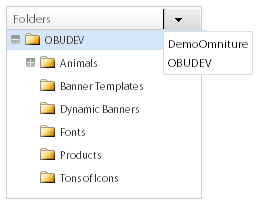
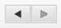
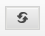
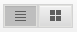
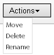
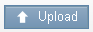
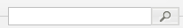
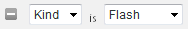
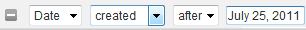

# 关于横幅 {#about-banners}

您可以使用横幅来管理您网站上的横幅广告。

## 使用横幅{#concept_5BBE01FEC6134393B43CC917C8CC64DA}

<!-- 

c_about_banners.xml

 -->

有两种方法可用于向网站添加横幅广告。

第一种方法是通过目标、Search&amp;Promote添加横幅。 横幅是客户搜索您的网站时显示的HTML代码片段。 您的横幅可以包含GIF、JPEG或PNG格式的文本或图像，也可以包含两者的组合。 您可以从预设大小中进行选择，也可以定义自己的自定义尺寸以适合您的页面。 用于显示横幅的HTML代码还可以指定要使用的字体样式和边框等内容。 此添加横幅的方法优惠了基本功能，并且不需要其他软件。

第二种方法是使用Adobe Dynamic Media Classic，一种动态媒体管理和发布服务。 有效的Adobe Dynamic Media Classic帐户可让您使用Dynamic Media Classic直接管理横幅内容并将其交付到目标、Search&amp;Promote。 在网站搜索/促销中，您可以配置对Dynamic Media经典帐户的访问权限。 然后，打开Dynamic Media Classic媒体浏览器并选择要用作横幅的Dynamic Media资产。

>[!NOTE]
>
>在您将Dynamic Media资产用作网站搜索/促销中的横幅之前，会首先在Scene7 Publishing System中上传和准备资产以进行发布。 您可以从网站搜索/销售中上传资产，并让Scene7 Publishing System自动为发布做好准备。 或者，您也可以从Scene7 Publishing System中上传和发布所有资产。

## 横幅与Adobe Scene7 Publishing System {#section_D4D7ADEA6A6348E68EDA138E184FE579}的集成

您可以在网站搜索/促销(包括图像、动态横幅和模板，如图像模板或Flash模板)中将Dynamic Media Classic资产类型用作横幅。

模板是动态创建和可寻址的分层图像文件，如图像编辑应用程序(如Adobe Photoshop®)中的分层文件。 与静态图像文件不同，模板可以包含参数。 通过参数，您可以自定义可变图像属性和图像内容。

>[!NOTE]
>
>您还可以通过使用Scene7 Publishing System中的“模板发布”以及Adobe Illustrator和Adobe InDesign中的文件，从基于布局的设计创建模板。

请参阅《Dynamic Media经典(Scene7)用户指南》中的[模板发布](https://help.adobe.com/en_US/scene7/using/WSFBFBAD30-2694-4b18-B7CE-894F9FC5CDDF.html)。

模板可以包含任意数量的图像图层和文本图层。 您可以将包含图层（如分层的PSD文件）的静态文件转换为模板，或在Dynamic Media Classic中创建模板。 您可以使用上传到Scene7 Publishing System的字体在模板中创建文本图层。 向模板添加文本后，可以通过更改其对齐方式、字体、字体大小和颜色来设置其格式。

使用Dynamic Media Classic中的“参数”屏幕，您可以将模板的任何方面转换为可寻址的参数。 这样，您就可以更改要使用的分层图像或模板中使用的文本值。 参数随URL字符串一起传递，允许您更改任何参数以动态自定义从图像服务器生成的回复图像。

您可以进一步了解如何使用Dynamic Media Classic创建模板并参数化图层上的属性，以便在横幅中使用它们。

请参阅《Dynamic Media经典(Scene7)用户指南》中的[模板基础知识](https://help.adobe.com/en_US/scene7/using/WS60B68844-9054-4099-BF69-3DC998A04D3C.html)。

**上传和发布资产**

您必须先在Dynamic Media Classic中上传和发布资产，然后才能将资产用于网站搜索/促销中的横幅。 此先决条件还包括图像模板或Flash模板使用的任何资产。 使用Dynamic Media Classic帐户上传和发布数字资产。 或者，您也可以使用网站搜索/促销来上传数字资产，然后让Dynamic Media Classic根据您的上传设置自动为您发布。 如果您尝试选择尚未上传和发布的资产，系统会在用户界面中通知您，并在继续操作之前提供上传资产的选项。

您可以了解有关使用Scene7 Publishing System上传和发布数字资产的更多信息。

请参阅《Dynamic Media经典(Scene7)用户指南》中的[上传和发布资产](https://help.adobe.com/en_US/scene7/using/WS3673AD39-098B-4f08-8A24-CA51261B7366.html)。

>[!NOTE]
>
>要在Dynamic Media Classic资源查看器中使用上传功能，请确保您使用的Dynamic Media Classic帐户已设置“SPS公司管理员”角色。

请参阅《Dynamic Media经典(Scene7)用户指南》中的[管理设置](https://help.adobe.com/en_US/scene7/using/WS662101DF-D697-47a7-A7D8-B52FD8E94438.html)。

**使用业务规则更改横幅中的Dynamic Media经典模板参数**

如果您将Dynamic Media Classic资源添加为横幅，则可以使用[!DNL Business Rules]中的[!DNL Visual Rule Builder]将其添加到网站上的任何横幅区域。 例如，您向搜索结果页面添加横幅，就像您添加任何其他横幅一样。 您还可以根据您的特定需求自定义Dynamic Media经典模板中的默认参数值，以覆盖这些默认值。 通过这种功能，您可以自定义Dynamic Media Classic模板，其中包含不同的营销消息和指向不同端点的超链接。

另请参阅[添加新业务规则](../c-about-rules-menu/c-about-business-rules.md#task_BD3B31ED48BB4B1B8F1DCD3BFA2528E7)。

另请参阅[编辑业务规则](../c-about-rules-menu/c-about-business-rules.md#task_375CFA75D1D94D9E92A35DE1228E5087)。

## 添加横幅{#task_549D02B5F73B4158B105A94E39D937B7}

您可以使用[!DNL Banners]管理横幅广告以及这些广告在您的网站上的位置。 添加横幅时，您通过在搜索时显示的HTML代码片段在外部引用图像。

<!-- 

t_adding_a_new_banner.xml

 -->

如果您有有效的Adobe Dynamic Media Classic帐户，则可以通过Scene7 Publishing System添加横幅广告。

请参阅[使用Adobe Dynamic Media Classic](../c-about-design-menu/c-about-banners.md#task_AD1E0C00A9E04B1FA819EB93288786B3)添加横幅。

请参阅[配置对您的Adobe Dynamic Media Classic帐户的访问权](../c-about-settings-menu/c-about-account-options-menu.md#task_CEFF88C2033D41D0B2FE86C435EDAC6D)。

**添加横幅**

1. 在产品菜单上，单击&#x200B;**[!UICONTROL Design]** > **[!UICONTROL Banners]**。
1. 在[!DNL Banners]页面的&#x200B;**[!UICONTROL Add Banner]**&#x200B;下拉列表中，选择&#x200B;**[!UICONTROL HTML code]**。
1. 在[!DNL Add Banner]对话框中，设置所需的选项。

   <table> 
    <thead> 
      <tr> 
      <th colname="col1" class="entry"> 
选项 
 </th> 
      <th colname="col2" class="entry"> 
描述 
 </th> 
      </tr> 
    </thead>
    <tbody> 
      <tr> 
      <td colname="col1"> 
名称 
 </td> 
      <td colname="col2"> 
必需。标识横幅的名称。 在“业务规则”的可视规则生成器中添加横幅时，该名称用于引用该横幅。 该名称不会显示在横幅中。 
 
请参阅<a href="../c-about-rules-menu/c-about-business-rules.md#task_BD3B31ED48BB4B1B8F1DCD3BFA2528E7" type="task" format="dita" scope="local">添加新业务规则。</a> 
 </td> 
      </tr> 
      <tr> 
      <td colname="col1"> 
横幅HTML 
 </td> 
      <td colname="col2"> 
 允许您粘贴与横幅关联的HTML代码。 
 
任何HTML代码都是可接受的，包括由 
        <code>
          &lt;style&gt; 
        </code>标签或由 
        <code>
          &lt;script&gt; 
        </code>标记。 例如，以下代码块用于Horizontal top类型的文本横幅：<code> &lt;div&nbsp;style="width:&nbsp;684px;&nbsp;background-image:&nbsp;url('https://www.brough.com/blackb.gif');&nbsp; 
          padding-top:&nbsp;10px;&nbsp;padding-bottom:&nbsp;10px;&nbsp;color:&nbsp;white;&nbsp;font-family:&nbsp;verdana;&nbsp; 
          text-align:&nbsp;center;&nbsp;font-size:&nbsp;20px;"&gt;&nbsp;Sound&nbsp;Study&nbsp;ships&nbsp;free!&nbsp;&lt;/div&gt; </code>在下面的示例中，代码块用于完整初始图像：<code> &lt;img&amp;nbsp;src='https://geometrixx.com/images/GEOAds/geometrixx-beauty-home-01.jpg'&amp;nbsp;border="0"&amp;nbsp;/&gt; </code> 
 </td> 
      </tr> 
      <tr> 
      <td colname="col1"> 
类型 
 </td> 
      <td colname="col2"> 
指定以下类型的横幅： 
        <ul id="ul_6423AEDB9E664049989EB529D63C4A62"> 
          <li id="li_BF6CD60B3ED748D49CFFB9C5D607661C">  [新类型]   
允许您指定所需的横幅类型，包括维和名称。 
 </li> 
          <li id="li_1A29AB22AD644E60A12298187B5E898E">  完全初始   
此类横幅的设置尺寸为680像素宽，高650像素。 您可以选择指定类型的名称，也可以接受默认名称，即横幅类型本身的名称。 
 </li> 
          <li id="li_2BE06D013CB54DDE851051BFC038BB57">  水平顶部   
 横幅位于网站的顶部区域。 如果要向横幅的左侧或右侧添加超链接，则此类型很有用。 此类横幅的设置尺寸为468像素宽，高60像素。 您可以选择指定类型的名称，也可以接受默认名称，即横幅类型本身的名称。 
 </li> 
          <li id="li_EC35AB92234749F08AA8A9BD26D0EA8D">  水平顶部 — 全宽   
添加新横幅时，此类型为默认类型。 横幅将位于网站顶部区域的对面，并占据页面的全部宽度。 此类横幅的设置尺寸为670像素宽，高150像素。 您可以选择指定类型的名称，也可以接受默认名称，即横幅类型本身的名称。 
 </li> 
        </ul> 
 </td> 
      </tr> 
      <tr> 
      <td colname="col1"> 
标记 
 </td> 
      <td colname="col2"> 
添加要与横幅关联的标记或“关键字”。 如果您使用多个横幅，添加标记可以帮助您优化横幅搜索，以便根据需要快速找到合适的横幅。 您还可以删除已添加的任何标记。 
 </td> 
      </tr> 
    </tbody> 
    </table>

1. 单击 **[!UICONTROL Save]**.
1. （可选）执行下列操作之一：

   * 单击&#x200B;**[!UICONTROL History]**&#x200B;可还原您所做的任何更改。

      请参阅[使用历史记录选项](../t-using-the-history-option.md#task_70DD3F87A67242BBBD2CB27156F43002)。

   * 单击 **[!UICONTROL Live]**.

      请参阅[查看实时设置](../c-about-staging.md#task_401A0EBDB5DB4D4CA933CBA7BECDC10F)。

   * 单击 **[!UICONTROL Push Live]**.

      请参阅[实时推送舞台设置](../c-about-staging.md#task_44306783B4C0408AAA58B471DAF2D9A4)。

## 编辑横幅{#task_D4081083BE7B40F5A003D1A2F1435AEA}

使用[!DNL Edit Banner]更改横幅名称、横幅HTML、横幅类型和任何关联标记等内容。

<!-- 

t_editing_a_banner.xml

 -->

如果您使用网站搜索/促销添加横幅，则还可以使用Adobe Dynamic Media Classic编辑横幅。

另请参阅[使用Adobe Dynamic Media Classic](../c-about-design-menu/c-about-banners.md#task_C3E782477FBF428ABEA220751781ACA9)编辑横幅。

**编辑横幅**

1. 在产品菜单上，单击&#x200B;**[!UICONTROL Design]** > **[!UICONTROL Banners]**。
1. 在[!DNL Banners]页面上，单击。

   在要编辑的横幅缩略图上方。
1. 在[!DNL Edit Banner]页面上，设置所需的选项。

   请参阅[添加横幅](../c-about-design-menu/c-about-banners.md#task_549D02B5F73B4158B105A94E39D937B7)下的选项表。
1. 编辑完横幅后，单击&#x200B;**[!UICONTROL Save]**。
1. （可选）执行下列操作之一：

   * 单击&#x200B;**[!UICONTROL History]**&#x200B;可还原您所做的任何更改。

      请参阅[使用历史记录选项](../t-using-the-history-option.md#task_70DD3F87A67242BBBD2CB27156F43002)。

   * 单击 **[!UICONTROL Live]**.

      请参阅[查看实时设置](../c-about-staging.md#task_401A0EBDB5DB4D4CA933CBA7BECDC10F)。

   * 单击 **[!UICONTROL Push Live]**.

      请参阅[实时推送舞台设置](../c-about-staging.md#task_44306783B4C0408AAA58B471DAF2D9A4)。

## 使用Adobe Dynamic Media Classic {#task_AD1E0C00A9E04B1FA819EB93288786B3}添加横幅

可使用[!DNL Banners]管理网站上的横幅广告。 使用Adobe Dynamic Media Classic添加横幅时，您可以从已上传到Scene7 Publishing System的任何数字资产中进行选择。

<!-- 

t_adding_a_banner_using_adobe_scene7.xml

 -->

要使用Adobe Dynamic Media Classic添加横幅，请确保您已配置了对有效Dynamic Media Classic帐户的访问权限。

请参阅[配置对您的Adobe Dynamic Media Classic帐户的访问权](../c-about-settings-menu/c-about-account-options-menu.md#task_CEFF88C2033D41D0B2FE86C435EDAC6D)。

**使用Adobe Dynamic Media Classic添加横幅**

1. 在产品菜单上，单击&#x200B;**[!UICONTROL Design]** > **[!UICONTROL Banners.]**
1. 在[!DNL Banners]页面的&#x200B;**[!UICONTROL Add Banner]**&#x200B;下拉列表中，单击&#x200B;**[!UICONTROL Adobe Scene7]**。
1. 在[!DNL Pick an Asset]对话框的左侧窗格中，使用用户界面中的导航选项来查找包含要用于横幅的数字资产的文件夹。

   除资产导航选项外，所有其他选项均取决于您选择添加或编辑的数字资产。

   使用资产导航选项可查找要在网站搜索/促销中用于新横幅的资产。 导航选项适用于所有类型的选定数字资产。

   >[!NOTE]
   >
   >在[!DNL Change Parameters]对话框中编辑横幅时，不会显示资产导航选项。

   请参阅[使用Adobe Dynamic Media Classic](../c-about-design-menu/c-about-banners.md#task_C3E782477FBF428ABEA220751781ACA9)编辑横幅。

   **资产导航选项**

   <table> 
    <thead> 
      <tr> 
      <th colname="col1" class="entry"> 
导航选项 
 </th> 
      <th colname="col2" class="entry"> 
描述 
 </th> 
      </tr> 
    </thead>
    <tbody> 
      <tr> 
      <td colname="col1"> 
  
 </td> 
      <td colname="col2"> 
允许您从下拉列表中为特定公司选择Dynamic Media Classic帐户，还可以导航该帐户中的数字资产文件夹。 
 
选择文件夹后，选择资产对话框的右侧窗格将显示该文件夹中包含的所有可用数字资产。 
 </td> 
      </tr> 
      <tr> 
      <td colname="col1"> 
  
 </td> 
      <td colname="col2"> 
允许您在文件夹导航历史记录中前后移动。 
 </td> 
      </tr> 
      <tr> 
      <td colname="col1"> 
  
 </td> 
      <td colname="col2"> 
刷新选定文件夹显示的数字资产的列表。 
 
如果您使用操作下拉列表移动、删除或重命名选定的资产，则可能需要单击此控件。 
 </td> 
      </tr> 
      <tr> 
      <td colname="col1"> 
  
 </td> 
      <td colname="col2"> 
在列表视图中显示数字资产。 该列表显示每个资产的关联图标或缩略图图像、文件名、数字资产类型、尺寸（如果适用）以及上次编辑日期。 
 
网格视图会以图标、缩览图或两者的形式显示选定文件夹中的数字资产。 
 </td> 
      </tr> 
      <tr> 
      <td colname="col1"> 
  
 </td> 
      <td colname="col2"> 
在“列表”视图中，您可以移动、删除或重命名选定的数字资产。 
 
在网格视图中，您可以移动或删除一个或多个选定的数字资产。 
 </td> 
      </tr> 
      <tr> 
      <td colname="col1"> 
  
 </td> 
      <td colname="col2"> 
打开上传对话框，您可以在其中从桌面或外部服务器上传选定的数字资产，以便将其用作横幅。 
 
上传资产后，Scene7 Publishing System中会自动为您计划发布作业。 
 
请参阅<a href="../c-about-design-menu/c-about-banners.md#task_AD1E0C00A9E04B1FA819EB93288786B3" type="reference" format="dita" scope="local">使用Adobe Dynamic Media Classic </a>添加横幅中的选项表。 
 
您可以了解有关使用Scene7 Publishing System上传和发布数字资产的更多信息。 
 
请参阅《Scene7 Publishing System用户指南》中的<a href="https://help.adobe.com/en_US/scene7/using/WS3673AD39-098B-4f08-8A24-CA51261B7366.html" scope="external" format="html">上传和发布资产</a>。 
 </td> 
      </tr> 
      <tr> 
      <td colname="col1"> 
  
 </td> 
      <td colname="col2"> 
允许您按关键字搜索数字资产，或按选定文件夹及其关联子文件夹中的文件位置搜索。 
 
单击搜索字段时，会自动为您添加一个可选的筛选器字段。 
 </td> 
      </tr> 
      <tr> 
      <td colname="col1"> 
  
 </td> 
      <td colname="col2"> 
添加另一个资产过滤器，以便您能够按类型或特定日期进一步优化显示的数字资产的列表。 
 </td> 
      </tr> 
      <tr> 
      <td colname="col1"> 
  
 </td> 
      <td colname="col2"> 
优化显示的数字资产的列表，以仅按特定类型(如Flash、图像、模板或任意)显示这些资产。 
 
单击以从搜索中删除筛选器。 
 </td> 
      </tr> 
      <tr> 
      <td colname="col1"> 
  
 </td> 
      <td colname="col2"> 
优化显示的数字资产的列表，以便仅显示在特定日期之前或特定日期之后创建或编辑的资产。 
 
单击以从搜索中删除筛选器。 
 </td> 
      </tr> 
      <tr> 
      <td colname="col1"> 
  
 </td> 
      <td colname="col2"> 
允许您向左或向右拖动滑块，以分别缩小或放大数字资产窗格的整个视图。 
 </td> 
      </tr> 
    </tbody> 
    </table>

   **属性选项**

   如果选择了Flash模板、图像模板或图像，将显示“属性”选项。 根据您选择的数字资产，并非所有选项都可用。

   <table> 
    <thead> 
      <tr> 
      <th colname="col1" class="entry"> 
属性选项 
 </th> 
      <th colname="col2" class="entry"> 
描述 
 </th> 
      </tr> 
    </thead>
    <tbody> 
      <tr> 
      <td colname="col1"> 
名称 
 </td> 
      <td colname="col2"> 
模板或图像的描述性名称，不带任何空格。 您可能希望在名称中包含图像大小规范，以帮助用户进一步识别资产。 
 </td> 
      </tr> 
      <tr> 
      <td colname="col1"> 
格式 
 </td> 
      <td colname="col2"> 
标识图像或图像模板的格式。 
 
您可以选择以下格式： 
 
        <ul id="ul_9A19421BCC424CF585645049DCB87F10"> 
        <li id="li_A4913D783BD547F9AFA1A259C56EC2B3">jpeg </li> 
        <li id="li_66237D7BE8754FB0B0088CE5A02C0214">png </li> 
        <li id="li_4EDDFD7C8AB04677BEC20EFC9AEBBF1F">png-alpha </li> 
        <li id="li_4FCB03C29AE647ACBAF5105016DF7579">gif </li> 
        <li id="li_B884BD7DFF1845FAA9C58EF09B888A77">gif-alpha </li> 
        </ul> 
此选项不适用于Flash模板。 
 </td> 
      </tr> 
      <tr> 
      <td colname="col1"> 
质量 
 </td> 
      <td colname="col2"> 
控制JPEG或GIF格式图像的压缩级别。 此设置会影响文件大小和图像质量。 质量比例尺为1-100。 
 
向左或向右拖动滑块时，预览窗口中的图像将更新以反映质量的变化。 
 
此选项不适用于Flash模板。 
 </td> 
      </tr> 
      <tr> 
      <td colname="col1"> 
宽度 
 </td> 
      <td colname="col2"> 
指定数字资产的宽度（以像素为单位）。 此维度是访问您网站的客户查看资产时所使用的宽度。 
 
此选项不适用于Flash模板。 
 </td> 
      </tr> 
      <tr> 
      <td colname="col1"> 
高度 
 </td> 
      <td colname="col2"> 
指定数字资产的高度（以像素为单位）。 此维度是访问您网站的客户查看资产的高度。 
 
此选项不适用于Flash模板。 
 </td> 
      </tr> 
    </tbody> 
    </table>

   **横幅链接选项**

   仅当您为横幅选择了图像或图像模板时，才会显示“横幅链接”选项。

   <table> 
    <thead> 
      <tr> 
      <th colname="col1" class="entry"> 
横幅链接选项 
 </th> 
      <th colname="col2" class="entry"> 
描述 
 </th> 
      </tr> 
    </thead>
    <tbody> 
      <tr> 
      <td colname="col1"> 
URL 链接 
 </td> 
      <td colname="col2"> 
指定当客户单击图像时希望横幅链接到的URL地址。 
 
如果您不希望横幅链接到任何内容，请将“链接URL”字段留空。 
 </td> 
      </tr> 
      <tr> 
      <td colname="col1"> 
Target 
 </td> 
      <td colname="col2"> 
指定打开链接横幅（如新浏览器窗口或新选项卡）的位置。 
 </td> 
      </tr> 
    </tbody> 
    </table>

   **修改链接选项**

   仅当您为横幅选择了Flash模板时，才会显示修改链接选项。

   <table> 
    <thead> 
      <tr> 
      <th colname="col1" class="entry"> 
修改链接选项 
 </th> 
      <th colname="col2" class="entry"> 
描述 
 </th> 
      </tr> 
    </thead>
    <tbody> 
      <tr> 
      <td colname="col1"> 
  
 </td> 
      <td colname="col2"> 
允许您编辑在Flash模板中使用的URL链接字段。 
 </td> 
      </tr> 
    </tbody> 
    </table>

   **替换文本选项**

   仅当您为具有可编辑文本图层的横幅选择了Flash模板时，才会显示“替换文本”选项。

   您对Flash模板中的文本所做的任何更改都会反映在预览窗口中。

   >[!NOTE]
   >
   >如果添加搜索并替换命令以将“cow”替换为“apple”，然后再创建一个命令以将“apple”替换为“orange”，则第二个命令不会生效。

   <table> 
    <thead> 
      <tr> 
      <th colname="col1" class="entry"> 
替换文本选项 
 </th> 
      <th colname="col2" class="entry"> 
描述 
 </th> 
      </tr> 
    </thead>
    <tbody> 
      <tr> 
      <td colname="col1"> 
  
 </td> 
      <td colname="col2"> 
添加搜索和替换字段。 
 </td> 
      </tr> 
      <tr> 
      <td colname="col1"> 
  
 </td> 
      <td colname="col2"> 
删除“搜索并替换”字段，并恢复以前使用的文本。 
 </td> 
      </tr> 
      <tr> 
      <td colname="col1"> 
搜索 
 </td> 
      <td colname="col2"> 
允许您在Flash模板的图层中输入非链接文本的搜索词。 
 </td> 
      </tr> 
      <tr> 
      <td colname="col1"> 
将 
 </td> 
      <td colname="col2"> 
允许您指定要插入的文本以代替要搜索的文本。 
 
按在此字段中输入时，预览窗口将更新为替换文本。 
 </td> 
      </tr> 
    </tbody> 
    </table>

   **参数选项**

   仅当您为横幅选择了图像模板或Flash模板时，才会显示参数选项。 实际参数选项因模板在Scene7 Publishing System中的创建和参数化方式而异。 例如，您的模板可能会参数化字段，这些字段允许您更改文本、字体样式、价格、用于免费送货的特殊代码、横幅中图像的大小，甚至浏览要使用的其他图像。

   >[!NOTE]
   >
   >请注意，您对参数所做的任何更改都可能会被业务规则所覆盖。 只有在没有创建会更改参数的业务规则时，这些参数才用作默认值。

   请参阅[添加新业务规则](../c-about-rules-menu/c-about-business-rules.md#task_BD3B31ED48BB4B1B8F1DCD3BFA2528E7)。

   请参阅[编辑业务规则](../c-about-rules-menu/c-about-business-rules.md#task_375CFA75D1D94D9E92A35DE1228E5087)。

   **切换图层可见性选项**

   仅当您为横幅选择了Flash模板时，才应用“切换图层可见性”选项。

   <table> 
    <thead> 
      <tr> 
      <th colname="col1" class="entry"> 
切换图层可见性选项 
 </th> 
      <th colname="col2" class="entry"> 
描述 
 </th> 
      </tr> 
    </thead>
    <tbody> 
      <tr> 
      <td colname="col1"> 
  
 </td> 
      <td colname="col2"> 
允许您打开或关闭组成Flash模板文件的各个图层的可见性。 
 
每次打开或关闭图层的可见性时，预览窗口都会刷新以更新显示。 
 </td> 
      </tr> 
    </tbody> 
    </table>

   （可选）如果您要用于横幅的数字资产在所选文件夹中不可用，您可能需要上传该数字资产。 单击&#x200B;**[!UICONTROL Upload]**，然后选择所需的文件和选项。 文件将上载到所选文件夹。

   >[!NOTE]
   >
   >如果要在Scene7资源查看器中使用上传功能，请确保您使用的Scene7帐户已设置“SPS公司管理员”角色。

   请参阅《Scene7 Publishing System用户指南》中的[管理设置](https://help.adobe.com/en_US/scene7/using/WS662101DF-D697-47a7-A7D8-B52FD8E94438.html)。

   **基本选项**

   <table> 
    <thead> 
      <tr> 
      <th colname="col1" class="entry"> 
选项 
 </th> 
      <th colname="col2" class="entry"> 
描述 
 </th> 
      </tr> 
    </thead>
    <tbody> 
      <tr> 
      <td colname="col1"> 
浏览 
 </td> 
      <td colname="col2"> 
 允许您浏览到要上传、发布，然后选择用作横幅的文件。 
 </td> 
      </tr> 
      <tr> 
      <td colname="col1"> 
 覆盖 
 </td> 
      <td colname="col2"> 
上传的文件将替换选定文件夹中具有相同文件名的现有文件。 
 </td> 
      </tr> 
      <tr> 
      <td colname="col1"> 
电子邮件首选项 
 </td> 
      <td colname="col2"> 
 允许您选择上传时收到的电子邮件通知，也可以选择不接收与上传作业相关的任何通知。 
 </td> 
      </tr> 
    </tbody> 
    </table>

   **高级选项**

   上传PostScript(EPS)或Illustrator(AI)图像文件时，可以采用各种格式设置它们。 您可以栅格化文件，将它们转换为FXG以进行模板发布，保持透明背景，选择分辨率，并选择色彩空间。

   Dynamic Media Classic中最常使用PSD(Photoshop 文档文件)创建模板。 在上传PSD文件时，可以自动从文件创建Dynamic Media Classic模板（选择&#x200B;**[!UICONTROL Create Template]**&#x200B;选项）。

   Scene7 Publishing System使用PSD文件创建模板时，会使用图层从PSD文件创建多个图像；它为每个图层创建一个图像。

   <table> 
    <thead> 
      <tr> 
      <th colname="col1" class="entry"> 
选项组名称 
 </th> 
      <th colname="col02" class="entry"> 
选项 
 </th> 
      <th colname="col2" class="entry"> 
描述 
 </th> 
      </tr> 
    </thead>
    <tbody> 
      <tr> 
      <td colname="col1"> 
颜色用户档案选项 
 </td> 
      <td colname="col02"> 
颜色用户档案 
 </td> 
      <td colname="col2"> 
 允许您从以下选项中进行选择： 
 
        <ul id="ul_6927BC08CA2647EDB2C85DAD2B82AE31"> 
        <li id="li_CA3F44FF9C0F4CE987DCB0AF9303C2E4">  转换为SRGB   
转换为SRGB（标准红绿蓝）。 SRGB是用于在网页上显示图像的推荐色彩空间。 
 </li> 
        <li id="li_FCCEE6B14CCD4246ADA152932010ABF1">  保留原始色彩空间   
保留原始色彩空间。 
 </li> 
        </ul> </td> 
      </tr> 
      <tr> 
      <td colname="col1"> 
图像编辑选项 
 </td> 
      <td colname="col02"> 
从剪切路径创建蒙版 
 </td> 
      <td colname="col2"> 
根据图像的剪切路径信息为图像创建蒙版。 此选项适用于使用创建了剪切路径的图像编辑应用程序创建的图像。 
 </td> 
      </tr> 
      <tr> 
      <td colname="col1"> 
PostScript选项 
 
Illustrator选项 
 </td> 
      <td colname="col02"> 
正在处理 
 </td> 
      <td colname="col2"> 
  栅格化  选项可将文件中的矢量图形转换为位图格式。 
 </td> 
      </tr> 
      <tr> 
      <td colname="col1"> 
 Postscript选项 
 
Illustrator选项 
 </td> 
      <td colname="col02"> 
 分辨率 
 </td> 
      <td colname="col2"> 
 确定分辨率设置。 此设置决定文件中每英寸显示的像素数。 默认值为 150。 
 </td> 
      </tr> 
      <tr> 
      <td colname="col1"> 
 PostScript选项 
 
Illustrator选项 
 </td> 
      <td colname="col02"> 
 色彩空间 
 </td> 
      <td colname="col2"> 
允许您为Illustrator文件选择色彩空间。 RGB色彩空间是联机查看的首选。 
 
您可以从以下色彩空间选项中进行选择： 
 
        <ul id="ul_0E83E2762A574480B243F963A7FB2ACD"> 
        <li id="li_B9FEC7D220D04CCABACD30839051DAE4">  自动检测   
 保留PDF文件的色彩空间。 
 </li> 
        <li id="li_ED0EB3B12BCF41C7AFC435447010B6FF">  强制为RGB   
 转换为RGB色彩空间。 
 </li> 
        <li id="li_3FB5DD8887C540BC97148A4D63B38F72">  强制为CMYK   
 转换为CMYK色彩空间。 
 </li> 
        <li id="li_6C018D3A4B254880AD41896E9F4AF3D9">  强制为灰度   
 转换为灰度色彩空间。 
 </li> 
        </ul> </td> 
      </tr> 
      <tr> 
      <td colname="col1"> 
 PostScript选项 
 
Illustrator选项 
 </td> 
      <td colname="col02"> 
 维护透明背景 
 </td> 
      <td colname="col2"> 
保持文件的背景透明度。 
 </td> 
      </tr> 
      <tr> 
      <td colname="col1"> 
Photoshop选项 
 </td> 
      <td colname="col02"> 
 维护图层 
 </td> 
      <td colname="col2"> 
将PSD中的图层（如果有）拆分到单个资源中。 资源图层仍与PSD关联。 
 </td> 
      </tr> 
      <tr> 
      <td colname="col1"> 
 Photoshop选项 
 </td> 
      <td colname="col02"> 
创建模板 
 </td> 
      <td colname="col2"> 
 从PSD文件中的图层创建模板。 
 </td> 
      </tr> 
      <tr> 
      <td colname="col1"> 
 Photoshop选项 
 </td> 
      <td colname="col02"> 
 提取文本 
 </td> 
      <td colname="col2"> 
 提取文本，以便客户可以在横幅中搜索关键字。 
 </td> 
      </tr> 
      <tr> 
      <td colname="col1"> 
Photoshop选项 
 </td> 
      <td colname="col02"> 
 扩展图层 
 </td> 
      <td colname="col2"> 
将撕开的图像图层的大小扩展到背景图层的大小。 
 </td> 
      </tr> 
      <tr> 
      <td colname="col1"> 
Photoshop选项 
 </td> 
      <td colname="col02"> 
 图层命名 
 </td> 
      <td colname="col2"> 
PSD文件中的图层将作为单独的图像上传。 您可以从以下选项中进行选择，以决定要在Scene7 Publishing System中命名这些图像的方式： 
 
        <ul id="ul_C2A25177A07740CA90B32C638304D39F"> 
        <li id="li_477D5BFF7238454BBF0E04B22DE378F7">  使用PSD文件中的图层名称   
在PSD文件中的图层名称后命名图像。 例如，原始PSD文件中名为价格标签的图层将变成名为价格标签的图像。 但是，如果PSD文件中的图层名称是默认的Photoshop图层名称（背景、图层1、图层2等），则图像的名称将以PSD文件中的图层编号而不是默认图层名称命名。 
 </li> 
        <li id="li_EB4173B884FC41328CFBDE27DA6D43AA">  使用PSD文件名并附加编号   
在PSD文件中将图像命名为图层编号之后，而忽略原始图层名称。 图像以Photoshop文件名和附加的图层编号命名。 例如，名为 Spring Ad.psd 的文件的第二个图层名为 Spring Ad_2 ，即使它在Photoshop中具有非默认名称。 
 </li> 
        <li id="li_10B2D2DE2FD24BD08DB56D1D95ABA53D">  使用PSD文件名和图层名称或编号   
在PSD文件之后命名图像，后跟图层名称或图层编号。 如果PSD文件中的图层名称是默认的Photoshop图层名称，则使用图层编号。 例如，名为 SpringAd 的PSD文件中名为 Price Tag 的图层名为 Spring Ad_Price Tag 。 默认名称为第2层的图层名为 Spring Ad_2 。 
 </li> 
        <li id="li_5E57AC0719D4484B9C9BD14DB42B4455">  根据PSD文件名创建文件夹   
使用PSD的文件名为图层图像创建文件夹。 
 </li> 
        </ul> </td> 
      </tr> 
      <tr> 
      <td colname="col1"> 
Photoshop选项 
 </td> 
      <td colname="col02"> 
锚点 
 </td> 
      <td colname="col2"> 
指定如何在从PSD文件生成的图层合成生成的模板中定位图像。 
 
默认情况下，锚点为中心。 无论替换图像的长宽比如何，中心锚点都允许替换图像以最佳方式填充相同的空间。 当引用模板并使用参数替换时，具有替换此图像的不同方面的图像会有效地占用相同的空间。 如果应用程序需要替换图像以填充模板中分配的空间，请更改为其他设置。 
 </td> 
      </tr> 
      <tr> 
      <td colname="col1"> 
PDF选项 
 </td> 
      <td colname="col02"> 
正在处理 
 </td> 
      <td colname="col2"> 
  栅格  化选项将PDF文件中的页面翻页，并将矢量图形转换为位图图像。  
        <!--Choose this option to create an eCatalog. (This option is thedefault.)--> 
 </td> 
      </tr> 
      <tr> 
      <td colname="col1"> 
PDF选项 
 </td> 
      <td colname="col02"> 
 分辨率 
 </td> 
      <td colname="col2"> 
确定分辨率设置。 此设置决定PDF文件中每英寸显示的像素数。 默认值为 150。 
 </td> 
      </tr> 
      <tr> 
      <td colname="col1"> 
PDF选项 
 </td> 
      <td colname="col02"> 
 色彩空间 
 </td> 
      <td colname="col2"> 
允许您为PDF文件选择色彩空间。 大多数PDF文件都有RGB和CMYK彩色图像。 RGB色彩空间是联机查看的首选。 
 
您可以从以下色彩空间选项中进行选择： 
 
        <ul id="ul_44A8C39DEB21473F9375E3962F14D3C6"> 
        <li id="li_1046FA0017934C5EB7C0100F8F78507D">  自动检测   
 保留PDF文件的色彩空间。 
 </li> 
        <li id="li_561CCF705EDD451993D2DA2EB33F05F7">  强制为RGB   
 转换为RGB色彩空间。 
 </li> 
        <li id="li_D9E8CF61C40140979484EDEF7DAD2C44">  强制为CMYK   
 转换为CMYK色彩空间。 
 </li> 
        <li id="li_F3606B45C0F84BA594263EA12243F67A">  强制为灰度   
 转换为灰度色彩空间。 
 </li> 
        </ul> </td> 
      </tr> 
      <tr> 
      <td colname="col1"> 
PDF选项 
 </td> 
      <td colname="col02"> 
从多页PDF自动生成电子目录 
 </td> 
      <td colname="col2"> 
 自动从PDF文件创建电子目录。 电子目录以您上传的PDF文件命名。 
 </td> 
      </tr> 
      <tr> 
      <td colname="col1"> 
 PDF选项 
 </td> 
      <td colname="col02"> 
提取关键字 
 </td> 
      <td colname="col2"> 
从PDF文件中提取单词，以便按关键字搜索文件。 
 </td> 
      </tr> 
    </tbody> 
    </table>

1. 在右侧窗格中，单击所需的图像、模板或Flash文件。

   出现[!DNL Pick An Asset]弹出窗口。
1. （可选）在[!DNL Pick An Asset]弹出窗口的[!DNL Actions]下拉列表中，执行下列任一操作：

   * 单击 **[!UICONTROL Move]**. 在[!DNL Select a folder to move to]对话框中，选择要移动数字资产的文件夹。 单击 **[!UICONTROL Move]**.

      您还可以选择要移动到其他文件夹的多个数字资产。

   * 单击 **[!UICONTROL Delete]**. 在[!DNL Delete Selected Assets]对话框中，单击&#x200B;**[!UICONTROL Delete]**。

      您还可以选择要从文件夹删除的多个数字资产。

   * 单击 **[!UICONTROL Rename]**. 在[!DNL Enter a new name for]对话框的文本字段中，键入数字资产的新名称。 单击 **[!UICONTROL Rename]**.

1. （可选）根据您选择的数字资产，在[!DNL Pick an Asset]弹出窗口的左窗格中设置所需的选项。
1. 单击资产以将其选为横幅。
1. （可选）执行下列操作之一：

   * 单击&#x200B;**[!UICONTROL History]**&#x200B;可还原您所做的任何更改。

      请参阅[使用历史记录选项](../t-using-the-history-option.md#task_70DD3F87A67242BBBD2CB27156F43002)。

   * 单击 **[!UICONTROL Live]**.

      请参阅[查看实时设置](../c-about-staging.md#task_401A0EBDB5DB4D4CA933CBA7BECDC10F)。

   * 单击 **[!UICONTROL Push Live]**.

      请参阅[实时推送舞台设置](../c-about-staging.md#task_44306783B4C0408AAA58B471DAF2D9A4)。

## 使用Adobe Dynamic Media Classic {#task_C3E782477FBF428ABEA220751781ACA9}编辑横幅

使用[!DNL Edit Banner]更改您使用Adobe Dynamic Media Classic添加的横幅的属性和参数。

<!-- 

t_editing_a_banner_using_adobe_scene7.xml

 -->

如果通过添加HTML代码添加横幅，则应改用站点搜索/促销来编辑横幅。

另请参阅[编辑横幅](../c-about-design-menu/c-about-banners.md#task_D4081083BE7B40F5A003D1A2F1435AEA)。

**使用Adobe Dynamic Media Classic编辑横幅**

1. 在产品菜单上，单击&#x200B;**[!UICONTROL Design]** > **[!UICONTROL Banners]**。
1. 在[!DNL Banners]页面上，单击横幅窗口左下角带有S7图标的横幅缩略图上方的。
1. 在[!DNL Change Parameter]页面上，设置所需的选项。
1. 编辑完横幅后，单击&#x200B;**[!UICONTROL Save]**。
1. （可选）执行下列操作之一：

   * 单击&#x200B;**[!UICONTROL History]**&#x200B;可还原您所做的任何更改。

      请参阅[使用历史记录选项](../t-using-the-history-option.md#task_70DD3F87A67242BBBD2CB27156F43002)。

   * 单击 **[!UICONTROL Live]**.

      请参阅[查看实时设置](../c-about-staging.md#task_401A0EBDB5DB4D4CA933CBA7BECDC10F)。

   * 单击 **[!UICONTROL Push Live]**.

      请参阅[实时推送舞台设置](../c-about-staging.md#task_44306783B4C0408AAA58B471DAF2D9A4)。

## 删除横幅{#task_32F3BADC481E4E8984B2AA04B96052EB}

您可以删除不再需要或希望一次使用某个横幅或作为组使用的分阶段横幅。

<!-- 

t_deleting_banners.xml

 -->

**删除横幅**

1. 在产品菜单上，单击&#x200B;**[!UICONTROL Design]** > **[!UICONTROL Banners]**。
1. （可选）执行以下一项或多项操作：

   * 在[!DNL Banners]页面上，从&#x200B;**[!UICONTROL Find banner of type]**&#x200B;下拉列表中选择要查找的横幅类型。 如果需要，请在&#x200B;**[!UICONTROL with tag]**&#x200B;文本字段中指定标记名称，或在&#x200B;**[!UICONTROL with name]**&#x200B;文本字段中指定横幅类型名称。 单击 **[!UICONTROL Find.]**

   * 在&#x200B;**[!UICONTROL Sort]**&#x200B;下拉列表中，选择您希望如何列表横幅。
   * 在&#x200B;**[!UICONTROL Show]**&#x200B;下拉列表中，选择要加载到当前正在查看的页面中的横幅数。

1. 执行以下操作之一：

   * 在任何横幅框的左上角，单击要删除的每个横幅的复选框。
   * 在[!DNL Banners]页面的上栏上，选中&#x200B;**[!UICONTROL Select all]**&#x200B;以选择当前显示页面上加载的每个横幅。

1. 在&#x200B;**[!UICONTROL Bulk Actions]**&#x200B;下拉列表中，单击&#x200B;**[!UICONTROL Delete]**。
1. 在[!DNL Confirmation Action]对话框中，单击&#x200B;**[!UICONTROL OK]**。
1. （可选）执行下列操作之一：

   * 单击&#x200B;**[!UICONTROL History]**&#x200B;可还原您所做的任何更改。

      请参阅[使用历史记录选项](../t-using-the-history-option.md#task_70DD3F87A67242BBBD2CB27156F43002)。

   * 单击 **[!UICONTROL Live]**.

      请参阅[查看实时设置](../c-about-staging.md#task_401A0EBDB5DB4D4CA933CBA7BECDC10F)。

   * 单击 **[!UICONTROL Push Live]**.

      请参阅[实时推送舞台设置](../c-about-staging.md#task_44306783B4C0408AAA58B471DAF2D9A4)。

## 预览横幅{#task_6AB1F81A984A4DC2ACACD1FE030545E2}

您可以浏览已添加到[!DNL Banners]页面的横幅，以视图其全尺寸。 模板中影响横幅的任何CSS均不会显示。

<!-- 

t_previewing_banners.xml

 -->

**到预览横幅**

1. 在产品菜单上，单击&#x200B;**[!UICONTROL Design]** > **[!UICONTROL Banners]**。
1. （可选）执行以下一项或多项操作：

   * 在[!DNL Banners]页面上，从&#x200B;**[!UICONTROL Find banner of type]**&#x200B;下拉列表中选择要查找的横幅类型。 如果需要，请在&#x200B;**[!UICONTROL with tag]**&#x200B;文本字段中指定标记名称，或在&#x200B;**[!UICONTROL with name]**&#x200B;文本字段中指定横幅类型名称。 单击 **[!UICONTROL Find.]**

   * 在&#x200B;**[!UICONTROL Sort]**&#x200B;下拉列表中，选择您希望如何列表横幅。
   * 在&#x200B;**[!UICONTROL Show]**&#x200B;下拉列表中，选择要加载到当前正在查看的页面中的横幅数。

1. 在[!DNL Banners]页面上，单击横幅缩略图以视图其完整大小。
1. 执行以下操作之一：

   * 在横幅预览对话框中，单击向左或向右箭头可导航和视图已添加的全尺寸横幅。
   * 单击关闭按钮可关闭横幅预览对话框，并返回至[!DNL Banners]页面。

## 实时推送横幅{#task_161F4FEC8362474296A566E64BF05B97}

您可以将一个或多个选定横幅实时推送到您的网站。

<!-- 

t_pushing_banners_live.xml

 -->

或者，如果您愿意，也可以使用[!DNL Banners]页面底部附近的&#x200B;**[!UICONTROL Push Live]**&#x200B;选项将所有更改实时推送到任何横幅。

请参阅[实时推送舞台设置](../c-about-staging.md#task_44306783B4C0408AAA58B471DAF2D9A4)。

**要实时推送横幅**

1. 在产品菜单上，单击&#x200B;**[!UICONTROL Design]** > **[!UICONTROL Banners]**。
1. （可选）执行以下一项或多项操作：

   * 在[!DNL Banners]页面上，从&#x200B;**[!UICONTROL Find banner of type]**&#x200B;下拉列表中选择要查找的横幅类型。 如果需要，请在&#x200B;**[!UICONTROL with tag]**&#x200B;文本字段中指定标记名称，或在&#x200B;**[!UICONTROL with name]**&#x200B;文本字段中指定横幅类型名称。 单击 **[!UICONTROL Find]**.

   * 在&#x200B;**[!UICONTROL Sort]**&#x200B;下拉列表中，选择您希望如何列表横幅。
   * 在&#x200B;**[!UICONTROL Show]**&#x200B;下拉列表中，选择要加载到当前正在查看的页面中的横幅数。

1. 执行以下操作之一：

   * 在任何横幅框的左上角，单击要删除的每个横幅的复选框。
   * 在[!DNL Banner]页面的上栏上，选中&#x200B;**[!UICONTROL Select all]**&#x200B;以选择当前显示页面上加载的每个横幅。

1. 在&#x200B;**[!UICONTROL Bulk Actions]**&#x200B;下拉列表中，单击&#x200B;**[!UICONTROL Push live]**。
1. 在[!DNL Confirmation Action]对话框中，单击&#x200B;**[!UICONTROL OK]**。
1. （可选）在[!DNL Banners]页面上，单击&#x200B;**[!UICONTROL History]**&#x200B;以还原您所做的任何更改。

   请参阅[使用历史记录选项](../t-using-the-history-option.md#task_70DD3F87A67242BBBD2CB27156F43002)。
