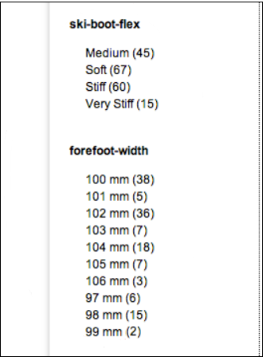
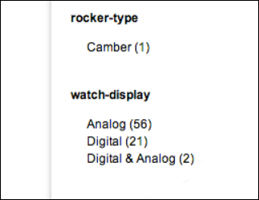
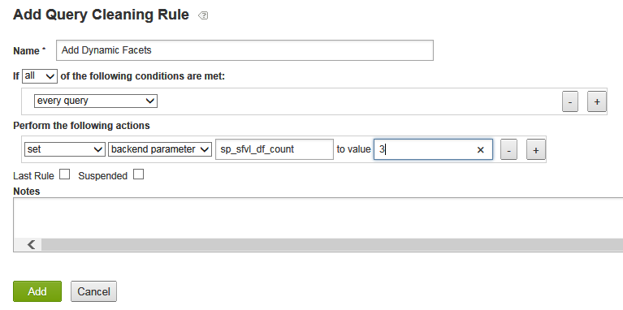
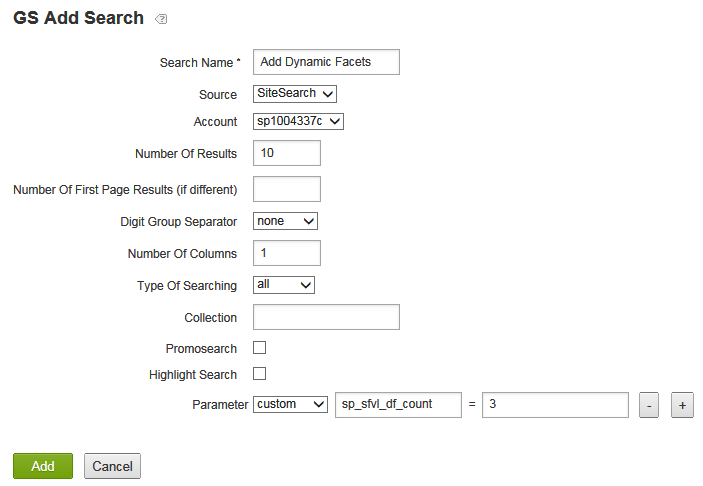
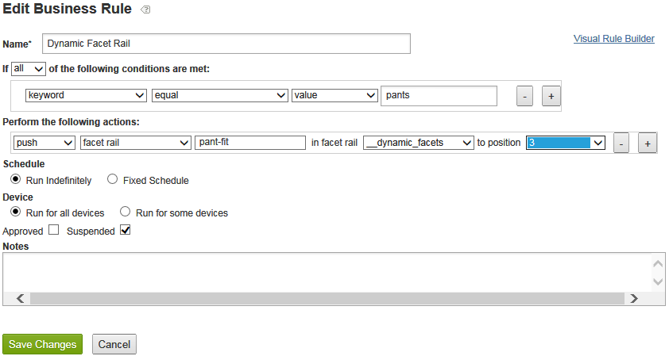

# 关于动态彩块化{#about-dynamic-facets}

使用动态彩块化在搜索时自动创建新的范围选择。 您可以选择将每个动态facet字段与Adobe Search&amp;Promote帐户中最多一个表名关联。 您可以在搜索时对搜索中涉及的任何动态facet字段应用这些表关系。

## 使用动态彩块化 {#concept_E65A70C9C2E04804BF24FBE1B3CAD899}

>[!NOTE]
>
>默认情况下，此功 [!DNL Adobe Search&Promote]能未在中启用。 请联系技术支持以激活该功能供您使用。

如果不使用动态彩块化，您必须将相关属性合并到“插槽”中，并且只显示相同的插槽，以便进行给定搜索。 即，它们只能包含一个逻辑属性的值，如“鞋大小”或“圈大小”。 该方法提供了具有大量唯一属性的适当搜索时间性能。

但是，当使用动态分面时，它不会对核心搜索可以有效跟踪的facet数量设置限制。 您可以定义数百个动态彩块化，核心搜索可以从中为给定搜索返回“顶级动态彩块化”，其中 `N``N` 通常值较小，为10-20或更少。 此方法无需插入属性——您现在可以为网站中的属性创建唯一的动态Facet。

## 您应该将哪些方面变为动态的？ {#section_254EE034BCAD4250A5D09FBF6158C4A5}

在您的网站中稀疏填充且仅针对部分搜索显示的彩块化是动态的好候选。 例如，名为“forefoot width”的彩块仅可在搜索鞋或靴时填充。 而另一个名为“脸数字样式”的facet，其可能值为“罗马”和“阿拉伯语”，则只有在搜索手表或时钟时才可能出现。

如果您的帐户有大量此类facet，它会增强搜索性能以使用动态facet，而不是始终为每次搜索选择整组可能的facet。 通用彩块化（如“SKU”或“品牌”）通常适合与每次搜索的结果一起显示，通常不适合作为动态彩块化。

## facet与元标记字段的关系 {#section_2869E5FCDA8B431A87BC6E5573F2B0A0}

Facet构建于元标记字段之上。 元标签字段是的低级核心搜索层特征 [!DNL Adobe Search&Promote]。 Facet是GS（向导搜索）的一部分，GS是Adobe Search&amp;Promote的高级表示层。 但是，Facet自有的meta标签字段对facet一无所知。 在配置动态彩块化时，您首先添加彩块化，然后添加元标签字段，同时选择“动态彩块化”选项以将标识彩块化设置为动态彩块化。

>[!NOTE]
>
>中没有“动态彩块化”设置 **[!UICONTROL Design > Navigation > Facets]**。 使facet“动态”的原因是其基础“元标签字段”是按中的设置动态的 **[!UICONTROL Settings > Metadata > Definitions]**。

## 动态彩块化的实际操作示例 {#section_BC699A05E2E742EF94D41679163ACE84}

搜索“引导”后显示的动态彩块化示例：



搜索“监视”后显示的动态彩块化的另一个示例：



另请参阅

* [后端搜索CGI参数](../c-appendices/c-cgiparameters.md#reference_582E85C3886740C98FE88CA9DF7918E8)
* [演示文稿模板标记](../c-appendices/c-templates.md#reference_F1BBF616BCEC4AD7B2548ECD3CA74C64)
* [传输模板标签](../c-appendices/c-templates.md#reference_227D199F5A7248049BE1D405C0584751)

## 配置动态彩块化 {#task_D17F484130E448258100BAC1EEC53F39}

在Search&amp;Promote中设置动态彩块化。

<!-- 

t_configuring_dynamic_facets.xml

 -->

>[!NOTE]
>
>默认情况下，Adobe Search&amp;Promote中未启用此功能。 请联系技术支持以激活该功能供您使用。

在您的动态彩块化效果对客户可见之前，您必须重新构建站点索引。

另请参阅

* [后端搜索CGI参数](../c-appendices/c-cgiparameters.md#reference_582E85C3886740C98FE88CA9DF7918E8)
* [演示文稿模板标记](../c-appendices/c-templates.md#reference_F1BBF616BCEC4AD7B2548ECD3CA74C64)
* [传输模板标签](../c-appendices/c-templates.md#reference_227D199F5A7248049BE1D405C0584751)

**配置动态彩块化**

1. 确保您已添加彩块化。

   请参 [阅添加新彩块化](../c-about-design-menu/c-about-facets.md#task_FC07BFFA62CA4B718D6CBF4F2855C89B)。
1. 添加facet后，请确保已将facet添加到新的用户定义的元标记字段。

   请参 [阅添加新的元标记字段](../c-about-settings-menu/c-about-metadata-menu.md#task_6DF188C0FC7F4831A4444CA9AFA615E5)。
1. 在产品菜单中，单击 **[!UICONTROL Settings]** > **[!UICONTROL Metadata]** > **[!UICONTROL Definitions.]**
1. 在页 [!DNL Definitions] 面上的表 [!DNL User-defined fields][!DNL Actions] 中，在列中，单击与要动态化的facet关联的元标记字段名称行中的铅笔图标（编辑）。
1. 在页面 [!DNL Edit Field] 上，选中 **[!UICONTROL Dynamic Facet]**。

   请参阅添加新元标 [记字段中的选项表](../c-about-settings-menu/c-about-metadata-menu.md#task_6DF188C0FC7F4831A4444CA9AFA615E5)。
1. 单击 **[!UICONTROL Save Changes]**.
1. 单击 **蓝色框中的重新生成分阶段站点索引** ，以快速重建分阶段网站索引。

   另请参 [阅重新生成实时或分阶段网站的索引](../c-about-index-menu/c-about-regenerate-index.md#task_B28DE40C0E9A475ABCBCBC4FF993AACD)。
1. 确定要为给定搜索选择的动态彩块化数量。 您可以通过执行以下任一操作来完成此任务:

   * 创建具有任何所需条件的查询清理规则，该规则执行相应的操作 `set`(如 `backend parameter`果值)，其中 `sp_sfvl_df_count` ，动态彩块化是搜索时要请求的所需数量，然后单击 `X``X`**[!UICONTROL Add]**。
   

   请参 [阅添加查询清理规则](../c-about-rules-menu/c-about-query-cleaning-rules.md#task_47F43988D3D9485F8AE1DFDA7E00BF54)。

   另请参 [阅表中的后端搜索CGI参数](../c-appendices/c-cgiparameters.md#reference_582E85C3886740C98FE88CA9DF7918E8)，第40行，进一步说明 `sp_sfvl_df_count`。

   * 添加搜索并将“自定义”参 `sp_sfvl_df_count` 数设置为所需值，然后单击 **[!UICONTROL Add]**。
   

   请参 [阅添加新搜索定义](../c-about-settings-menu/c-about-searching-menu.md#task_98D3A168AB5D4F30A1ADB6E0D48AB648)。

   另请参 [阅表中的后端搜索CGI参数](../c-appendices/c-cgiparameters.md#reference_582E85C3886740C98FE88CA9DF7918E8)，第40行，进一步说明 `sp_sfvl_df_count`。

1. 编辑相应的传输模板以输出核心搜索返回的动态彩块化。

   请参 [阅编辑演示文稿或传输模板](../c-about-design-menu/c-about-templates.md#task_800E0E2265C34C028C92FEB5A1243EC3)。

   例如，假定您的传输模板被命名 `guided.tpl`。 在这种情况下，请在产品菜单上单击 **[!UICONTROL Design > Templates]**。 在页 [!DNL Templates] 面上，找 `guided.tpl` 到表中。 然后单 **[!UICONTROL Edit]** 击该名称的最右侧。 在“编辑”页面上，将以下代码块添加到结尾 `</facets>`:JSON输出：

   ```
   ... 
   }<search-dynamic-facet-fields>, 
           { 
               "name" : "<search-dynamic-facet-field-name>", 
               "dynamic-facet" : 1, 
               "values" : [<search-field-value-list quotes="yes" commas="yes" data="values" sortby="values" encoding="json" />], 
               "counts" : [<search-field-value-list quotes="yes" commas="yes" data="results" sortby="values" />] 
   
           }</search-dynamic-facet-fields> 
   ...
   ```

1. 编辑相应的演示文稿模板或模板以输出动态彩块化。

   请参 [阅编辑演示文稿或传输模板](../c-about-design-menu/c-about-templates.md#task_800E0E2265C34C028C92FEB5A1243EC3)。

   例如，假定您有一个名为的模板， `sim.tmpl` 用于在模拟器中输出内容。 要编辑该模板，请在产品菜单上单击 **[!UICONTROL Design > Templates]**。 在页 [!DNL Templates] 面上，找 `sim.tmpl` 到表中。 然后单 **[!UICONTROL Edit]** 击该名称的最右侧。 在“编辑”页面上，在模板的facet显示区域中添加以下内容：

   ```
   <h6>DF RAIL</h6> 
   <guided-facet-rail gsname="__dynamic_facets"> 
               <guided-facet ><!-- behavior=Normal --> 
               <div class="facet-block" id="facet"> 
               <p><b><guided-facet-display-name /></b></p> 
               <ul> 
                   <guided-facet-values> 
                       <guided-if-facet-value-equals-length-threshold> 
               </ul> 
               <ul id="brand" style="display:none"> 
                       </guided-if-facet-value-equals-length-threshold> 
                       <guided-if-facet-value-selected> 
                           <li><guided-facet-value> [<guided-lt>a href="<guided-facet-value-undo-path />"<guided-gt>X</a>]</li> 
                       <guided-else-facet-value-selected> 
                           <li><guided-facet-link><guided-facet-value></guided-facet-link> (<guided-facet-count>) </li> 
                       </guided-if-facet-value-selected> 
                   </guided-facet-values> 
               </ul> 
               <guided-if-facet-long> 
                 <br /><guided-lt />a href="#" onclick="moreless(this,'brand');return false;" <guided-gt /><button style="font-size:10px;">VIEW MORE</button></a> 
               </guided-if-facet-long> 
               </div> 
               </guided-facet> 
   </guided-facet-rail> 
   <h6>/DF RAIL</h6>
   ```

   您还可以根据需要对其他演示文稿模板进行类似修改，如 `json.tmpl`。

   请务必在标 `__dynamic_facets` 记中 `gsname` 指定 `guided-facet-rail` 。 此标签是预定义的facet边栏，保留用于输出为给定搜索返回的任何动态facet。

   您还可以通过以下方式和方式来编辑此特殊 **[!UICONTROL Rules > Business Rules]**&#x200B;的facet边栏， **[!UICONTROL Advanced Rule Builder]** 如下所示。

   

   另请参阅 [添加新业务规则](../c-about-rules-menu/c-about-business-rules.md#task_BD3B31ED48BB4B1B8F1DCD3BFA2528E7)
