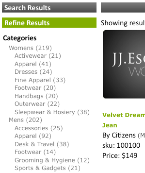

# 关于彩块化{#about-facets}

您可以使用彩块化来自定义您的表示层，并为用户提供“向导式搜索”，让他们深入查看其搜索结果。

## 使用彩块化 {#concept_FA912B3B41EE493DB2F492D188457FF5}

例如，假设某个销售工具的网站的访客搜索扳手。 该公司可以利用两个方面：一个用于指定找到的所有品牌扳手，另一个用于指定所有扳手尺寸。 客户可以单击相应方面中的任何品牌或大小以缩小结果范围并快速找到所需的正确扳手。

您可以基于任何现有元数据定义创建Facet。 如果在元数据中将facet定义为日期类型，则它将显示为日期范围facet。

页面上的表格 [!DNL Staged Facets] 显示了组成每个已添加facet的设置的一般概述。 您可以添加新彩块化以及编辑或删除现有彩块化。 您可以使用页面右上角附近的 **[!UICONTROL History]** 对facet所做的任何更改还原。

默认情况下，Facet设置会进行暂存，以便您在将更改实时推送之前测试这些更改。

请参阅 [关于暂存](../c-about-staging.md#concept_08B8F3CA1F4241108F14BA7FC7806CA7)。

您可以使用 **[!UICONTROL View Live Settings]** 将暂存设置与当前实时设置进行比较。 使 **[!UICONTROL View Staged Settings]** 用可返回登台区域。 对于已暂存的项目，设置的实时版本为只读。 因此，您可以通过实时推送暂存设置来操作它。 在对已暂存的彩块化所做的任何更改感到满意后，单击以 **[!UICONTROL Push Live]** 将其实时推送。

## 日期范围彩块化 {#section_FEFFF6B5B6534456913189FEF559BA58}

在元数据中定义为“日期”类型的彩块化与其他彩块化的处理方式不同。 它们不被视为一组值，而是被视为日期范围、开始日期、结束日期或两者。

日期范围facet的值为开始日期，后跟“BTW”（表示“介于”），后跟结束日期。 日期采用以下两种格式：

mm-dd-yyyy

yyyy/mm/dd

需要4位数的年份。 起始日期或结束日期中必须至少有一个，但两者都不是必需的。 例如，“12/1/2007BTW1/4/2009”表示2007年12月1日至2009年1月4日之间的所有日期。 但是，“1-1-2005BTW”指自2005年1月1日起的所有日期。

您可以使用演示文稿模板标 `<guided-facet-value/>` 签获取日期范围facet的值，如普通facet。 目前，需要JavaScript才能允许用户输入要搜索的日期范围。 例如，您可以从两个输入字段输入开始日期和结束日期。 然后，您可以验证输入，并将新facet的值（从两个输入字段构建）和facet名称附加到现有URL。

请参阅 [演示文稿模板标记](../c-appendices/c-templates.md#reference_F1BBF616BCEC4AD7B2548ECD3CA74C64)。

以下代码示例是有关如何在页面上显示日期范围的示例。 如果选中，则显示现有日期范围；否则，它会显示一个简单的输入表单。 提交表单后，将执行简单的验证。 然后，它将浏览器发送到包含两个新参数的新URL:

* `q#` -表示从两个输入字段组合的选定日期范围。
* `x#` -命名facet。 在此示例中，日期范围facet的名称为“modified”。

由于 `replace(/%2F/ig, '~2F')` 安全原因，Apache不允许在 `%2F` URL路径中包含代码中的部分，而使用SEO URL时，查询位于URL路径中。 因此， `/` 将编码为 `~2F` 而不是 `%2F`像通常在URL中一样。

```
<div class="date_range"> 
 <p>Date Range</p> 
 <guided-if-facet-selected gsname="modified"> 
  <guided-facet-values gsname="modified"> 
   <script> 
   var modified_daterange= '<guided-facet-value />'.split(/BTW/) ; 
   if (modified_daterange[0]=='') modified_daterange[0]= '--/--/----' ; 
   if (modified_daterange[1]=='') modified_daterange[1]= '--/--/----' ; 
   document.write('From: ' + modified_daterange[0]) ; 
   document.write('<br>To: ' + modified_daterange[1]) ; 
   </script> 
  </guided-facet-values> 
 
 <guided-else-facet-selected> 
  <form action="#"> 
   From: <input name="dateFrom" size=10> 
   <br>To: <input name="dateTo" size=10> 
   <br><input type="button" value="Go" onclick="goClick(this.form)"> 
  </form> 
  <script> 
  function goClick(f) { 
   if (f.dateFrom.value=='' && f.dateTo.value=='') { 
    alert('You must enter either a From: date or a To: date.') ; 
    return ; 
   } 
   if ( f.dateFrom.value!='' && !f.dateFrom.value.match(/^\d+[\/\-]\d+[\/\-]\d\d\d\d$/) ) { 
    alert('From: date must be in "mm/dd/yyyy" or "mm-dd-yyyy" format.') ; 
    return ; 
   } 
   if ( f.dateTo.value!='' && !f.dateTo.value.match(/^\d+[\/\-]\d+[\/\-]\d\d\d\d$/) ) { 
    alert('To: date must be in "mm/dd/yyyy" or "mm-dd-yyyy" format.') ; 
    return ; 
   } 
   // Note that "/" is encoded as "~2F" instead of "%2F" to avoid Apache 404 error. 
   var new_url= '<guided-current-path />&<guided-query-param-name gsname="q#" offset="0" />=' 
    + encodeURIComponent(f.dateFrom.value).replace(/%2F/ig, '~2F') + 'BTW' 
    + encodeURIComponent(f.dateTo  .value).replace(/%2F/ig, '~2F') 
    + '&<guided-query-param-name gsname="x#" offset="0" />=modified' ; 
   location.href= new_url ; 
  } 
  </script> 
 </guided-if-facet-selected> 
</div>
```

## 关于嵌套彩块化 {#section_6BC77F38DE9F43D5B6911F8CECB15DFC}

嵌套彩块化是显示多个类别级别的彩块化，如下所示：



“女性”和“男性”类别位于顶部或父级彩块中。 子类别（如附件和鞋类）位于下方或子方面。

当前支持的嵌套facet深度为2，但可以位于下钻列表的任意位置。

以下是各种类型嵌套facet的行为：

<table> 
 <thead> 
  <tr> 
   <th colname="col1" class="entry"> <p>嵌套facet类型的行为 </p> </th> 
   <th colname="col2" class="entry"> <p>行为 </p> </th> 
  </tr> 
 </thead>
 <tbody> 
  <tr> 
   <td colname="col1"> <p>普通 </p> </td> 
   <td colname="col2"> <p>正常嵌套facet的行为是当其他facet缩小搜索范围时，它会收缩。 </p> <p>如果选择嵌套的facet，它会向下缩小以选择。 如果选择了父facet，则只有该父项显示其所有其余子facet。 如果选择了子facet，则facet仅显示选定的父facet和选定的子facet。 </p> </td> 
  </tr> 
  <tr> 
   <td colname="col1"> <p>置顶 </p> </td> 
   <td colname="col2"> <p>粘性嵌套facet的行为是它尝试根据其他facet的状态或搜索条件尽可能保持facet的打开。 如果选择了子彩块化，则会计入粘性深度。 </p> </td> 
  </tr> 
  <tr> 
   <td colname="col1"> <p>多选 </p> </td> 
   <td colname="col2"> <p>多选facet的行为是它使facet保持打开状态。 除非facet是类别嵌套facet的“父项”，否则任何新选择都会尝试擦除所有其他facet选择。 在本例中，“父项”指类别facet，而不是嵌套facet的顶级类别。 </p> </td> 
  </tr> 
  <tr> 
   <td colname="col1"> <p>类别多选 </p> </td> 
   <td colname="col2"> <p>类似于多选嵌套facet类型，但有以下例外： </p> 
    <ul id="ul_D5AB6AF3169A483E8F3FC6D2A2EA3A28"> 
     <li id="li_9308156EF2FF43CE9DFB933F13786C58">如果第一次选择此facet，则先前选择的任何其他facet都将取消选择。 </li> 
     <li id="li_DD96D6802A9C479283212A0FD68C6F85">如果客户直接向下钻取到子彩块化而未单击父彩块化或选择其他父彩块化的同级彩块化，则先前选择的其他彩块化也将取消选择。 </li> 
     <li id="li_8BF58F10969B4743986D5D0E0086AD6C">他们可以有父母，从类别层面来说，有父母。 请勿将此行为与所有嵌套facet的父子关系混淆。 </li> 
    </ul> </td> 
  </tr> 
 </tbody> 
</table>

See also [About Facet Rail](../c-about-design-menu/c-about-facet-rails.md#concept_1FDC8BCDFFC84A0889DA670F63D5F6DB).

## Adding a new facet {#task_FC07BFFA62CA4B718D6CBF4F2855C89B}

您可以添加彩块化以自定义您的表示层，并为客户提供“向导式搜索”，让他们深入查看其搜索结果。

<!-- 

t_adding_a_new_facet.xml

 -->

页面上的facet表 [!DNL Facets] 显示了组成单个facet的设置的摘录。 您可以添加新彩块化以及编辑或删除现有彩块化。 您对facet所做的任何更改都可以使用历史记录功能进行还原。

>[!NOTE]
>
>请确保在演示文稿模板中引用facet，以便它在网站上可见。

See also [About Facet Rail](../c-about-design-menu/c-about-facet-rails.md#concept_1FDC8BCDFFC84A0889DA670F63D5F6DB).

**添加新彩块化**

1. 在添加新facet之前，请确保您已经完成以下操作，然后继续执行下一步：

   * 已定义一些元标记字段。

      请参 [阅添加新的元标记字段](../c-about-settings-menu/c-about-metadata-menu.md#task_6DF188C0FC7F4831A4444CA9AFA615E5)。
   * 将元数据插入索引中。
请参 [阅添加字段注入定义](../c-about-settings-menu/c-about-metadata-menu.md#task_E86566FA1FF74CF68115C0ADA05172AE)。

1. 在产品菜单中，单击 **[!UICONTROL Design]** > **[!UICONTROL Navigation]** > **[!UICONTROL Facets.]**
1. 在页面 [!DNL Facets] 上，单击 **[!UICONTROL Add New Facet]**。
1. 在页 [!DNL Add Facet] 面上，设置所需的选项。

   这些设置影响facet的行为和默认表示。 您可以通过演示文稿模板的设置覆盖其中的一些设置。

   如果在元数据中将facet定义为日期类型，则它将显示为日期范围。

   请参阅 [日期范围彩块化](../c-about-design-menu/c-about-facets.md#section_FEFFF6B5B6534456913189FEF559BA58)。

   根据您选择的facet选项，并非所有选项都可用。

   <!-- 
   r_add_facet_options.xml
   -->

   <table> 
    <thead> 
      <tr> 
      <th colname="col1" class="entry"> <p>选项 </p> </th> 
      <th colname="col2" class="entry"> <p>描述 </p> </th> 
      </tr> 
    </thead>
    <tbody> 
      <tr> 
      <td colname="col1"> <p>彩块化名称 </p> </td> 
      <td colname="col2"> <p>标识给定facet的名称。 </p> <p> <p>注意： 您只能基于现有用户定义的元数据拥有一个彩块化。 如果下拉列表中没有可用的彩块化，则您必须首先定义一些元数据。 </p> </p> <p>请参 <a href="../c-about-settings-menu/c-about-metadata-menu.md#task_6DF188C0FC7F4831A4444CA9AFA615E5" type="task" format="dita" scope="local"> 阅添加新的元标记字段 </a>。 </p> <p>要基于字段表构建facet，请使用自定义facet名称并指定字段表名。 </p> </td> 
      </tr> 
      <tr> 
      <td colname="col1"> <p>显示标签 </p> </td> 
      <td colname="col2"> <p>设置可在痕迹导航中使用的facet的标签，而不是元数据字段名称(带有 <span class="codeph"> &lt;guided-breadcrumb-label&gt;标签)或独立值(带有 </span> &lt;guided-facet-display-name&gt;标签 <span class="codeph"></span> )。 </p> </td> 
      </tr> 
      <tr> 
      <td colname="col1"> <p>行为 </p> </td> 
      <td colname="col2"> <p>设置三个facet行为之一。 </p> <p> 
      <ul id="ul_67C19E1C16224B9990F04A0D05BD3D05"> 
      <li id="li_6B232C11A61840B68CA59E1F593405A0"> <span class="uicontrol"> 普通 </span> <p>当客户单击行为设置为“正常”的彩块 <span class="uicontrol"> 时， </span>它会深入到该项目的搜索结果中。 从那里，客户可以进一步细化和缩小搜索结果数。 </p> </li> 
      <li id="li_7D7C43A7F7AB4B84A9B0FEF34627605A"> <span class="uicontrol"> 类别 </span> <p>类别彩块化的作用与导航元素类似。 这些彩块化是顶级彩块化，客户通常在显示带有属性选项的彩块化之前对其进行深入探讨。 选择其他彩块化并保持打开状态时，类别彩块化不会缩小。 单击类别facet中的其他值将取消选择页面上除该类别facet的父项外的所有其他facet。 </p> </li> 
      <li id="li_01255993D71F40DBA8870AA3FEA7D304"> <span class="uicontrol"> 类别多选 </span> <p>facet是类别facet，它支持从facet中选择多个项目，在facet中，这些项目是“或”一起使用的。 </p> </li> 
      </ul> 
      <ul id="ul_683F6D3FC8524E65AF303453ADDB6001"> 
        <li id="li_81F504D1D1294666BBBC5EA43B34B712"> <span class="uicontrol"> 置顶 </span> <p>当客户单击行为设置为“粘性”的 <span class="uicontrol"> Facet </span>时，具有选定选项的Facet在向下钻取期间保持打开状态。 当您希望让客户更改之前的选择时，此选项很有用。 </p> </li> 
      </ul> 
      <ul id="ul_8E871D63B09445268C600C8ABC20F6A4"> 
        <li id="li_F88AC5528B0C4751BC4CFE7FA9525857"> <span class="uicontrol"> 多选 </span> <p>允许从facet中选择多个项目，其中facet中的项目是“ORed”在一起的。 此选项对于可能显示颜色等次要属性的facet很有用，您希望让客户能够构建一个查询，让他们“以我的大小显示红色或黑色的鞋子”。 </p> </li> 
      </ul> </p> </td> 
      </tr> 
      <tr> 
      <td colname="col1"> <p>始终显示 </p> </td> 
      <td colname="col2"> <p>对于正常或粘滞彩块面，请设置该块面以始终对客户可见。 </p> <p>仅当您从“行为”下拉列 <span class="uicontrol"> 表中选 </span>择“正常”、“类 <span class="uicontrol"> 别”或“粘滞”时， </span><span class="uicontrol"></span><span class="uicontrol"></span> 此选项才可用。 </p> </td> 
      </tr> 
      <tr> 
      <td colname="col1"> <p>Facet的父项 </p> </td> 
      <td colname="col2"> <p>只有在从“行为”下拉列表中选 <span class="uicontrol"> 择了“ </span> 类别”或“类别多选” <span class="uicontrol"> 时，此选 </span> 项才 <span class="uicontrol"></span> 可用。 </p> <p>指示类别facet的父代是什么。 类别父彩块化中的选定项目用于缩小当前类别彩块化中可用的选择范围。 当客户与类别facet交互时，不取消选择父facet。 可以指定多个以逗号分隔的父项。 </p> </td> 
      </tr> 
      <tr> 
      <td colname="col1"> <p>粘性深度 </p> </td> 
      <td colname="col2"> <p>仅当您从“行为”下拉列 <span class="uicontrol"> 表中 </span> 选择了“ <span class="uicontrol"> 粘性”时， </span> 此选项才可用。 </p> <p>设置在向下钻取期间保持打开的选项的数量。 </p> </td> 
      </tr> 
      <tr> 
      <td colname="col1"> <p>长度阈值 </p> </td> 
      <td colname="col2"> <p>设置在项目数中定义的facet的垂直长度(1-9999)。 </p> <p>如果您的演示文稿模板设置得当，则可以使用此设置提供“显示更多……” 链接，或确定何时将facet抛入可滚动div，依此类推。 </p> </td> 
      </tr> 
      <tr> 
      <td colname="col1"> <p>截断长度阈值 </p> </td> 
      <td colname="col2"> <p>截断给定阈值后facet中的项数。 </p> <p>某些实现有数千个项目的facet。 通过线上发送所有数据可能非常昂贵。 您可以使用此设置将facet修剪到可管理的级别。 分类后，facet将被截断。 </p> </td> 
      </tr> 
      <tr> 
      <td colname="col1"> <p>最大值宽度 </p> </td> 
      <td colname="col2"> <p>指定facet值字符串长度的限制(1-999)。 </p> <p>当您要将facet放入固定宽度布局并防止字符串换行时，此选项很有用。 默认情况下，字符串设置为比阈值短3个字符，这样可以添加省略号。 </p> </td> 
      </tr> 
      <tr> 
      <td colname="col1"> <p>值扩展 </p> </td> 
      <td colname="col2"> <p>指定要用于指示facet的值被截断的字符串。 默认情况下，字符串“...” 中。 </p> </td> 
      </tr> 
      <tr> 
      <td colname="col1"> <p>Delimiter（分隔符） </p> </td> 
      <td colname="col2"> <p>指定用于应用于facet的任何分隔值列表的分隔符。 </p> <p>使用的分隔符与在facet所基于的元数据中定义的分隔符相同。 默认分隔符为逗号。 但是，您可以使用任何符合XML的值。 </p> </td> 
      </tr> 
      <tr> 
      <td colname="col1"> <p>排序 </p> </td> 
      <td colname="col2"> <p>指定您希望彩块化在网站上的排序方式。 您可以按以下方式对facet进行排序。 如果需要，最多可以组合五种。 </p> 
      <ul id="ul_12987F4DC7B34C63ABC906B59688A174"> 
      <li id="li_3206C96013DF431D90119F594D93D85D"> <span class="uicontrol"> alpha </span> <p>按字母顺序(0-9, A-Z)对值进行排序，包括标点字符。 </p> </li> 
      <li id="li_304E4A518FBE48D18D9E9EA7339A3481"> <span class="uicontrol"> alpha（仅限字母数字） </span> <p>按字母顺序(0-9, A-Z)对值排序，忽略标点字符。 </p> </li> 
      <li id="li_CADB888CC514455F9CA379C8EEE490AA"> <span class="uicontrol"> alpha（不区分大小写） </span> <p>按字母顺序(0-9, A-Z)对值排序，忽略字母字符的大小写，包括标点符号。 </p> </li> 
      <li id="li_F61122E79AB5413792DA31F8AB1414BD"> <span class="uicontrol"> alpha（不区分大小写，仅限字母数字） </span> <p>按字母顺序(0-9, A-Z)对值排序，忽略字母字符的大小写，忽略标点符号。 </p> </li> 
      <li id="li_F50CC298ABF046D0A39D5AE5B1261823"> <span class="uicontrol"> count（计数） </span> <p>按匹配每个facet值从最大到最小的结果数排序。 </p> </li> 
      <li id="li_32B6AF39E9534762B39B15181DC5AD01"> <span class="uicontrol"> 数字 </span> <p>按数字对值进行排序。 对数字排序时，此选项优于Alpha排序，因为如果使用Alpha排序，则10在2之前显示。 </p> </li> 
      <li id="li_CF8E76A7B1184E0C8DCC11B53E31A1DC"> <span class="uicontrol"> 拆分 </span> <p>按计数阈值将列表分为两个单独的列表。 高于阈值的Facet值将移到顶部。 计数低于阈值的Facet值将移至底部。 如果要强制特定范围的值始终位于顶部，则需要拆分阈值。 </p> </li> 
      <li id="li_4AB8276577384B1099CBA895898205AD"> <span class="uicontrol"> break </span> <p>将某些值强制到列表的顶部或底部。 例如，您可能始终希望术语“其他”显示在列表底部。 使用分段排序来标识应位于排序顶部或底部的显式值时，需要顶部值或底部值。 </p> </li> 
      <li id="li_227E96CFED2044FCA2F10B6913B03CFB"> <span class="uicontrol"> order </span> <p>facet值应始终以固定顺序(在下面的“顺序”选项中定义的分隔符分隔的值列 <span class="uicontrol"> 表) </span> 显示。 </p> </li> 
      </ul> </td> 
      </tr> 
      <tr> 
      <td colname="col1"> <p>Facet的别名 </p> </td> 
      <td colname="col2"> <p>要支持可能在通配符中存在的现有搜索URL，您可以使用facet别名将旧参数名称映射到已修改的名称，或仅创建具有不同名称的facet。 别名仅应用于传入请求，不用于创建facet链接。 </p> </td> 
      </tr> 
      <tr> 
      <td colname="col1"> <p>彩块化边栏名称 </p> </td> 
      <td colname="col2"> <p>如果决定按字母顺序、计数或自定义方法对facet进行排序，则facet边栏的名称。 </p> <p>请参阅<a href="../c-about-design-menu/c-about-facet-rails.md#concept_1FDC8BCDFFC84A0889DA670F63D5F6DB" format="dita" scope="local">关于 Facet Rail</a>。 </p> </td> 
      </tr> 
      <tr> 
      <td colname="col1"> <p>订购 </p> </td> 
      <td colname="col2"> <p>仅当您从“排序”下拉列表中选 <span class="uicontrol"> 择了“ </span> 排序” <span class="uicontrol"> 时， </span> 此选项才可用。 </p> <p>允许您定义指定使用顺序的分隔值列表。 </p> </td> 
      </tr> 
      <tr> 
      <td colname="col1"> <p>附加额外内容 </p> </td> 
      <td colname="col2"> <p>仅当您从“排序”下拉列表中选 <span class="uicontrol"> 择了“ </span> 排序” <span class="uicontrol"> 时， </span> 此选项才可用。 </p> <p>如果有序列表中不存在这些值，则这些值将附加到结尾。 </p> </td> 
      </tr> 
      <tr> 
      <td colname="col1"> <p>显示幽灵 </p> </td> 
      <td colname="col2"> <p>仅当您从“排序”下拉列表中选 <span class="uicontrol"> 择了“ </span> 排序” <span class="uicontrol"> 时， </span> 此选项才可用。 </p> <p>如果缺少由有序列表指定的值，则此选项会将facet中每个缺失的项标记为“ghost”，以便以不同方式显示这些项。 </p> </td> 
      </tr> 
      <tr> 
      <td colname="col1"> <p>嵌套彩块化 </p> </td> 
      <td colname="col2"> <p>嵌套的彩块化显示其类别及其子项的类别。 它只能显示两个类别的深度，但可以位于向下钻取的任意位置。 </p> <p>此facet的数据必须遵循一个约定，以描述两个级别的类别。 例如，facet值可以是“shoes:boots”，其中父类别为“shoes”，子类别为“boots”。 ':'用作分隔符以分隔它们。 </p> <p>有关更改分隔符的详细信息，请参阅下面的嵌套分隔符。 </p> <p>要生成此格式的数据，您可以使用过滤器脚本来组合两个现有类别。 您可以将“正常”、“类别”和“粘滞”行为与嵌套彩块化相结合。 </p> </td> 
      </tr> 
      <tr> 
      <td colname="col1"> <p>嵌套父项名称 </p> </td> 
      <td colname="col2"> <p>此下拉列表仅在您选择了嵌套彩块化时 <span class="uicontrol"> 可用 </span>。 </p> <p>允许您选择表示父类别的字段。 此字段在匹配的父类别的搜索期间使用。 </p> </td> 
      </tr> 
      <tr> 
      <td colname="col1"> <p>嵌套子名称 </p> </td> 
      <td colname="col2"> <p>此下拉列表仅在您选择了嵌套彩块化时 <span class="uicontrol"> 可用 </span>。 </p> <p>允许您选择表示子类别的字段。 此字段在匹配子类别的搜索期间使用。 </p> </td> 
      </tr> 
      <tr> 
      <td colname="col1"> <p>嵌套Facet分隔符 </p> </td> 
      <td colname="col2"> <p>仅当您选择了“嵌套彩块化”时，此选 <span class="uicontrol"> 项才可用 </span>。 </p> <p>此处输入的字符用于解析父类别和子类别的数据。 </p> <p>例如，如果“:”用作分隔符，而父项是“shoes”，而子项是“boots”，则它希望数据的格式设置为“shoes:boots”。 </p> </td> 
      </tr> 
      <tr> 
      <td colname="col1"> <p>分割阈值 </p> </td> 
      <td colname="col2"> <p>仅当从“排序”下拉列表中选 <span class="uicontrol"> 择了“ </span> 拆分” <span class="uicontrol"> 时， </span> 此选项才可用。 </p> <p>使用拆分排序时，拆分阈值定义将facet拆分为两个单独列表的计数。 计数大于或等于阈值的值被保持在顶部，而低于阈值的值被移动到底部。 </p> </td> 
      </tr> 
      <tr> 
      <td colname="col1"> <p>最高值 </p> </td> 
      <td colname="col2"> <p>仅当从“排序”下拉列表中选 <span class="uicontrol"> 择了“ </span> 分 <span class="uicontrol"> 组”时， </span> 此选项才可用。 </p> <p>使用分隔排序时，此分隔值列表始终放在列表顶部。 允许使用正则表达式，但它们应位于大括号或大括号中，例如：{^New.*?},{^Very New.*} </p> </td> 
      </tr> 
      <tr> 
      <td colname="col1"> <p>最低值 </p> </td> 
      <td colname="col2"> <p>仅当从“排序”下拉列表中选 <span class="uicontrol"> 择了“ </span> 分 <span class="uicontrol"> 组”时， </span> 此选项才可用。 </p> <p>使用分隔排序时，此分隔值列表始终放在列表底部。 允许使用正则表达式，但它们应位于大括号或大括号中，如下例所示：{^Old.*?},{^Very Old。*} </p> </td> 
      </tr> 
    </tbody> 
    </table>

1. 单击 **[!UICONTROL Add]**.
1. （可选）在页 [!DNL Facets] 面上，执行下列操作之一：

   * 单击 **[!UICONTROL History]** 可还原您所做的任何更改。

      请参 [阅使用历史记录选项](../t-using-the-history-option.md#task_70DD3F87A67242BBBD2CB27156F43002)。

   * 单击 **[!UICONTROL Live]**.

      请参阅 [查看实时设置](../c-about-staging.md#task_401A0EBDB5DB4D4CA933CBA7BECDC10F)。

   * 单击 **[!UICONTROL Push Live]**.

      请参 [阅实时推送舞台设置](../c-about-staging.md#task_44306783B4C0408AAA58B471DAF2D9A4)。

## 添加嵌套彩块化 {#task_A132FA7EB7494A6B88E443F2C3FABBBA}

您可以添加嵌套的彩块化来显示多个类别级别。

<!-- 

t_adding_a_nested_facet.xml

 -->

在创建嵌套的facet时，请牢记以下几点：

* 每个嵌套facet都需要一个用户定义的元标记字段。
* 嵌套的彩块化由两个其他彩块化组成，即父彩块化和子彩块化。 它们可以是单值彩块化或多值彩块化。 不允许混合单值彩块化和多值彩块化。
* 您需要确定此facet是否将用在搜索字段表中。 字段表需要嵌套facet本身及其合成facet。
* 考虑使用JSON实现嵌套彩块化；它更简单。

* [任务1 —— 添加meta标签](../c-about-design-menu/c-about-facets.md#task_6944558325204E749C725DCFEF17EF3D)
* [任务2 —— 添加筛选脚本以生成预格式化的数据](../c-about-design-menu/c-about-facets.md#task_2DFED8BCB87B4067A6CE280945D7CAF4)
* [任务3 —— 添加新facet](../c-about-design-menu/c-about-facets.md#task_3C11A4159FC44B9494D48594941AF8CF)
* [任务4 —— 编辑向导式搜索](../c-about-design-menu/c-about-facets.md#task_E50EFD7BBD0F45729C15759EA4F548D8)
* [任务5 —— 创建传输模板](../c-about-design-menu/c-about-facets.md#task_C1FEDEF11D2549DEB1A9C09BFBA64381)
* [任务6 —— 创建演示文稿模板](../c-about-design-menu/c-about-facets.md#task_4B2ABB37B9CD4F3F8AF8E6874227A995)
* [任务7 —— 编辑痕迹导航](../c-about-design-menu/c-about-facets.md#task_5E22409528EC4DA284821F82FDCE3438)

>[!NOTE]
>
>本主题将嵌套facet称为facet n1。

## 任务1 —— 添加meta标签 {#task_6944558325204E749C725DCFEF17EF3D}

添加一个新的meta标记字段，该字段专用于嵌套facet的保存日期。 它可以是多值字段或单值字段。

1. 在产品菜单中，单击 **[!UICONTROL Settings]** > **[!UICONTROL Metadata]** > **[!UICONTROL Definitions]**。
1. 在页面 [!DNL Definitions] 上，单击 **[!UICONTROL Add New Field]**。
1. 在页 [!DNL Add Field] 面上，设置所需的选项。

   请参 [阅添加新的元标记字段](../c-about-settings-menu/c-about-metadata-menu.md#task_6DF188C0FC7F4831A4444CA9AFA615E5)。
1. 单击 **[!UICONTROL Add]**.
1. （可选）如果要预览结果，请重新构建分阶段站点索引。

   请参 [阅配置分阶段网站的增量索引](../c-about-index-menu/c-about-incremental-index.md#task_46A367B0786C4C90BFFA5D3F95FD86C0)。

   其余任务将此meta标记字段引用为 **n1**。

## 任务2 —— 添加筛选脚本以生成预格式化的数据 {#task_2DFED8BCB87B4067A6CE280945D7CAF4}

1. 添加筛选脚本以将原始彩块化合并为以下格式： `<parent_value><nested_delimiter><child_value>`.

   请参 [阅添加筛选脚本](../c-about-settings-menu/c-about-filtering-menu.md#task_0AB84FD1133F47F9AA069A79BEA13A22)。

   以下是使用上述格式的元标记字段n1的值示例

   `Womens:Handbags`

   `Womens:Dresses`

   `Mens:Accessories`

   `Mens:Footwear`
1. 创建或编辑筛选脚本后，请测试该脚本。 如果看起来正确，请根据需要重新索引您的帐户。 您可以使用检查索引 [!DNL Index Overview]。

   以下示例假定过滤脚本初始化中包含一些标准咨询库。 请记住，每个帐户都不同，因此您的过滤脚本应反映您自己帐户的必要要求。

   **多值过滤脚本的示例**

   ```
   my $doc; 
   { 
   # Slurp all the data into $doc 
   local $/; 
   undef $/; 
   $doc = <>; 
   } 
    # Create n1 field 
    if ( $doc =~ m{<meta\s+name="t1"\s+content="([^\"]*)"}is ) 
    { 
     my @t1arr = split(/\|/, $1); 
     if (scalar @t1arr > 0) 
     { 
      if ( $doc =~ m{<meta\s+name="t2"\s+content="([^\"]*)"}is ) 
      { 
       my @t2arr = split(/\|/, $1); 
   
       if ( scalar @t2arr > 0 ) 
       { 
        my $max = ((scalar @t1arr) < (scalar @t2arr)) ? (scalar @t1arr) : (scalar @t2arr); 
        for (my $i = 0; $i < $max; $i++) 
        { 
         $t1arr[$i] .= ":" . $t2arr[$i]; 
        } 
       } 
      } 
      my $output = join( '|', @t1arr ); 
      $doc =~ s{</head>}{<meta name="n1" content="$output" />\b</head>}is; 
     } 
    } 
    # END: n1 field
   ```

   **单值筛选脚本示例**

   ```
   # This is a complete example. 
   # This script is designed for index connector where each record 
   # in the XML file is converted into a fake HTML page filled with 
   # meta data tags.  
   my $doc; 
   { 
   # Slurp all the data 
   local $/; 
   undef $/; 
   $doc = <>; 
   } 
   # All legitimate index connector data has key in its URL. 
   # Process the page if and only if it is coming from index connector and 
   # it is not the first entry point page.  Entry point pages don't have key 
   # in the URL. 
   if ($main::search_url =~ /\?key=/) { 
    my $meta = {}; 
    # Mine and scrape the meta fields from the page 
    my @lines = split(/\n/,$doc); 
    foreach my $line (@lines) 
    { 
     if ($line =~ m{<meta name="(.*?)" content="(.*?)" />}) 
     { 
      $meta->{lc($1)} = $2; 
     } 
    } 
    # Combined t1,t2 and t2,t3, and t3,t4 together. 
    # Assign them respectively to n1, n2, and n3. 
    my ($t1, $t2, $t3, $t4); 
    my %meta2; 
    $t1 = $meta->{'t1'}; 
    $t2 = $meta->{'t2'}; 
    $t3 = $meta->{'t3'}; 
    $t4 = $meta->{'t4'}; 
    if (defined $t1 && $t1) { 
     $meta2{'n1'} = $t1; 
     if (defined $t2 && $t2) { 
      $meta2{'n1'} .= ":" . $t2; 
      $meta2{'n2'} = $t2; 
      if (defined $t3 && $t3) { 
      $meta2{'n2'} .= ":" . $t3; 
       $meta2{'n3'} = $t3; 
       if (defined $t4 && $t4) { 
        $meta2{'n3'} .= ":" . $t4; 
       } 
      } 
     } 
    } 
    foreach my $stuff ( keys %meta2 ) 
    { 
     my $v = $meta2{$stuff}; 
     $doc =~ s{</head>}{<meta name="$stuff" content="$v" />\n</head>}; 
    } 
   } 
   
   # Do some ranking stuff here 
   ws_insert_static_rank_meta_tag(\$doc, "RANK"); 
   
   # Prints the entire page back out. 
   print $doc;
   ```

## 任务3 —— 添加新facet {#task_3C11A4159FC44B9494D48594941AF8CF}

1. 在产品菜单中，单击 **[!UICONTROL Design]** > **[!UICONTROL Navigation]** > **[!UICONTROL Facets]**。
1. 在页面 [!DNL Facets] 上，单击 **[!UICONTROL Add New Facet]**。
1. 在页面 [!DNL Add Facet] 上，设置以下选项：

   * 在下拉 [!DNL Facet Name] 列表中，选择您在任务1中定义的meta标记字段。 如果您使用搜索字段表，请 **[!UICONTROL custom]** 在下拉列表中选择，然后输入facet的自定义名称。

   * 选中 **[!UICONTROL Nested Facet]** 以“打开”嵌套彩块化。
   * 在和下 [!DNL Nested Parent Name] 拉列 [!DNL Nested Child Name] 表中，选择您可以使用的meta标记字段。 如果您使用搜索字段表，请选 **[!UICONTROL custom]** 择并输入facet的自定义名称。

   * 在字 [!DNL Nested Facet Delimiter] 段中，指定要使用的分隔符，如“:”（冒号）。 请勿将其与多值分隔符混淆。 这两个分隔符应该不同。
   * 如果设置facet的行为，则可 **[!UICONTROL Category]**&#x200B;以指定facet的父项（请勿将父项与嵌套facet父项混淆）。 通常，不要将另一个嵌套facet的名称用作类别父项。 请改用构成该嵌套facet的各个facet。
   * 设置您需要的任何其他facet选项。
   请参 [阅添加新彩块化](../c-about-design-menu/c-about-facets.md#task_FC07BFFA62CA4B718D6CBF4F2855C89B)。
1. 单击 **[!UICONTROL Add]**.

## 任务4 —— 编辑向导式搜索 {#task_E50EFD7BBD0F45729C15759EA4F548D8}

1. 在产品菜单中，单击 **[!UICONTROL Settings]** > **[!UICONTROL Searching]** > **[!UICONTROL Searches]**。
1. 在页面 [!DNL Searches] 上，单 **[!UICONTROL Edit]** 击要更新的搜索类型名称。
1. 需 `sp_field_table` 求字段n1、t1和t2。

   如果使用字段表，则应编辑该 `sp_field_table` 参数。 或者，您也可以使用查询清理规则或预搜索规则在其他位置完成此操作。

   请参 [阅添加查询清除规则](../c-about-rules-menu/c-about-query-cleaning-rules.md#task_47F43988D3D9485F8AE1DFDA7E00BF54)。

   请参 [阅添加新的预搜索规则](../c-about-rules-menu/c-about-pre-search-rules.md#task_182B95918462490D8BDA7F16A81CAC11)。
1. 单击 **[!UICONTROL Save Changes]**.

## 任务5 —— 创建传输模板 {#task_C1FEDEF11D2549DEB1A9C09BFBA64381}

1. 在产品菜单中，单击 **[!UICONTROL Design]** > **[!UICONTROL Templates]**。
1. 在页面 [!DNL Templates] 上，单击 **[!UICONTROL Add New Template]**。
1. 在对 [!DNL Add Template] 话框中，指定传输模板文件的名称。
1. 在下 [!DNL New Template Type] 拉列表中，选择 **[!UICONTROL Transport]**。
1. 单击 **[!UICONTROL Add]**.
1. 在页 [!DNL Templates] 面上，单击刚刚添加的传输模板文件名称。
1. 在传输 [!DNL Template Editor] 模板的页面上，包括来自字段n1的数据。 请参阅以下示例。

   **返回嵌套facet数据的XML示例** XML示例需要指定使用哪个字符作为facet值之间的分隔符。 在这种情况下，它是管道(|)。

   ```
   <facet name="n1"> 
     <values delimiter="|"><search-field-value-list name="n1" quotes="no" separator="|" sortby="values" data="values" /></values> 
     <counts><search-field-value-list name="n1" quotes="no" sortby="values" data="results" /></counts> 
   </facet>
   ```

   **返回嵌套facet数据的JSON示例**

   ```
   { 
      "name" : "n1", 
      "values" : [ <search-field-value-list name="n1" quotes="yes" sortby="values" data="values" encoding="json"/>], 
      "counts" : [<search-field-value-list name="n1" quotes="no" sortby="values" data="results" />] 
   },
   ```

## 任务6 —— 创建演示文稿模板 {#task_4B2ABB37B9CD4F3F8AF8E6874227A995}

1. 在产品菜单中，单击 **[!UICONTROL Design]** > **[!UICONTROL Templates]**。
1. 在页面 [!DNL Templates] 上，单击 **[!UICONTROL Add New Template]**。
1. 在对 [!DNL Add Template] 话框中，指定演示文稿模板文件的名称。
1. 在下 [!DNL New Template Type] 拉列表中，选择 **[!UICONTROL Presentation]**。
1. 单击 **[!UICONTROL Add]**.
1. 在页面 [!DNL Templates] 上，单击刚刚添加的演示文稿模板文件名称。
1. 在演示文稿 [!DNL Template Editor] 模板的页面上，添加与预期输出集成的HTML标记。

   可以使用以下标记显示子标记：

* **如果子项存在标记**`<guided-if-facet-value-has-children><guided-else-facet-value-selected></guided-if-facet-value-has-children>`

* **子值标记**`<guided-facet-value-children></guided-facet-value-children>`

   “子值”标签的行为方式与常规的向导facet-value标签不同。 包装器标签强制所有包含的标 `<guided-facet-value>` 签遍历子facet值而不是父facet值。 同样，其他向导式facet标签（如撤消标签）也遵循相同的操作。 它们最好在标记中 `<guided-if-facet-value-has-children>` 使用。

   以下是带有HTML标记的演示文稿模板的示例。

   ```
   <guided-facet gsname="n1"> 
   <guided-if-facet-selected> 
    <guided-facet-values> 
    <guided-if-facet-value-selected> 
     <li><span class="selected"><guided-facet-value /></span><guided-facet-value-undo-link gsname="n1">X</guided-facet-value-undo-link></li> 
     <guided-if-facet-value-has-children> 
      <ul> 
      <guided-facet-value-children> 
      <guided-if-facet-value-selected> 
       <li><span class="selected"><guided-facet-value /></span><guided-facet-value-undo-link gsname="n1">X</guided-facet-value-undo-link></li> 
      <guided-else-facet-value-selected> 
       <li><guided-facet-link title='<guided-facet-value />'><guided-facet-value /> (<guided-facet-count />)</guided-facet-link> </li> 
      </guided-if-facet-value-selected> 
      </guided-facet-value-children> 
      </ul> 
     </guided-if-facet-value-has-children> 
    <guided-else-facet-value-selected> 
     <li><guided-facet-link title='<guided-facet-value />'><guided-facet-value /> (<guided-facet-count />)</guided-facet-link> </li> 
     <guided-if-facet-value-has-children> 
      <ul> 
      <guided-facet-value-children> 
       <li><guided-facet-link title='<guided-facet-value />'><guided-facet-value /> (<guided-facet-count />)</guided-facet-link> </li> 
      </guided-facet-value-children> 
      </ul> 
     </guided-if-facet-value-has-children> 
    </guided-if-facet-value-selected> 
    </guided-facet-values> 
   <guided-else-facet-selected>  
    <guided-facet-values> 
    <guided-if-facet-value-selected> 
     <li><span class="selected"><guided-facet-value /></span><guided-facet-value-undo-link gsname="n1">X</guided-facet-value-undo-link></li> 
     <guided-if-facet-value-has-children> 
      <ul> 
      <guided-facet-value-children> 
       <li><guided-facet-link title='<guided-facet-value />'><guided-facet-value /> (<guided-facet-count />)</guided-facet-link> </li> 
      </guided-facet-value-children> 
      </ul> 
     </guided-if-facet-value-has-children> 
    <guided-else-facet-value-selected> 
     <li><guided-facet-link title='<guided-facet-value />'><guided-facet-value /> (<guided-facet-count />)</guided-facet-link> </li> 
     <guided-if-facet-value-has-children> 
      <ul> 
      <guided-facet-value-children> 
       <li><guided-facet-link title='<guided-facet-value />'><guided-facet-value /> (<guided-facet-count />)</guided-facet-link> </li> 
      </guided-facet-value-children> 
      </ul> 
     </guided-if-facet-value-has-children> 
    </guided-if-facet-value-selected> 
    </guided-facet-values> 
   </guided-if-facet-selected> 
   </guided-facet>
   ```

## 任务7 —— 编辑痕迹导航 {#task_5E22409528EC4DA284821F82FDCE3438}

如果您在搜索中使用痕迹导航，则需要将行为设置为“转 **到”**。

1. 在产品菜单中，单击 **[!UICONTROL Design]** > **[!UICONTROL Navigation]** > **[!UICONTROL Breadcrumbs]**。
1. 在页面 [!DNL Breadcrumbs] 上，单 **[!UICONTROL Edit]** 击要更新其行为的痕迹导航名称。
1. 在页 [!DNL Edit Breadcrumb] 面的下拉列 [!DNL Behavior] 表中，选择转 **到**。
1. 单击 **[!UICONTROL Save Changes]**.

## 编辑彩块化 {#task_457EDC49983F4F7781873703AF574DA5}

您可以编辑已添加的任何facet的设置。

<!-- 

t_editing_a_facet.xml

 -->

>[!NOTE]
>
>请确保在演示文稿模板中引用facet，以便它在网站上可见。

**编辑彩块化**

1. 在产品菜单中，单击 **[!UICONTROL Design]** > **[!UICONTROL Navigation]** > **[!UICONTROL Facets.]**
1. 在页 [!DNL Facets] 面上，单 **[!UICONTROL Edit]** 击facet名称最右侧的。
1. 在页 [!DNL Edit Facet] 面上，设置所需的选项。

   请参阅添加新facet下 [的选项表](../c-about-design-menu/c-about-facets.md#task_FC07BFFA62CA4B718D6CBF4F2855C89B)。
1. 单击 **[!UICONTROL Save Changes]**.
1. （可选）在页 [!DNL Facets] 面上，

   * 单击 **[!UICONTROL History]** 可还原您所做的任何更改。

      请参 [阅使用历史记录选项](../t-using-the-history-option.md#task_70DD3F87A67242BBBD2CB27156F43002)。

   * 单击 **[!UICONTROL Live]**.

      请参阅 [查看实时设置](../c-about-staging.md#task_401A0EBDB5DB4D4CA933CBA7BECDC10F)。

   * 单击 **[!UICONTROL Push Live]**.

      请参 [阅实时推送舞台设置](../c-about-staging.md#task_44306783B4C0408AAA58B471DAF2D9A4)。

## 删除彩块化 {#task_17756FD66BCC49629325B2217F821BDD}

您可以删除已添加的任何facet。

<!-- 

t_deleting_a_facet.xml

 -->

**删除彩块化**

1. 在产品菜单中，单击 **[!UICONTROL Design]** > **[!UICONTROL Navigation]** > **[!UICONTROL Facets]**。
1. 在页 [!DNL Facets] 面上，单 **[!UICONTROL Delete]** 击facet名称最右侧的。
1. 在对话 [!DNL Confirmation] 框中，单击 **[!UICONTROL OK]**。
1. 执行以下操作之一：

   * 单击 **[!UICONTROL History]** 可还原您所做的任何更改。

      请参 [阅使用历史记录选项](../t-using-the-history-option.md#task_70DD3F87A67242BBBD2CB27156F43002)。

   * 单击 **[!UICONTROL Live]**.

      请参阅 [查看实时设置](../c-about-staging.md#task_401A0EBDB5DB4D4CA933CBA7BECDC10F)。

   * 单击 **[!UICONTROL Push Live]**.

      请参 [阅实时推送舞台设置](../c-about-staging.md#task_44306783B4C0408AAA58B471DAF2D9A4)。

