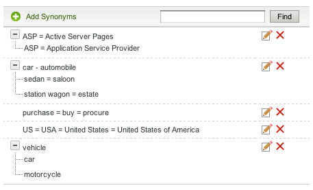
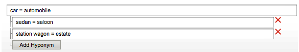

# 关于字典{#about-dictionaries}

您可以使用字典来管理字典的集合及其关联的同义词和同义词。

## 使用字典{#concept_B8028B71EC8144669614C64578EDB034}

同义词是指具有相同或类似含义的词，如裤子、牛仔裤、裤子和长裤，或购买、购买、获取和订购。

同义词是单向同义词，当同义词不合适时，提供一种解决方案。 例如，服装零售网站的热门搜索词是“pants”。 但是，搜索结果中不显示牛仔裤。 在这种情况下，您可以使用混搭词将牛仔裤和裤子关联起来，但允许搜索牛仔裤以仅返回牛仔裤。 使用混合词，还可以为终止的产品或竞争条款提供匹配。 此策略确保对其他搜索结果的影响最小。 例如，如果“S2000”产品已停止，且“S3000”是其后继名，则使用混音而不是同义词，以确保“S3000”的搜索结果不包含任何杂散的“S2000”结果。

当客户输入网页上不存在的非精确匹配术语时，同义词和混合词可帮助客户找到相关搜索结果。 例如，如果网站中使用“pants”一词，您可以创建将“pants”和“thaes”结合在一起的同义词。 反之，当客户搜索“裤子”时，会返回与裤子相关的搜索结果。

同义词和混合词被组合为域词典。 这些是您为特定主题或目的创建的特殊词典。

“字典菜单”页列表帐户当前定义的所有域字典。 在此主页中，您可以重命名、编辑、删除或启用和禁用域词典。

## 了解同义词和同义符号{#section_B459CCB850974F4FB16A14E489BBBEC0}

下图是同义词和同义词关系的一组术语的示例。

明确定义了六个主要同义词关系。 每个术语以等号(=)分隔。

* “汽车”是汽车的同义词。
* “轿车”是轿车的同义词。
* “旅行车”是房地产的同义词。
* “ASP”是Active Server页面和应用程序服务提供商的同义词。
* “购买”、“购买”和“采购”是彼此的同义词。
* “US”、“USA”和“United States of America”是彼此的同义词。

包含单个单词的行是纯同义词。 具有可扩展树的行构成混合关系。 在示例中，第二棵树将轿车、轿车、货车和房地界定义为汽车和汽车的混合体。 相反，汽车和汽车是树中其余术语的超级词。

第三棵树把汽车和摩托车定义为汽车的假名。

您可以在每个同义词中包含多个首字母缩写和／或多词扩展，如上面的“US”同义词示例所示。 当单词或首字母缩略词具有多个含义时，请为每个含义创建一个同义词，如上面的“ASP”示例中所示。 通过添加多个同义词，您可以确保搜索“应用程序服务提供商”时不会返回“活动服务器页面”的搜索结果。

“地名”不随其他地名而扩大。 同义词的同义词最多只会扩展一个级别。 例如，搜索“vehicle”将返回“car”和“automabile”的结果，但不返回“sedan”和“tastion wagon”的结果。

## 关于跨词典搜索词{#section_28E7F80CE68D4481BBF4F51EED237C67}

您可以在您添加的所有词典中搜索地名和同义词。 如果要编辑或删除可能存在于多个词典中的特定术语，此功能非常有用。 每个具有匹配结果的字典都显示其匹配的词集。 如果查询返回的集数超过1000个，则只显示前1000个。

请参阅[跨字典搜索](../c-about-linguistics-menu/c-about-dictionaries.md#task_8D2BACC6F9B4487FA82367CBEDEE306F)。

请参阅[编辑字典](../c-about-linguistics-menu/c-about-dictionaries.md#task_7B349B2D385048D7A06E754FAB75316A)。

## 关于将字典配置为词干字典{#section_B859E2E957674F558AC6F8D05A0ED190}

词干，即搜索词根的能力，它可以以三种模式之一运行：域词典、默认替代字Forms和无。

请参阅[关于单词和语言](../c-about-linguistics-menu/c-about-words-and-language.md#concept_CEB4B9576F3C4E2EB87B352EEC738D79)。

以下信息假定您的帐户已将&#x200B;**[!UICONTROL Alternative Word Forms]**&#x200B;设置为&#x200B;**[!UICONTROL Domain Dictionaries]**，以便您可以将特定域词典配置为茎源。

你可以把任何域词典都变成“词干词典”。 它的同义词和地名继续扩大，但有额外的副作用。 如果在另一本字典中找到任何常用术语，甚至其本身也是如此，它将其词组与这些同义词或同义词合并。 你可以把它看成另一个级别的词扩展。

如果没有词干、同义词和混合词，则必须详尽而完整，将每个相关单词列为成员。

下面是同义词和无词干的示例：

* 同义词：角拐=正在运行
* “慢跑”的查询会产生文档，词语为“跑步”和“慢跑”。
* “跑”的查询与“慢跑”的文档相同。
* 没有“jog”和“running”的网页，但有“runs”和“run”等其他单词格式的网页在查询结果中缺失。

在此示例中，查询词不展开，除非它是特定同义词或同义词的成员。

以下是同义词和词干的示例：

* 同义词：角拐=正在运行
* 来自词干词典的同义词条目：运行=运行=运行
* 查询“角拐”或“角拐”将返回所有带有“runs”、“running”、“run”和“角拐”字样的网页。
* “runs”和“run”的查询返回相同或类似的结果。

在本示例中，词根词典的同义词能够将其组对等词与任何其它词典中至少有一个词的同义词或同义词合并。

指定词过多的字典可能会产生性能影响。 您应将域词典指定为词根词典。 在搜索过程中，词干还可以产生意想不到的词扩展，并使调试和跟踪词扩展的过程变得复杂。

请参阅[将字典配置为词干字典](../c-about-linguistics-menu/c-about-dictionaries.md#task_541E8453A12F4A8E89CF6F595469F074)。

## 添加新词典{#task_F31AC6723E894C4F91D12AB2A4CEE9FB}

您可以添加新的同义词和混合义词词典，以帮助客户找到相关的搜索结果。 当客户输入网页上可能不存在的非精确匹配术语时，此功能特别有用。

另请参阅[添加新业务规则](../c-about-rules-menu/c-about-business-rules.md#task_BD3B31ED48BB4B1B8F1DCD3BFA2528E7)。

**添加新词典**

1. 在产品菜单中，单击&#x200B;**[!UICONTROL Linguistics]** > **[!UICONTROL Dictionaries]**。
1. 在&#x200B;**[!UICONTROL Dictionary Menu]**&#x200B;页面上，单击&#x200B;**[!UICONTROL Add New Dictionary]**。
1. 在&#x200B;**[!UICONTROL Dictionary]**&#x200B;页面的&#x200B;**[!UICONTROL Name]**&#x200B;字段中，输入新词典的名称。
1. 单击 **[!UICONTROL Add Synonyms]**.
1. 在&#x200B;**[!UICONTROL Add Terms]**&#x200B;对话框中，执行下列操作之一：

   * 要添加同义词，请在主文本字段中输入两个或多个术语，用等号(=)分隔每个单词或短语。 比如，裤子=裤子=宽松裤。
   * 要添加地名，请在主文本字段中输入超名词。 单击&#x200B;**[!UICONTROL Add Hyponym]**，然后输入与您输入的超名相关的hyponym。 例如，“轿车”、“轿车”、“旅行车”和“房产”可以是“汽车”和“汽车”（二者都是超级豪宅）的混合名，如下所示。

      

      地名条目也可以形成同义词，如“轿车”和“轿车”。

1. 单击 **[!UICONTROL Save]**.
1. 执行以下操作之一：

   * 重复第4-6步，以添加更多同义词和同义词。
   * 继续下一步。

1. 要预览更改结果，请单击&#x200B;**[!UICONTROL regenerate your staged site index]**&#x200B;以重新构建分阶段网站索引。

   请参阅[运行实时或分阶段网站的完整索引……](../c-about-index-menu/c-about-full-index.md#task_F7FE04D8A1654A7787FCCA31B45EB42D)。

   请参阅[运行实时或分阶段网站的增量索引……](../c-about-index-menu/c-about-incremental-index.md#task_9BFB6157F3884B2FAECB7E0E9CA318CB)。
1. （可选）在产品菜单上，单击&#x200B;**[!UICONTROL Linguistics]** > **[!UICONTROL Dictionaries]**，然后执行下列操作之一：

   * 单击&#x200B;**[!UICONTROL History]**&#x200B;以还原您所做的任何更改。

      请参阅[使用历史记录选项](../t-using-the-history-option.md#task_70DD3F87A67242BBBD2CB27156F43002)。

   * 单击 **[!UICONTROL Live]**.

      请参阅[查看实时设置](../c-about-staging.md#task_401A0EBDB5DB4D4CA933CBA7BECDC10F)。

   * 单击 **[!UICONTROL Push Live]**.

      请参阅[实时推送舞台设置](../c-about-staging.md#task_44306783B4C0408AAA58B471DAF2D9A4)。

## 启用或禁用字典{#task_EC282EA0846942F6913918EA8218220B}

每个单词的关系是在您为网站编制索引时生成的。 在下一个索引操作之前，您可以打开或关闭已添加的任何字典。

**启用或禁用词典**

1. 在产品菜单中，单击&#x200B;**[!UICONTROL Linguistics]** > **[!UICONTROL Dictionaries]**。
1. 在&#x200B;**[!UICONTROL Dictionary Menu]**&#x200B;页面的表的&#x200B;**[!UICONTROL Enabled]**&#x200B;列下，执行下列操作之一：

   * 选中要打开并已编制索引的词典的框。
   * 取消选中您要关闭但尚未编制索引的词典的框。

1. 单击 **[!UICONTROL Save Changes]**.
1. 要预览更改结果，请单击&#x200B;**[!UICONTROL regenerate your staged site index]**&#x200B;以重新构建分阶段网站索引。

   请参阅[运行实时或分阶段网站的完整索引……](../c-about-index-menu/c-about-full-index.md#task_F7FE04D8A1654A7787FCCA31B45EB42D)。

   请参阅[运行实时或分阶段网站的增量索引……](../c-about-index-menu/c-about-incremental-index.md#task_9BFB6157F3884B2FAECB7E0E9CA318CB)。
1. （可选）在产品菜单上，单击&#x200B;**[!UICONTROL Linguistics]** > **[!UICONTROL Dictionaries]**，然后执行下列操作之一：

   * 单击&#x200B;**[!UICONTROL History]**&#x200B;以还原您所做的任何更改。

      请参阅[使用历史记录选项](../t-using-the-history-option.md#task_70DD3F87A67242BBBD2CB27156F43002)。

   * 单击 **[!UICONTROL Live]**.

      请参阅[查看实时设置](../c-about-staging.md#task_401A0EBDB5DB4D4CA933CBA7BECDC10F)。

   * 单击 **[!UICONTROL Push Live]**.

      请参阅[实时推送舞台设置](../c-about-staging.md#task_44306783B4C0408AAA58B471DAF2D9A4)。

## 编辑字典{#task_7B349B2D385048D7A06E754FAB75316A}

可以编辑或删除组成特定词典的同义词和同义词组。

<!-- 

t_editing_a_dictionary.xml

 -->

您还可以使用&#x200B;**[!UICONTROL Find]**&#x200B;查找要在所有词典中编辑或删除的特定同义词和混合词。

**编辑字典**

1. 在产品菜单中，单击&#x200B;**[!UICONTROL Linguistics]** > **[!UICONTROL Dictionaries]**。
1. 执行以下操作之一：

   * 在[!DNL Dictionary Menu]页的表中，单击要编辑或删除其术语的单个词典的超链接名称。
   * 在[!DNL Dictionary Menu]页面的&#x200B;**[!UICONTROL Find]**&#x200B;文本字段中，键入要在所有字典中查找的术语，然后单击&#x200B;**[!UICONTROL Find]**。

      在[!DNL Find in Dictionaries]页面上，使用随附的下拉列表设置所需的细化选项。

      <table> 
      <thead> 
        <tr> 
        <th colname="col1" class="entry"> 
选项 
 </th> 
        <th colname="col2" class="entry"> 
描述 
 </th> 
        </tr> 
      </thead>
      <tbody> 
        <tr> 
        <td colname="col1"> 
查找 
 </td> 
        <td colname="col2"> 
允许您输入要在所有词典中搜索的词。 
 </td> 
        </tr> 
        <tr> 
        <td colname="col1"> 
匹配下拉列表 
 </td> 
        <td colname="col2"> 
允许您从以下四种类型的匹配中进行选择： 
        <ul id="ul_D656F159677946938050115F610EEF4B"> 
        <li id="li_2D6B302E021A4CE7A47F028812633EDC">  精确匹配   
查询必须与同义词或同义词完全匹配。 
 </li> 
        <li id="li_30AD5976E43041E98190F4757E821092">  包含文本   
查询只需要子字符串匹配；同义词或同义词中的匹配。 
 </li> 
        <li id="li_9BF911EFB54345BB82679BDE51DDF8AF">  开始于  
查询仅与每个同义词和同义词的开头匹配。 
 </li> 
        <li id="li_CB791C7F5B5A4496B329ED505E7D97BC">  字匹配   
查询与同义词或同义词的每个单词进行比较，但该单词必须完全匹配。 
 </li> 
        </ul> 
 </td> 
        </tr> 
        <tr> 
        <td colname="col1"> 
启用／禁用词典下拉列表 
 </td> 
        <td colname="col2"> 
允许您从以下选项中进行选择： 
        <ul id="ul_EBBD3F3A2D854952A35CBDDBECB40958"> 
        <li id="li_7F5654C284BE485EAC9B000A663C6C60">  已启用和已禁用词典   
在启用和禁用的词典中搜索指定的术语。 
 </li> 
        <li id="li_4A83EECF38044287A923EC0AAF639079">  仅启用词典   
仅搜索启用的词典有助于调试当前索引。 
 </li> 
        </ul> 
 
请参阅<a href="../c-about-linguistics-menu/c-about-dictionaries.md#task_EC282EA0846942F6913918EA8218220B" type="task" format="dita" scope="local">启用或禁用字典</a>。 
 </td> 
        </tr> 
        <tr> 
        <td colname="col1"> 
暂存／实时下拉列表 
 </td> 
        <td colname="col2"> 
允许您从以下选项中进行选择： 
        <ul id="ul_BD0733A30E6B470E942B21F499A4373B"> 
        <li id="li_F9A8C39C22EA4FBF86536F5924ED973C">  暂存／实时词典   
在分阶段和实时词典中搜索指定术语。 但是，它只搜索词典的分阶段版本（如果存在）。 如果分阶段版本不存在，它将搜索字典的实时版本。 
 </li> 
        <li id="li_DB0944DB18564269AA10676BDFDB0460">  实时词典   
仅在实时词典中搜索指定术语。 
 </li> 
        </ul> 
 </td> 
        </tr> 
      </tbody> 
      </table>

1. 在表中，执行下列操作之一：

   * 单击与要更新的术语关联的。 在&#x200B;**[!UICONTROL Edit Terms]**&#x200B;对话框中，更改所需的术语。 完成后，单击&#x200B;**[!UICONTROL Save]**。

   * 单击与要删除的词关联的。 在&#x200B;**[!UICONTROL Delete Terms]**&#x200B;对话框中，单击&#x200B;**[!UICONTROL Delete]**。 确保删除正确的术语；没有删除确认对话框。

1. 要预览更改结果，请单击&#x200B;**[!UICONTROL regenerate your staged site index]**&#x200B;以重新构建分阶段网站索引。

   请参阅[运行实时或分阶段网站的完整索引……](../c-about-index-menu/c-about-full-index.md#task_F7FE04D8A1654A7787FCCA31B45EB42D)。

   请参阅[运行实时或分阶段网站的增量索引……](../c-about-index-menu/c-about-incremental-index.md#task_9BFB6157F3884B2FAECB7E0E9CA318CB)。
1. （可选）在产品菜单上，单击&#x200B;**[!UICONTROL Linguistics]** > **[!UICONTROL Dictionaries]**，然后执行下列操作之一：

   * 单击&#x200B;**[!UICONTROL History]**&#x200B;以还原您所做的任何更改。

      请参阅[使用历史记录选项](../t-using-the-history-option.md#task_70DD3F87A67242BBBD2CB27156F43002)。

   * 单击 **[!UICONTROL Live]**.

      请参阅[查看实时设置](../c-about-staging.md#task_401A0EBDB5DB4D4CA933CBA7BECDC10F)。

   * 单击 **[!UICONTROL Push Live]**.

      请参阅[实时推送舞台设置](../c-about-staging.md#task_44306783B4C0408AAA58B471DAF2D9A4)。

## 重命名字典{#task_7F1F372B337B4853BFA2A60AD267B092}

您可以更改已添加的词典的名称。

<!-- 

t_renaming_a_dictionary.xml

 -->

如果将&#x200B;**[!UICONTROL Alternate Word Forms]**&#x200B;选项设置为&#x200B;**[!UICONTROL Words & Language]**&#x200B;中的&#x200B;**[!UICONTROL Domain Dictionaries]**，则使用选项&#x200B;**[!UICONTROL Configure]**&#x200B;代替&#x200B;**[!UICONTROL Rename]**。

请参阅[关于单词和语言](../c-about-linguistics-menu/c-about-words-and-language.md#concept_CEB4B9576F3C4E2EB87B352EEC738D79)。

**重命名字典**

1. 在产品菜单中，单击&#x200B;**[!UICONTROL Linguistics]** > **[!UICONTROL Dictionaries]**。
1. 在&#x200B;**[!UICONTROL Dictionary Menu]**&#x200B;页面的表的&#x200B;**[!UICONTROL Actions]**&#x200B;列下，执行下列操作之一：

   * 单击&#x200B;**[!UICONTROL Rename]**&#x200B;以查看要更改其名称的关联词典。

      在&#x200B;**[!UICONTROL Rename Dictionary]**&#x200B;对话框中。 在&#x200B;**[!UICONTROL Name]**&#x200B;字段中，输入字典的新名称。

      单击 **[!UICONTROL Rename File]**.

   * 单击&#x200B;**[!UICONTROL Configure]**&#x200B;以查看要更改其名称的关联词典。

      在&#x200B;**[!UICONTROL Configure Dictionary]**&#x200B;对话框中。 在&#x200B;**[!UICONTROL Name]**&#x200B;字段中，输入字典的新名称。

      单击 **[!UICONTROL Save Configuration]**.

1. （可选）执行下列操作之一：

   * 单击&#x200B;**[!UICONTROL History]**&#x200B;以还原您所做的任何更改。

      请参阅[使用历史记录选项](../t-using-the-history-option.md#task_70DD3F87A67242BBBD2CB27156F43002)。

   * 单击 **[!UICONTROL Live]**.

      请参阅[查看实时设置](../c-about-staging.md#task_401A0EBDB5DB4D4CA933CBA7BECDC10F)。

   * 单击 **[!UICONTROL Push Live]**.

      请参阅[实时推送舞台设置](../c-about-staging.md#task_44306783B4C0408AAA58B471DAF2D9A4)。

## 将字典配置为词干字典{#task_541E8453A12F4A8E89CF6F595469F074}

您可以将词典设置为高级词干模式，以便在搜索中利用词干。

<!-- 

t_configuring_a_dictionary_as_a_stemming_dictionary.xml

 -->

这种模式会返回与客户正在搜索的内容的变体匹配的网页。

请参阅[关于字典](../c-about-linguistics-menu/c-about-dictionaries.md#concept_B8028B71EC8144669614C64578EDB034)。

请参阅[关于单词和语言](../c-about-linguistics-menu/c-about-words-and-language.md#concept_CEB4B9576F3C4E2EB87B352EEC738D79)。

**将字典配置为词干字典**

1. 在产品菜单中，单击&#x200B;**[!UICONTROL Linguistics]** > **[!UICONTROL Words & Language]**。
1. 在[!DNL Words & Languages]页面的&#x200B;**[!UICONTROL Alternate Words Forms]**&#x200B;下拉列表中，选择&#x200B;**[!UICONTROL Domain Dictionaries]**。

   任何设置为词干词典的域词典（请参阅下面的步骤7）都用作替代词表单的源。

1. 单击 **[!UICONTROL Save Changes]**.
1. 在产品菜单中，单击&#x200B;**[!UICONTROL Linguistics]** > **[!UICONTROL Dictionaries]**。
1. 在[!DNL Dictionaries Menu]页面的表中的&#x200B;**[!UICONTROL Actions]**&#x200B;列下，单击&#x200B;**[!UICONTROL Configure]**&#x200B;以获取要设置为词干词典的关联词典。
1. 在&#x200B;**[!UICONTROL Configure Dictionary]**&#x200B;对话框的&#x200B;**[!UICONTROL Advanced Stemming Mode]**&#x200B;下拉列表中，选择&#x200B;**[!UICONTROL Yes]**。
1. 单击 **[!UICONTROL Save Configuration]**.
1. 单击&#x200B;**[!UICONTROL regenerate your staged site index]**&#x200B;可重新构建分阶段网站索引。

   请参阅[运行实时或分阶段网站的完整索引……](../c-about-index-menu/c-about-full-index.md#task_F7FE04D8A1654A7787FCCA31B45EB42D)。

   请参阅[运行实时或分阶段网站的增量索引……](../c-about-index-menu/c-about-incremental-index.md#task_9BFB6157F3884B2FAECB7E0E9CA318CB)。
1. （可选）在产品菜单上，单击&#x200B;**[!UICONTROL Linguistics]** > **[!UICONTROL Dictionaries]**，然后执行下列操作之一：

   * 单击&#x200B;**[!UICONTROL History]**&#x200B;以还原您所做的任何更改。

      请参阅[使用历史记录选项](../t-using-the-history-option.md#task_70DD3F87A67242BBBD2CB27156F43002)。

   * 单击 **[!UICONTROL Live]**.

      请参阅[查看实时设置](../c-about-staging.md#task_401A0EBDB5DB4D4CA933CBA7BECDC10F)。

   * 单击 **[!UICONTROL Push Live]**.

      请参阅[实时推送舞台设置](../c-about-staging.md#task_44306783B4C0408AAA58B471DAF2D9A4)。

## 在词典中搜索{#task_8D2BACC6F9B4487FA82367CBEDEE306F}

您可以在添加到网站搜索／销售的所有词典中搜索地名和同义词。

<!-- 

t_searching_across_dictionaries.xml

 -->

如果要编辑或删除可能存在于多个词典中的特定术语，此功能非常有用。 每个具有匹配结果的字典都显示其匹配的词集。 如果查询返回的集数超过1000个，则只显示前1000个。

请参阅[编辑字典](../c-about-linguistics-menu/c-about-dictionaries.md#task_7B349B2D385048D7A06E754FAB75316A)。

**要在字典中搜索**

1. 在产品菜单中，单击&#x200B;**[!UICONTROL Linguistics]** > **[!UICONTROL Dictionaries]**。
1. 在[!DNL Dictionary Menu]页面的&#x200B;**[!UICONTROL Find]**&#x200B;文本字段中，键入要在所有字典中查找的术语，然后单击&#x200B;**[!UICONTROL Find]**。
1. 在[!DNL Find in Dictionaries]页面上，使用随附的下拉列表设置所需的任何细化选项。

   请参阅[编辑字典](../c-about-linguistics-menu/c-about-dictionaries.md#task_7B349B2D385048D7A06E754FAB75316A)。
1. （可选）使用&#x200B;**[!UICONTROL Show]**&#x200B;下拉列表指定每页要显示的结果的最大数量。

## 删除字典{#task_DBAAEE624BC14D2590444B0B7869ECCA}

您可以删除不再需要或使用的词典。

<!-- 

t_deleting_a_dictionary.xml

 -->

如果删除实时的字典，则会将其暂存以删除。 如果删除已暂存的词典，则会立即删除该词典。

确保删除的是您知道更需要的字典；没有可还原删除的历史记录功能。

**删除字典**

1. 在产品菜单中，单击&#x200B;**[!UICONTROL Linguistics]** > **[!UICONTROL Dictionaries]**。
1. 在[!DNL Dictionary Menu]页面的表的&#x200B;**[!UICONTROL Actions]**&#x200B;列下，单击&#x200B;**[!UICONTROL Delete]**&#x200B;以获取要删除的关联词典。
1. 在&#x200B;**[!UICONTROL Delete Dictionary]**&#x200B;对话框中。 单击&#x200B;**[!UICONTROL Yes]**&#x200B;以确认删除。
1. （可选）如果删除了活动词典，请执行下列操作之一：

   * 单击 **[!UICONTROL Live]**.

      请参阅[查看实时设置](../c-about-staging.md#task_401A0EBDB5DB4D4CA933CBA7BECDC10F)。

   * 单击 **[!UICONTROL Push Live]**.

      请参阅[实时推送舞台设置](../c-about-staging.md#task_44306783B4C0408AAA58B471DAF2D9A4)。

