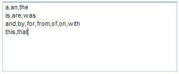
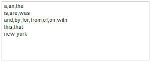

# 关于排除的单词{#about-excluded-words}

您可以使用“排除的单词”来指定您希望从搜索结果中遗漏的常用短语和常用单词，如“a”和“the”。

## 使用排除的单词{#concept_9DB67BD2F0DC43AC88741003D9F39812}

另请参阅[关于搜索](../c-about-settings-menu/c-about-searching-menu.md#concept_207105CF26B1448F8A3D223787C56AB8)。

如果没有排除的词，包含这些词的搜索可能会识别大量不相关的结果。 排除单词和短语时，将忽略仅与您指定的被排除术语匹配的搜索结果。 如果搜索查询包含排除的单词，则仅使用非排除的单词来查找文档。

排除的搜索词不会在搜索结果中突出显示。 但是，每个结果的相关性得分受排除的词的影响。 换句话说，在查找文档时，排除的词会被忽略，但在对搜索结果页面上的文档进行排名时，仍会使用这些词。 在“排除的词语”设置（或对这些设置的更改）的效果对客户可用之前，请确保重新生成网站索引。

在输入要从搜索结果中排除的单词时，可以用逗号将单词或短语分开。 您可以为每行输入一个或多个排除字。 以下是用逗号隔开的单独行上排除的词的示例。

使用上述排除字词的示例列表，如果您的客户搜索“美国”，则搜索中将排除“the”和“of”这两个词。 相反，搜索会查找所有包含“united”、“states”和“america”字样的页面。 不显示仅包含单词“of”或“the”的页面。

某些站点在大多数或所有页面上都包含特定短语。 例如，纽约旅游网站的每个页面标题中都可以包含“纽约”字样。 请考虑将此短语和其他类似短语添加到排除列表:

排除某个词组后，构成该词组的单个词仍用作搜索词。 只有当访客按排除短语的确切顺序搜索确切单词时，搜索结果中才会排除该短语。 使用上例，如果客户搜索了“纽约芭蕾舞团”，则不包括“the”和“new york”；仅包含“ballet”一词的页面将作为搜索结果返回。 另一方面，搜索“new boulds”或“duke of york”时，仍会找到分别包含“new”或“york”的页面。

## 配置排除的单词{#task_60BF6BB7A66C48479D2BBB32C0F38CDE}

您可以从搜索结果中排除常用短语和常用词。

您可以在每行输入一个或多个单词。 用逗号分隔每个单词，如下例所示：

当客户搜索中的所有词都被排除时，您可以选择显示搜索结果。 例如，如果您排除了“the”一词，而客户选择只搜索“the”，则搜索结果将显示包含“the”一词的任何页面。 即使排除了“the”一词，结果也是正确的。 如果不选中此选项，则客户将不获得任何搜索结果。 如果搜索包含至少一个未排除的单词，则此设置无效。

**配置排除的词**

1. 在产品菜单上，单击&#x200B;**[!UICONTROL Linguistics]** > **[!UICONTROL Excluded Words]**。
1. 在[!DNL Excluded Words]页面的&#x200B;**[!UICONTROL Words and Phrases]**&#x200B;文本字段中，输入要从搜索结果中排除的单词。
1. （可选）单击&#x200B;**[!UICONTROL Show results when all words in the query are excluded words]**。

   当客户搜索中的所有单词都被排除时，所有单词将一起用于执行搜索。
1. 单击 **[!UICONTROL Save Changes]**.
1. 要预览更改的结果，请单击&#x200B;**[!UICONTROL regenerate your staged site index]**&#x200B;以重新构建分阶段网站索引。

   请参阅[运行实时或分阶段网站的完整索引……](../c-about-index-menu/c-about-full-index.md#task_F7FE04D8A1654A7787FCCA31B45EB42D)。

   请参阅[运行实时或分阶段网站的增量索引……](../c-about-index-menu/c-about-incremental-index.md#task_9BFB6157F3884B2FAECB7E0E9CA318CB)。
1. （可选）在产品菜单上，单击&#x200B;**[!UICONTROL Linguistics]** > **[!UICONTROL Excluded Words]**，然后执行以下操作之一：

   * 单击&#x200B;**[!UICONTROL History]**&#x200B;可还原您所做的任何更改。

      请参阅[使用历史记录选项](../t-using-the-history-option.md#task_70DD3F87A67242BBBD2CB27156F43002)。

   * 单击 **[!UICONTROL Live]**.

      请参阅[查看实时设置](../c-about-staging.md#task_401A0EBDB5DB4D4CA933CBA7BECDC10F)。

   * 单击 **[!UICONTROL Push Live]**.

      请参阅[实时推送舞台设置](../c-about-staging.md#task_44306783B4C0408AAA58B471DAF2D9A4)。

