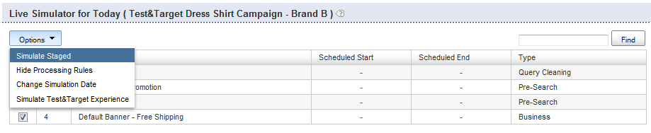

# 关于Business Rules{#about-business-rules}

您可以使用业务规则来推销您的搜索。

## 使用业务规则{#concept_2A93D76216754D3D8412CDEA00BD26BD}

例如，您可以配置横幅的显示时间、结果的显示和顺序。 您还可以配置项目在facet中的位置，以及用于给定搜索的模板。 这些规则按照定义的顺序运行；规则的订单编号越高，其在流程中运行得越晚，超过了之前的规则。 您可以拖放规则以更改其顺序，也可以通过在规则顺序文本框中输入新编号对规则重新排序。

每个业务规则都由触发器和操作组成。

触发器定义规则何时运行。 例如，当查询词为“mens”或结果大多为帽子时。 触发器由多个条件组成，这些条件必须全部为，或者其中任何一个条件必须为true才能使整个触发器为真。 可以通过更改触发器运算符来指定优先级。

操作定义满足触发条件时发生的情况。 例如，将横幅设置为显示或将给定结果移动到位置1。 规则表显示有关规则的摘要信息。 您可以单击规则名称以将其打开，并查看其他信息。

规则表显示所有业务规则的列表。 默认情况下，该表按降序显示添加的最后十个规则。 您可以单击表中的列标题，按升序或降序对规则排序。

业务规则可以包含以下三种状态之一：已批准、已暂停或WIP（在制品）

<table> 
 <thead> 
  <tr> 
   <th colname="col1" class="entry"> 
业务规则状态 
 </th> 
   <th colname="col2" class="entry"> 
描述 
 </th> 
  </tr> 
 </thead>
 <tbody> 
  <tr> 
   <td colname="col1"> 
已批准 
 </td> 
   <td colname="col2"> 
已批准的业务规则在您的实时环境和分阶段环境中运行。 您可以在高级规则生成器中批准业务规则。 
 </td> 
  </tr> 
  <tr> 
   <td colname="col1"> 
挂起 
 </td> 
   <td colname="col2"> 
挂起的业务规则从不在您的分阶段环境或实时环境中运行。 
 </td> 
  </tr> 
  <tr> 
   <td colname="col1"> 
WIP 
 </td> 
   <td colname="col2"> 
WIP（在制品）是既未批准也未暂停的业务规则。 即，您可能仍在处理它们，或者在批准它们之前，可能希望先对它们进行测试。 处于WIP状态的业务规则仅在已提货环境中运行。 
 </td> 
  </tr> 
 </tbody> 
</table>

您批准业务规则并将其实时推送，以便它们在您的实时环境中运行。 当前，只能将&#x200B;*所有*&#x200B;规则实时推送。 但是，您可以更改规则的状态，以控制哪些规则在您的实时环境中运行和不运行。

默认情况下，规则在满足其关联触发器时运行。 但是，您可以选择计划规则，以在特定日期和时间范围内运行。

此外，默认情况下，规则在满足所有商店的关联触发器时运行。 如果希望规则仅应用于某些商店，则可以使用“商店”面板选择应用该规则的一个或多个商店。

## 添加新业务规则{#task_BD3B31ED48BB4B1B8F1DCD3BFA2528E7}

您可以使用[!DNL Visual Rule Builder]或[!DNL Advanced Rule Builder]添加可定制客户搜索体验的业务规则。

**添加新业务规则**

以下步骤假定您使用可视规则生成器。

1. 执行以下操作之一：

   * 在产品菜单上，单击&#x200B;**[!UICONTROL Rules]** > **[!UICONTROL Business Rules]**。 在[!DNL Business Rules]页面上，单击&#x200B;**[!UICONTROL Add New Rule]**。

   * 在产品菜单上，单击&#x200B;**[!UICONTROL Simulator]**。 在&#x200B;**[!UICONTROL Simulator for Today]**&#x200B;页面上，单击&#x200B;**[!UICONTROL Options]**&#x200B;下拉菜单右侧的&#x200B;**[!UICONTROL Add New Rule]**。

      如果页面上未显示&#x200B;**[!UICONTROL Add New Rule]**&#x200B;选项，请在&#x200B;**[!UICONTROL Options]**&#x200B;下拉菜单中单击&#x200B;**[!UICONTROL Simulate Staged]**。

      

1. 在&#x200B;**[!UICONTROL Name]**&#x200B;文本字段中，键入业务规则的新名称。

   尚未单击&#x200B;**[!UICONTROL Save Rule]**。
1. （可选）如果您管理大量业务规则，则可以用特定标签标记业务规则。 在&#x200B;**[!UICONTROL Tags]**&#x200B;字段中，输入一个或多个标签，使用逗号、Tab或Enter作为分隔符。

   在[!DNL Business Rules]页面上，使用&#x200B;**[!UICONTROL Filter by tag]**&#x200B;功能筛选与给定标签匹配的规则。 1.在[!DNL Business Rule Builder]页面中，设置要使用的触发器和操作。

   **触发器选项**

   触发器是运行业务规则必须满足的条件。 当业务规则有多个触发器时，您可以使用以下三种方法之一配置触发器的响应方式：

   * 所有触发器都必须为true（默认设置）的响应，如下例所示：

      `if a AND b AND c then ...`

   * 任何触发器都必须为true的响应，如以下示例中所示：

      `if a OR b OR c then ...`

   * 指定触发器的自定义组合的响应。 即，将单个触发器或“conditions”与`AND`运算符和`OR`运算符组合。

      您还可以通过添加左括号和右括号组合来更改评估的优先级，如下例所示：

      `if (a OR b) AND c then ...`

      >[!NOTE]
      >
      >如果将`AND`运算符与`OR`运算符组合在自定义业务规则集中，请确保正确地指定括号以确保以正确的顺序评估触发器。

      默认情况下，无法启用自定义触发器组合这一特殊功能。 请联系技术支持以激活此功能供您使用。
   <table> 
      <thead> 
      <tr> 
      <th colname="col1" class="entry"> 
触发器选项 
 </th> 
      <th colname="col2" class="entry"> 
描述 
 </th> 
      </tr> 
    </thead>
    <tbody> 
      <tr> 
      <td colname="col1"> 
关键字匹配 
 </td> 
      <td colname="col2"> 
当搜索词与给定区分大小写的关键字匹配时，触发器为true。 触发器对于关键字及其所有同义词均为true，如语言词典中所定义。 
 </td> 
      </tr> 
      <tr> 
      <td colname="col1"> 
 查询匹配 
 </td> 
      <td colname="col2"> 
 当所有搜索参数匹配时，触发器为true。 
 </td> 
      </tr> 
      <tr> 
      <td colname="col1"> 
 结果组占优势 
 </td> 
      <td colname="col2"> 
 当给定搜索定义的结果组主导结果集时，触发器为true。 
 
默认情况下，主导权设定为50%。 此设置是您可以设置的促销首选项。 
 
 
        <!--See <xref href="t_Configuring_Merchandising_preferences.xml#task_7AC7B9F5D9F44E10AB5BC0B8CB31C37A" type="task" format="dita" scope="local">Configuring Merchandising preferences</xref>. --> 
 
要使此触发器为true，整个组必须在结果集中。 结果组是动态的。 根据与原始搜索条件匹配的结果，索引操作后可以更改。 
 </td> 
      </tr> 
      <tr> 
      <td colname="col1"> 
结果组存在 
 </td> 
      <td colname="col2"> 
 如果结果集中存在给定搜索定义的结果组，则触发器为true。 要满足此触发器，必须在结果集中包含整个组（结果可在任何页面上显示）。 结果组是动态的，在索引操作之后可能会根据与原始搜索条件匹配的结果而改变。 
 </td> 
      </tr> 
      <tr> 
      <td colname="col1"> 
 结果显示 
 </td> 
      <td colname="col2"> 
 当在结果集中找到单个结果时，触发器为true。 结果可以位于结果集中的任意位置，而不必位于用户当前查看的页面上。 
 </td> 
      </tr> 
    </tbody> 
    </table>

   **操作选项**

   当满足业务规则的触发器时，将执行与规则关联的操作。 可视化规则生成器允许您创建以下操作，但您可以使用高级规则生成器创建其他类型的操作。

   下表中的“删除Facet项”(Remove Facet Item)、“显示Facet项”(Reveal Facet)、“删除Facet”(Remove Facet)、“推送Facet项”(Push Facet Item)操作需要facet。 选择facet的界面取决于帐户的配置方式。 例如，普通帐户使用下拉式列表来选择彩块化。 但是，如果您的帐户具有已开槽的facet，则会出现一个自动完成文本框，您可以在其中输入任何facet的名称。 在您键入facet的名称时，自动完成会在下拉列表中建议facet。 建议包括当前定义的彩块化。 如果您的帐户有插槽图，则还建议使用已开槽的彩块化。

   <table> 
    <thead> 
      <tr> 
      <th colname="col1" class="entry"> 
动作选项 
 </th> 
      <th colname="col2" class="entry"> 
描述 
 </th> 
      </tr> 
    </thead>
    <tbody> 
      <tr> 
      <td colname="col1"> 
推送组 
 </td> 
      <td colname="col2"> 
 将由指定搜索条件定义的搜索结果组推送到特定位置。 
 
推送搜索结果组不会隐式添加该组。 
 </td> 
      </tr> 
      <tr> 
      <td colname="col1"> 
添加组 
 </td> 
      <td colname="col2"> 
 添加由指定搜索条件定义的搜索结果组。 
 </td> 
      </tr> 
      <tr> 
      <td colname="col1"> 
删除组 
 </td> 
      <td colname="col2"> 
 删除由指定搜索条件定义的搜索结果组。 
 </td> 
      </tr> 
      <tr> 
      <td colname="col1"> 
单推 
 </td> 
      <td colname="col2"> 
 将单个搜索结果推送到所选位置。 
 </td> 
      </tr> 
      <tr> 
      <td colname="col1"> 
添加单个 
 </td> 
      <td colname="col2"> 
 将单个搜索结果添加到选定位置。 
 </td> 
      </tr> 
      <tr> 
      <td colname="col1"> 
删除单个 
 </td> 
      <td colname="col2"> 
 从搜索结果集中删除单个搜索结果。 
 </td> 
      </tr> 
      <tr> 
      <td colname="col1"> 
删除所有结果 
 </td> 
      <td colname="col2"> 
从搜索结果集中删除所有结果。 
 
 
        <!-- Bug #3331637 The option is meant to be used in conjunction with other rule actions in order to create "canned landing pages" where we want to create a page's content solely by rule actions, and need to completely discard the "natural" results of the search. Given that the other options don't have any kind of "here's how/why you might use this", I don't see much point in breaking that precedent here.--> 
 </td> 
      </tr> 
      <tr> 
      <td colname="col1"> 
选择其他横幅 
 </td> 
      <td colname="col2"> 
 更改选定横幅区域中的横幅。 
 
当您右键单击网页查看区域中的横幅时，此选项可用。 
 </td> 
      </tr> 
      <tr> 
      <td colname="col1"> 
添加横幅命令 
 </td> 
      <td colname="col2"> 
仅适用于Adobe Dynamic Media Classic模板。 
 
允许您更改在横幅模板中使用的默认参数。 
 
请参阅<a scope="local" href="../c-about-design-menu/c-about-banners.md#task_AD1E0C00A9E04B1FA819EB93288786B3" type="reference" format="dita">使用Adobe Dynamic Media Classic </a>添加横幅中的选项表。 
 
另请参阅<a href="../c-about-design-menu/c-about-banners.md#task_C3E782477FBF428ABEA220751781ACA9" type="task" format="dita" scope="local">使用Adobe Dynamic Media Classic </a>编辑横幅。 
 </td> 
      </tr> 
      <tr> 
      <td colname="col1"> 
删除横幅 
 </td> 
      <td colname="col2"> 
 从选定的横幅区域删除横幅；除非设置横幅的其他规则覆盖此规则，否则不会显示横幅。 
 
当您右键单击网页查看区域中的横幅时，此选项可用。 
 </td> 
      </tr> 
      <tr> 
      <td colname="col1"> 
推送彩块化项 
 </td> 
      <td colname="col2"> 
 将小平面内的项目推到所选位置。 
 </td> 
      </tr> 
      <tr> 
      <td colname="col1"> 
删除区域 
 </td> 
      <td colname="col2"> 
 从搜索结果页面中删除区域。 
 
另请参阅下面的“删除彩块化”(Remove Facet)操作。 
 </td> 
      </tr> 
      <tr> 
      <td colname="col1"> 
显示区域 
 </td> 
      <td colname="col2"> 
 在搜索结果页面中显示区域。 
 
另请参阅下面的“显示彩块化”(Revael Facet)操作。 
 </td> 
      </tr> 
      <tr> 
      <td colname="col1"> 
删除彩块化项 
 </td> 
      <td colname="col2"> 
 从facet中删除facet项。 
 </td> 
      </tr> 
      <tr> 
      <td colname="col1"> 
“显示 Facet 项目” 
 </td> 
      <td colname="col2"> 
 显示特定的facet项。 
 </td> 
      </tr> 
      <tr> 
      <td colname="col1"> 
显示彩块化 
 </td> 
      <td colname="col2"> 
 显示特定彩块化。 此操作比“显示区域”操作更为首选。 
 </td> 
      </tr> 
      <tr> 
      <td colname="col1"> 
删除彩块化 
 </td> 
      <td colname="col2"> 
 删除特定facet。 此操作比“删除区域”操作更为首选。 
 </td> 
      </tr> 
    </tbody> 
    </table>

   根据处于活动状态（展开）的规则生成器面板，您还可以执行以下操作来设置触发器和操作。

   * 展开&#x200B;**[!UICONTROL Triggers]**&#x200B;面板时 — 在“业务规则生成器”页面的演示文稿模板区域中，右键单击任何搜索结果或搜索彩块化，然后单击&#x200B;**[!UICONTROL Add "result present" trigger]**。

      在“触发器”面板中，单击触发器左侧的“X”，以从触发器的列表中删除它。

   * 展开&#x200B;**[!UICONTROL Actions]**&#x200B;面板时 — 在“业务规则生成器”页面的演示模板区域，右键单击搜索结果。 单击&#x200B;**[!UICONTROL Add Result]**、**[!UICONTROL Remove Result]**、**[!UICONTROL Push to bottom]**&#x200B;或&#x200B;**[!UICONTROL Push to #`<n>`]**（其中`<n>`是数字）。

1. （可选）在任何“业务规则生成器”面板（[!DNL Triggers]、[!DNL Actions]或[!DNL Schedule]）中，执行下列操作之一：

   * 在“业务规则生成器”页面区域的演示文稿模板区域中，右键单击横幅，然后单击&#x200B;**[!UICONTROL Select different banner]**。 在&#x200B;**[!UICONTROL Pick Banner]**&#x200B;页面上，单击横幅缩略图下方的&#x200B;**[!UICONTROL Pick this banner]**，将其添加到演示文稿模板中。 只有与演示文稿模板上原始横幅的大小和区域匹配的横幅才可供您选择。

      添加横幅操作将添加到[!DNL Actions]面板。

   * 在[!DNL Business Rule Builder]页面的演示文稿模板区域中，右键单击要更改参数的Adobe Dynamic Media Classic模板横幅，然后单击&#x200B;**[!UICONTROL Add banner commands]**。 在[!DNL Change Parameters]对话框中，设置所需的参数选项。

      请参阅[使用Adobe Dynamic Media Classic](../c-about-design-menu/c-about-banners.md#task_AD1E0C00A9E04B1FA819EB93288786B3)添加横幅中的选项表。

      单击 **[!UICONTROL Save]**.

      参数更改将添加到[!DNL Actions]面板。

      另请参阅[使用Adobe Dynamic Media Classic](../c-about-design-menu/c-about-banners.md#task_C3E782477FBF428ABEA220751781ACA9)编辑横幅。

   * 在“业务规则生成器”页面的演示文稿模板区域中，右键单击要从页面中删除的横幅，然后单击&#x200B;**[!UICONTROL Remove banner]**。 删除横幅操作将添加到“操作”面板。

1. （可选）在&#x200B;**[!UICONTROL Schedule]**&#x200B;面板中，执行下列操作之一：

   * 单击&#x200B;**[!UICONTROL Run Indefinitely]**&#x200B;以在满足其关联触发器时运行规则。 此选项为默认值。
   * 单击&#x200B;**[!UICONTROL Fixed Schedule]**，然后指定开始日期和时间，以及规则在满足其关联触发器时运行的结束日期和时间。

1. 单击 **[!UICONTROL Save Rule]**.
1. （可选）在[!DNL Business Rules]页面上，执行下列操作之一：

   * 单击&#x200B;**[!UICONTROL History]**&#x200B;可还原您所做的任何更改。

      请参阅[使用历史记录选项](../t-using-the-history-option.md#task_70DD3F87A67242BBBD2CB27156F43002)。

   * 单击 **[!UICONTROL Live]**.

      请参阅[查看实时设置](../c-about-staging.md#task_401A0EBDB5DB4D4CA933CBA7BECDC10F)。

   * 单击 **[!UICONTROL Push Live]**.

      请参阅[实时推送舞台设置](../c-about-staging.md#task_44306783B4C0408AAA58B471DAF2D9A4)。

## 编辑业务规则{#task_375CFA75D1D94D9E92A35DE1228E5087}

您可以使用可视规则生成器或高级规则生成器来编辑已添加的业务规则。

**编辑新业务规则**

1. 在产品菜单上，单击&#x200B;**[!UICONTROL Rules]** > **[!UICONTROL Business Rules]**。
1. 在[!DNL Business Rules]页面上，执行以下操作之一：

   * 在[!DNL Name]列下，单击要更改的业务规则的名称。

      在&#x200B;**[!UICONTROL Settings]** > **[!UICONTROL My Profile]** > **[!UICONTROL My Preferences]**&#x200B;中指定的默认接口中打开业务规则。

   * 在下拉列表中，在要编辑的业务规则名称旁，单击&#x200B;**[!UICONTROL Edit in advanced mode]**&#x200B;或&#x200B;**[!UICONTROL Edit in visual mode]**。

1. 在[!DNL Name]文本字段中，键入业务规则的新名称。

   尚未单击&#x200B;**[!UICONTROL Save Rule]**。 1.在[!DNL Business Rule Builder]页面中，设置要使用的触发器和操作。

   请参阅[添加新业务规则](../c-about-rules-menu/c-about-business-rules.md#task_BD3B31ED48BB4B1B8F1DCD3BFA2528E7)下的选项表。
1. （可选）在任何&#x200B;**[!UICONTROL Business Rule Builder]**&#x200B;面板（[!DNL Triggers]、[!DNL Actions]或[!DNL Schedule]）中，执行下列任一操作：

   * 在[!DNL Business Rule Builder]页面的演示文稿模板区域中，右键单击横幅，然后单击&#x200B;**[!UICONTROL Select different banner]**。 在[!DNL Pick Banner page]上，单击横幅缩略图下方的&#x200B;**[!UICONTROL Pick this banner]**，将其添加到您的演示文稿模板中。 只有与演示文稿模板上原始横幅的大小和区域匹配的横幅才可供您选择。

      添加横幅操作将添加到[!DNL Actions]面板。

   * 在[!DNL Business Rule Builder]页面的演示文稿模板区域中，右键单击要更改参数的Adobe Dynamic Media Classic模板横幅，然后单击&#x200B;**[!UICONTROL Add banner commands]**。 在[!DNL Change Parameters]对话框中，设置所需的参数选项。

      请参阅[使用Adobe Dynamic Media Classic](../c-about-design-menu/c-about-banners.md#task_AD1E0C00A9E04B1FA819EB93288786B3)添加横幅中的选项表。

      单击 **[!UICONTROL Save]**.

      参数更改将添加到[!DNL Actions]面板。

      另请参阅[使用Adobe Dynamic Media Classic](../c-about-design-menu/c-about-banners.md#task_C3E782477FBF428ABEA220751781ACA9)编辑横幅。

   * 在[!DNL Business Rule Builder]页面的演示文稿模板区域中，右键单击要从页面中删除的横幅，然后单击&#x200B;**[!UICONTROL Remove banner]**。 删除横幅操作将添加到[!DNL Actions]面板。

1. （可选）在[!DNL Schedule]面板中，执行下列操作之一：

   * 单击&#x200B;**[!UICONTROL Run Indefinitely]**&#x200B;以在满足其关联触发器时运行规则。 此选项为默认值。
   * 单击&#x200B;**[!UICONTROL Fixed Schedule]**，然后指定开始日期和时间，以及规则在满足其关联触发器时运行的结束日期和时间。

1. 单击 **[!UICONTROL Save Rule]**.

   [!DNL Business Rule Builder]页面将关闭，您将返回到&#x200B;**[!UICONTROL Business Rule]**&#x200B;页面。 您的规则显示在表中。 单击&#x200B;**[!UICONTROL Modified]**&#x200B;列标题可按编辑日期对规则排序。 1. （可选）执行下列操作之一：

   * 单击&#x200B;**[!UICONTROL History]**&#x200B;可还原您所做的任何更改。

      请参阅[使用历史记录选项](../t-using-the-history-option.md#task_70DD3F87A67242BBBD2CB27156F43002)。

   * 单击 **[!UICONTROL Live]**.

      请参阅[查看实时设置](../c-about-staging.md#task_401A0EBDB5DB4D4CA933CBA7BECDC10F)。

   * 单击 **[!UICONTROL Push Live]**.

      请参阅[实时推送舞台设置](../c-about-staging.md#task_44306783B4C0408AAA58B471DAF2D9A4)。

## 复制业务规则{#task_89F1879C71A54EE9B7454439302C03EC}

您可以复制现有业务规则以用作要创建的新业务规则的基础。

**复制业务规则**

1. 在产品菜单上，单击&#x200B;**[!UICONTROL Rules]** > **[!UICONTROL Business Rules]**。
1. 在&#x200B;**[!UICONTROL Business Rules]**&#x200B;页面中，在要复制的业务规则名称旁的下拉列表中，单击&#x200B;**[!UICONTROL Copy rule]**。
1. 照常编辑复制的业务规则。

   请参阅[编辑业务规则](../c-about-rules-menu/c-about-business-rules.md#task_375CFA75D1D94D9E92A35DE1228E5087)。

## 批准业务规则{#task_BD569D18BF664272B8692294C162E2C1}

您可以激活状态为“WIP”（“在制品”）或已挂起的业务规则。

**批准业务规则**

1. 在产品菜单上，单击&#x200B;**[!UICONTROL Rule]** > **[!UICONTROL Business Rules]**。
1. 在[!DNL Business Rules]页面上，使用业务规则表[!DNL Status]列中的状态列标题对状态为&#x200B;**[!UICONTROL WIP]**&#x200B;或&#x200B;**[!UICONTROL suspended]**&#x200B;的规则进行排序。

   使用表左侧的复选框列标题检查当前在页面上显示的所有规则，或仅检查状态为&#x200B;**[!UICONTROL WIP]**&#x200B;或&#x200B;**[!UICONTROL suspended]**&#x200B;的规则。 1.在页面顶部附近的菜单栏上，单击&#x200B;**[!UICONTROL Approve]**。
1. 在&#x200B;**[!UICONTROL Confirm Action]**&#x200B;对话框中，单击&#x200B;**[!UICONTROL OK]**。
1. （可选）执行下列操作之一：

   * 单击&#x200B;**[!UICONTROL History]**&#x200B;可还原您所做的任何更改。

      请参阅[使用历史记录选项](../t-using-the-history-option.md#task_70DD3F87A67242BBBD2CB27156F43002)。

   * 单击 **[!UICONTROL Live]**.

      请参阅[查看实时设置](../c-about-staging.md#task_401A0EBDB5DB4D4CA933CBA7BECDC10F)。

   * 单击 **[!UICONTROL Push Live]**.

      请参阅[实时推送舞台设置](../c-about-staging.md#task_44306783B4C0408AAA58B471DAF2D9A4)。

## 暂停业务规则{#task_364E1FFB905141C08E306C8F1794A20E}

您可以暂停状态为“WIP（在制品）”或“已批准”的业务规则。

暂停某个规则时，您在用户界面中指示该规则暂时处于非活动状态，并将其上的任何工作推迟一段时间。 但是，您仍可以编辑挂起的规则。

**暂停业务规则**

1. 在产品菜单上，单击&#x200B;**[!UICONTROL Rule]** > **[!UICONTROL Business Rules]**。
1. 在[!DNL Business Rules]页面中，使用业务规则表的“状态”列中的状态，在表的最左列中检查状态为&#x200B;**[!UICONTROL WIP]**&#x200B;或&#x200B;**[!UICONTROL approved]**&#x200B;的规则。
1. 在页面顶部附近的菜单栏上，单击&#x200B;**[!UICONTROL Suspend]**。
1. 在&#x200B;**[!UICONTROL Confirm Action]**&#x200B;对话框中，单击&#x200B;**[!UICONTROL OK]**。
1. （可选）执行下列操作之一：

   * 单击&#x200B;**[!UICONTROL History]**&#x200B;可还原您所做的任何更改。

      请参阅[使用历史记录选项](../t-using-the-history-option.md#task_70DD3F87A67242BBBD2CB27156F43002)。

   * 单击 **[!UICONTROL Live]**.

      请参阅[查看实时设置](../c-about-staging.md#task_401A0EBDB5DB4D4CA933CBA7BECDC10F)。

   * 单击 **[!UICONTROL Push Live]**.

      请参阅[实时推送舞台设置](../c-about-staging.md#task_44306783B4C0408AAA58B471DAF2D9A4)。

## 恢复业务规则{#task_E67D678C765B436EA2A3D6ADD7A49ABA}

您可以恢复业务规则以重新激活挂起的规则。 在您恢复业务规则后，其状态将设置为“WIP”（“在制品”）。

**恢复业务规则**

1. 在产品菜单上，单击&#x200B;**[!UICONTROL Rule]** > **[!UICONTROL Business Rules]**。
1. 在[!DNL Business Rules]页面上，使用业务规则表的“状态”列中的状态，检查状态为&#x200B;**[!UICONTROL suspended]**&#x200B;的规则。
1. 在页面顶部附近的菜单栏上，单击&#x200B;**[!UICONTROL Resume]**。
1. 在[!DNL Confirm Action]对话框中，单击&#x200B;**[!UICONTROL OK]**。
1. （可选）执行下列操作之一：

   * 单击&#x200B;**[!UICONTROL History]**&#x200B;可还原您所做的任何更改。

      请参阅[使用历史记录选项](../t-using-the-history-option.md#task_70DD3F87A67242BBBD2CB27156F43002)。

   * 单击 **[!UICONTROL Live]**.

      请参阅[查看实时设置](../c-about-staging.md#task_401A0EBDB5DB4D4CA933CBA7BECDC10F)。

   * 单击 **[!UICONTROL Push Live]**.

      请参阅[实时推送舞台设置](../c-about-staging.md#task_44306783B4C0408AAA58B471DAF2D9A4)。

## 更改业务规则运行{#task_FE3B1C17307F49B49050C2EC5A063991}的顺序

您可以对业务规则重新排序，以更改它们在演示文稿模板上运行的顺序。

商业规则按照定义的顺序运行；规则的订单编号越高，其在流程中运行得越晚，超过了之前的规则。 通过在[!DNL Business Rules]页面的表的“顺序”列中输入新编号来重新排序规则。 您还可以对规则使用拖放来更改其运行顺序。

**更改业务规则运行的顺序**

1. 在产品菜单上，单击&#x200B;**[!UICONTROL Rule]** > **[!UICONTROL Business Rules]**。
1. 在[!DNL Business Rules]页面的表中，执行下列任一操作：

   * 单击&#x200B;**[!UICONTROL Order]**&#x200B;列标题以按升序或降序对规则排序。
   * 在&#x200B;**[!UICONTROL Order]**&#x200B;列中，在业务规则名称左侧的文本字段中，键入希望规则运行的订单编号。
   * 将表行拖放到希望规则运行的位置。 所有订单编号都会更新，以反映规则运行的新订单。

1. 单击 **[!UICONTROL Save Changes]**.

   您的业务规则现在将按您指定的顺序运行。 例外情况是，如果指定了重定向业务规则。 当触发或点击重定向业务规则时，业务规则处理会停止以允许重定向。
1. （可选）执行下列操作之一：

   * 单击&#x200B;**[!UICONTROL History]**&#x200B;可还原您所做的任何更改。

      请参阅[使用历史记录选项](../t-using-the-history-option.md#task_70DD3F87A67242BBBD2CB27156F43002)。

   * 单击 **[!UICONTROL Live]**.

      请参阅[查看实时设置](../c-about-staging.md#task_401A0EBDB5DB4D4CA933CBA7BECDC10F)。

   * 单击 **[!UICONTROL Push Live]**.

      请参阅[实时推送舞台设置](../c-about-staging.md#task_44306783B4C0408AAA58B471DAF2D9A4)。

## 删除业务规则{#task_AE37B42412044541BCC6D46CF8793DFF}

您可以使用“批量活动”下拉菜单删除其状态为WIP、挂起或已批准的业务规则。

**删除业务规则**

1. 在产品菜单上，单击&#x200B;**[!UICONTROL Rules]** > **[!UICONTROL Business Rules]**。
1. 在[!DNL Business Rules]页面上，执行以下操作之一：

   * 使用复选框列标题可检查页面上当前显示的所有规则。
   * 根据表的“状态”列中的状态，仅检查要删除的业务规则。

1. 在[!DNL Bulk Actions]下拉列表中，单击&#x200B;**[!UICONTROL Delete]**。
1. 在[!DNL Confirm Action]对话框中，单击&#x200B;**[!UICONTROL OK]**。
1. （可选）执行下列操作之一：

   * 单击&#x200B;**[!UICONTROL History]**&#x200B;可还原您所做的任何更改。

      请参阅[使用历史记录选项](../t-using-the-history-option.md#task_70DD3F87A67242BBBD2CB27156F43002)。

   * 单击 **[!UICONTROL Live]**.

      请参阅[查看实时设置](../c-about-staging.md#task_401A0EBDB5DB4D4CA933CBA7BECDC10F)。

   * 单击 **[!UICONTROL Push Live]**.

      请参阅[实时推送舞台设置](../c-about-staging.md#task_44306783B4C0408AAA58B471DAF2D9A4)。
