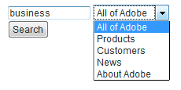
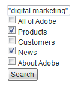
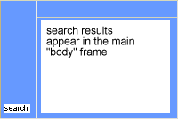
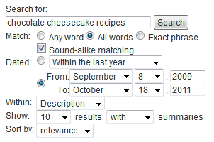

# 搜索表单{#search-forms}

## 在搜索表单中使用收藏集 {#reference_5A079AEEEFB84457892EF0870D0605C3}

通过收藏集，客户可以搜索网站的特定区域。 根据您实施的是下拉列表还是复选框列表，您可以让客户搜索单个收藏集或多个收藏集。

另请参阅[关于收藏集](../c-about-settings-menu/c-about-searching-menu.md#concept_62E42ACE53D54EEE9273433B86259127)。

以下示例显示了四个不同的收藏集名称及其所涵盖的网站的关联区域：

<table> 
 <thead> 
  <tr> 
   <th colname="col1" class="entry"> <p>集合名称 </p> </th> 
   <th colname="col2" class="entry"> <p> </p> </th> 
  </tr> 
 </thead>
 <tbody> 
  <tr> 
   <td colname="col1"> <p>产品 </p> </td> 
   <td colname="col2"> <p> 
     <ul id="ul_7AE70789C0914EBFBCCC7695C6F53B9E"> 
      <li id="li_72525BAA34E2442D86152F2FD8CA83D5"> https://www.mycompany.com/products.htm </li> 
      <li id="li_5CA4152239124BDBB251E6C94B15D45B"> https://www.mycompany.com/publish/ </li> 
      <li id="li_6E266736B3494696A3AFD841C4AFEC57"> https://www.mycompany.com/search/ </li> 
     </ul> </p> </td> 
  </tr> 
  <tr> 
   <td colname="col1"> <p>客户 </p> </td> 
   <td colname="col2"> <p>https://www.mycompany.com/customers/ </p> </td> 
  </tr> 
  <tr> 
   <td colname="col1"> <p>新闻 </p> </td> 
   <td colname="col2"> <p>https://www.mycompany.com/news/ </p> </td> 
  </tr> 
  <tr> 
   <td colname="col1"> <p>关于Adobe </p> </td> 
   <td colname="col2"> <p>https://www.mycompany.com/company/ </p> </td> 
  </tr> 
 </tbody> 
</table>

下拉搜索表单界面允许用户选择一个收藏集，如下所示：



下拉搜索表单将使用以下HTML代码生成：

```
<select name="sp_k"> 
<option value="">All of Adobe</option> 
<option value="Products">Products</option> 
<option value="Customers">Customers</option> 
<option value="News">News</option> 
<option value="About Adobe">About Adobe</option> 
</select>
```

或者，您也可以在搜索表单中使用一组复选框，以便访客可以选择多个收藏集：



使用以下HTML代码生成复选框搜索表单：

```
<input type="checkbox" name="sp_k" value="">All of Adobe<br> 
<input type="checkbox" name="sp_k" value="Products">Products<br> 
<input type="checkbox" name="sp_k" value="Customers">Customers<br> 
<input type="checkbox" name="sp_k" value="News">News<br> 
<input type="checkbox" name="sp_k" value="About Adobe">About Adobe<br>
```

## 搜索结果 {#section_BBDD5B44E2B349BC88D937F44583D350}

搜索模板标记`<search-input-collections>`会在搜索结果中生成集合列表框HTML，并自动选择在搜索中指定的集合。 如果要改为生成复选框，请使用`<search-input>`标记，而不是`<input>`标记，如下所示：

```
<search-input type="checkbox" name="sp_k" value="">All of Adobe<br> 
<search-input type="checkbox" name="sp_k" value="Products">Products<br> 
<search-input type="checkbox" name="sp_k" value="Customers">Customers<br> 
<search-input type="checkbox" name="sp_k" value="News">News<br> 
<search-input type="checkbox" name="sp_k" value="About Adobe">About Adobe<br>
```

`<search-input>`标记会输出`<input>`标记，并且如果在搜索中指定了集合，则该标记将包含`checked`属性。

## 将框架与表单结合使用 {#reference_82CDDDA1E37042E4849EBF7EA05407C5}

您可以配置框架集以与网站搜索/促销结合使用。

<!-- 404 DEAD LINK To learn more about HTML frames and the HTML frameset element, see the following URL:

[https://www.w3schools.com/html/html_frames.asp](https://www.w3schools.com/html/html_frames.asp) -->

如果您的网站使用框架，则可以为搜索结果链接指定目标框架。 默认目标为_self，它将在当前框架或浏览器窗口中打开链接。 您可以指定特定于网站或浏览器保留的目标：

* _top（保留浏览器）结果在当前浏览器窗口中打开并替换所有当前帧。
* _blank（浏览器保留）结果会在新的浏览器窗口中打开。
* _parent（浏览器保留）结果在当前框架的父框架中打开。
* frame2（特定于站点）结果在名为“frame2”的帧中打开。 您可以将任何帧的名称指定为值（例如，主帧或内容）。

如果您的网站不使用框架，则您很可能不希望更改默认目标名称。

如果您为网站创建自定义搜索结果模板，则可以使用`<search-link>`标记的`target`属性覆盖指定的设置。

框架集的配置过程如下所示：

<table> 
 <thead> 
  <tr> 
   <th colname="col1" class="entry"> <p>处理步骤 </p> </th> 
   <th colname="col02" class="entry"> <p>流程描述 </p> </th> 
   <th colname="col2" class="entry"> <p>链接 </p> </th> 
  </tr> 
 </thead>
 <tbody> 
  <tr> 
   <td colname="col1"> <p>1 </p> </td> 
   <td colname="col02"> <p>将表单添加到网页中的所需框架。 </p> </td> 
   <td colname="col2"> <p> <a href="#section_BAA8A502BB2243F8B5FF9783CDF2BFFD" type="section" format="dita" scope="local"> 将搜索表单代码添加到您的……  </a> </p> </td> 
  </tr> 
  <tr> 
   <td colname="col1"> <p>2 </p> </td> 
   <td colname="col02"> <p>为搜索结果页面设置目标框架。 </p> </td> 
   <td colname="col2"> <p> <a scope="local" href="#section_532CACB90888467093D95EACB64FDFA1" type="section" format="dita"> 为搜索结果页面设置目标框架  </a> </p> </td> 
  </tr> 
  <tr> 
   <td colname="col1"> <p>3 </p> </td> 
   <td colname="col02"> <p>设置从搜索结果页面生成的链接的目标。 </p> </td> 
   <td colname="col2"> <p> <a scope="local" href="#section_523248C5AC424D878321C21A23A5CD66" type="section" format="dita"> 正在设置从搜索结果生成的链接的目标……  </a> </p> </td> 
  </tr> 
  <tr> 
   <td colname="col1"> <p>4 </p> </td> 
   <td colname="col02"> <p>编辑导航框架页面以阻止将其编入索引。 </p> </td> 
   <td colname="col2"> <p> <a scope="local" href="#section_C62E5F0EE1294D5EBD97E123E54433FC" type="section" format="dita"> 编辑导航框页面以防止它们……  </a> </p> </td> 
  </tr> 
  <tr> 
   <td colname="col1"> <p>5 </p> </td> 
   <td colname="col02"> <p>测试搜索表单。 </p> </td> 
   <td colname="col2"> <p> <a scope="local" href="#section_43D8D4A7BF524DC480DFE5442F6A2E3C" type="section" format="dita"> 测试搜索表单  </a> </p> </td> 
  </tr> 
 </tbody> 
</table>

## 将搜索表单代码添加到网页中的框架 {#section_BAA8A502BB2243F8B5FF9783CDF2BFFD}

1. 在产品菜单中，单击&#x200B;**[!UICONTROL Design]** > **[!UICONTROL Auto-Complete]** > **[!UICONTROL Form Source]**。

   HTML搜索表单代码类似于以下内容：

   ```
   <!-- Adobe Target HTML for [your customer name] --> 
   <form method="get" action="https://search.atomz.com/search/"> 
   <input size=15 name="sp_q"><br> 
   <input type=submit value="Search"> 
   <input type=hidden name="sp_a" value="[your account number]"> 
   </form>
   ```

1. 在[!DNL Standard Form Source]页面上，选择并复制文本字段中显示的HTML搜索表单代码。
1. 将搜索表单代码粘贴到框架集中所需的框架中。

   在以下示例中，搜索表单代码会粘贴到导航框架中，即屏幕左侧的窄垂直框架。

   

## 为搜索结果页面设置目标框架 {#section_532CACB90888467093D95EACB64FDFA1}

如果将搜索表单代码如上所示放入垂直导航框架中，则可以在较大的主框架中显示搜索结果。 在此示例中，您将主框架调用为“body”，并将其设置为目标框架。



1. 要为结果页面指定目标框架，请通过从以下内容更改搜索表单代码中的以下行，将目标和值添加到表单：

   `<form method="get" action="https://search.atomz.com/search/">`

   更改为：

   `<form target="body" method="get" action="https://search.atomz.com/search/">`

   确保在表单目标值周围加上引号。

当客户对您的网站进行搜索时，搜索结果会显示在网页的“body”框架中。

## 设置从搜索结果页面生成的链接的目标 {#section_523248C5AC424D878321C21A23A5CD66}

您可以通过直接编辑模板来设置目标框架。

如果搜索结果显示在“body”框架中，则您可能还希望在“body”框架中打开这些链接。 由于这是同一帧，目标值`"_self"`（默认设置），因此您无需进行任何更改。

您还可以为结果链接设置目标框架。 以下是您可以执行的操作的几个示例：

* 为搜索结果及其链接指定不同的框架，以便当每个点击的结果在单独的框架中打开时，搜索结果在其自己的框架中保持活动状态。
* 指定将搜索结果打开到新的空白窗口中，以便旧窗口在其原始内容中保持活动状态，这也会保留搜索结果。

目标名称可以是在HTML中指定的框架名称，也可以是以下几个HTML默认值之一：

* `target="_blank"` 在新的空白未命名窗口中打开链接。

* `target="_self"` 默认. 在搜索结果所在的同一窗口中打开链接。 在这种情况下，将显示原始搜索结果窗口。 使用此选项可覆盖全局分配的基本目标。

* `target="_parent"` 在链接页面的父框架集中打开链接。如果文档没有父项，则默认情况下此函数类似于`"_self"`。

* `target="_top"` 在完整窗口中打开链接。如果文档已位于顶部，则默认情况下此函数类似于`"_self"`。 使用此选项可排除任意深度的框架嵌套。

例如，要设置`_blank`目标目标框架，可以通过以下方式编辑模板：

1. 在产品菜单中，单击&#x200B;**[!UICONTROL Design]** > **[!UICONTROL Templates]**。

1. 在[!DNL Staged Templates]页面的表中，单击目标框架的模板名称。
1. 找到`<search-link>`标记。 默认的`<search-link>`标记应类似于以下内容：

   `<search-link><search-title length=100></search-link>`

1. 将帧目标添加到`<search-link>`标记中。 在以上示例中，输入`target="_blank"`。 确保在目标值周围包含下划线和引号。

   `<search-link>`标记现在如下所示：

   `<search-link target="_blank"><search-title length=100></search-link>`

网站访客选择搜索结果链接时，链接的页面现在会打开一个新的空白窗口。

## 编辑导航框架页面以阻止将其编入索引 {#section_C62E5F0EE1294D5EBD97E123E54433FC}

通常，您希望排除导航框架，使其与搜索结果建立索引。 要完成此功能，您可以向这些页面添加`noindex`元标记。

1. 打开导航框架的HTML页面源。
1. 在HTML的`<head>`部分中添加以下元标记：

   `<meta name="robots" content="noindex">`

   例如：

   ```
   <html> 
   <head> 
   <title>This page is a frameset that I do not want indexed</title> 
   <meta http-equiv="Content-Type" content="text/html; charset=iso-8859-1"> 
   <meta name="robots" content="noindex"> 
   </head>
   ```

## 测试搜索表单 {#section_43D8D4A7BF524DC480DFE5442F6A2E3C}

1. 转到您的网站并导航到表单。
1. 在搜索字段中，输入一些搜索词，然后单击&#x200B;**[!UICONTROL Search]**。

   以下是true:

   * 搜索结果页面显示在指定的目标框架中。
   * 搜索结果中的链接位于指定的目标框架中。
   * 未显示导航框架结果。

   如果您在测试搜索表单后遇到帧问题，请联系客户支持。

## 高级搜索表单示例 {#reference_82E1051918744EBA88A01E9E6AE42C4A}

您可以编辑高级表单代码以满足您的设计和内容需求，或者添加或删除其他搜索参数。

您的主页是插入高级搜索表单的好地方，因为许多客户希望在该处查找搜索功能。 您还可以创建包含搜索表单和其他有用信息的HTML页面，然后在您的网站中链接到该页面。

如果为安全内容编制索引，则可以从安全搜索Web服务器中提供搜索结果。 将搜索表单操作属性中的URL更改为：action=&quot;https://search.atomz.com/search/&quot;来执行此操作。

>[!NOTE]
>
>某些HTML编辑器在粘贴来自其他应用程序的HTML代码时遇到问题。 如果HTML代码以文本形式显示在网页上，请将搜索代码复制并粘贴到简单文本编辑器中（如Windows上的记事本或Mac上的简单文本），然后再从简单文本编辑器复制并粘贴到HTML编辑器中。

搜索参数用在高级搜索表单代码中，用于创建单选按钮、复选框和列表框，客户可以使用这些复选框来自定义单个搜索。 客户可以指定显示的搜索结果的数量，例如，日期范围，或是通过高级搜索表单上显示的选项，指定是否显示包含搜索结果的概要。

使用以下示例高级搜索表单，本主题的其余部分向您展示如何使用搜索参数创建表单上的每个选项。



您可以查看上述示例的整个高级搜索表单HTML代码。

请参阅[高级搜索表单HTML代码](#reference_9AAD4A46B68D4D48865508982CB86DB9)。

请参阅[配置自动完成CSS](../c-about-auto-complete.md#task_EECE35DEB6C94F4A8A5B42B4DED76D96)。

请参阅[将搜索表单的HTML代码复制到……](../c-about-auto-complete.md#task_A3A01EA800F24C0AA33902387E0362C7)。

<table> 
 <thead> 
  <tr> 
   <th colname="col2" class="entry"> <p>表单上的位置 </p> </th> 
   <th colname="col1" class="entry"> <p>参数 </p> </th> 
   <th colname="col3" class="entry"> <p>HTML代码 </p> </th> 
   <th colname="col4" class="entry"> <p>描述 </p> </th> 
  </tr> 
 </thead>
 <tbody> 
  <tr> 
   <td colname="col2"> <p>启用高级搜索表单选项（隐藏字段） </p> </td> 
   <td colname="col1"> <p> <span class="codeph"> sp_advanced  </span> </p> </td> 
   <td colname="col3"> <p> <span class="syntax html codeph"> &lt;input type="hidden" name="sp_advanced" value="1"&gt; </span> </p> </td> 
   <td colname="col4"> <p>启用或禁用高级搜索选项。 例如，您可以在主页上放置一个标准搜索表单，其中包含指向另一个包含高级表单的页面的链接。 在这种情况下，您需要将标准表单的副本放入<span class="codeph"> &lt;search-if-not-advanced&gt;...&lt;/search-if-not-advanced&gt; </span>模板标记。 </p> <p>从标准表单执行搜索的客户在显示搜索结果时会看到标准搜索表单。 在高级搜索表单屏幕上，您需要包含<span class="codeph"> &lt;input type=hidden name="sp_advanced" value=1&gt; </span>标记以及其他高级表单选项。 </p> <p>在&lt;search-if-advanced&gt;... &lt;/search-if-advanced&gt;模板标记中还包含高级搜索表单的副本。 显示搜索结果时，从高级搜索表单执行搜索的客户会看到高级搜索表单。 </p> </td> 
  </tr> 
  <tr> 
   <td colname="col2"> <p> 匹配任意、全部或短语 </p> </td> 
   <td colname="col1"> <p> <span class="codeph"> sp_p  </span> </p> <p> </p> </td> 
   <td colname="col3"> <p> <code class="syntax html"> &lt;!--&nbsp;Allow&nbsp;"any,"&nbsp;"all,"&nbsp;or&nbsp;"phrase"&nbsp;--&gt; 
      &lt;input&nbsp;type=radio&nbsp;name="sp_p"&nbsp;value="any"&gt;Any&nbsp;word 
      &lt;input&nbsp;type=radio&nbsp;name="sp_p"&nbsp;value="all"&nbsp;checked&gt;All&nbsp;words 
      &lt;input&nbsp;type=radio&nbsp;name="sp_p"&nbsp;value="phrase"&gt;Exact&nbsp;phrase </code> </p> </td> 
   <td colname="col4"> <p>允许您的客户指定文档必须存在“任意单词”、“所有单词”或“确切短语”才能匹配。 指定<span class="codeph"> sp_p </span>参数后，客户无需在搜索查询中使用“+”、“ — ”或两者。 </p> <p> 如果忽略<span class="codeph"> sp_p </span>参数，或者将其设置为“”或“any”，则客户仍可以使用“+”和“ — ”说明符。 如果将<span class="codeph"> sp_p </span>参数设置为“all”或“phrase”，则将忽略指定的“+”和“ — ”。 </p> <p>您可以进一步了解如何在搜索中使用“+”和“ — ”。 </p> <p>请参阅<a href="../c-about-settings-menu/c-about-searching-menu.md#concept_207105CF26B1448F8A3D223787C56AB8" type="concept" format="dita" scope="local">关于搜索</a>。 </p> </td> 
  </tr> 
  <tr> 
   <td colname="col2"> <p> 相似声音匹配 </p> </td> 
   <td colname="col1"> <p> <span class="codeph"> sp_w  </span> </p> <p>和 </p> <p> <span class="codeph"> sp_w_control  </span> </p> <p> </p> </td> 
   <td colname="col3"> <p> <code class="syntax html"> &lt;!--&nbsp;Checkbox&nbsp;enables&nbsp;sound-alike&nbsp;matching&nbsp;--&gt; 
      &lt;input&nbsp;type=hidden&nbsp;name="sp_w_control"&nbsp;value=1&gt; 
      &lt;input&nbsp;type=checkbox&nbsp;name="sp_w"&nbsp;value="alike"&gt;&nbsp;Sound-alike&nbsp;matching </code> </p> </td> 
   <td colname="col4"> <p>允许客户启用或禁用相似声音匹配。 相似声音匹配允许拼写错误的搜索查询，以匹配文档中“相似声音”的词语。 </p> <p>将<span class="codeph"> spw_control </span>参数设置为1，将<span class="codeph"> spw </span>参数设置为“相似”时，会选中生成的复选框，默认情况下会启用相似声音匹配。 </p> <p>如果<span class="codeph"> sp_w </span>参数设置为“”，则未选中该复选框。 </p> <p>如果在最近的索引操作中未启用相似声音匹配，则不可能进行相似声音匹配，并且会忽略<span class="codeph"> sp_w </span>参数。 要启用相似声音匹配，请在产品菜单中，单击<span class="uicontrol">语言</span> &gt; <span class="uicontrol">单词和语言</span> &gt; <span class="uicontrol">相似声音匹配</span>。 </p> <p>您还可以通过以下方式分配参数<span class="codeph"> sp_w </span>和<span class="codeph"> sp_w_control </span>: </p> <p> <code class="syntax html"> &lt;!--&nbsp;Checkbox&nbsp;disables&nbsp;sound-alike&nbsp;matching&nbsp;--&gt; 
      &lt;input&nbsp;type=hidden&nbsp;name="sp_w_control"&nbsp;value=0&gt; 
      &lt;input&nbsp;type=checkbox&nbsp;name="sp_w"&nbsp;value="exact"&gt; 
      No&nbsp;sound-alike&nbsp;matching </code> </p> <p>在这种情况下，如果将<span class="codeph"> spw_control </span>参数设置为0，将<span class="codeph"> spw </span>参数设置为“exact”，则默认情况下会禁用相似声音匹配。 如果将<span class="codeph"> sp_w </span>参数设置为“”，则会启用相似声音匹配。 </p> </td> 
  </tr> 
  <tr> 
   <td colname="col2"> <p>日期范围匹配 </p> </td> 
   <td colname="col1"> <p> <span class="codeph"> sp_d  </span> </p> <p> </p> </td> 
   <td colname="col3"> <p> <code class="syntax html"> &lt;!--Specifies&nbsp;type&nbsp;of&nbsp;date&nbsp;range&nbsp;searching&nbsp;to&nbsp;perform.--&gt; 
      &lt;input&nbsp;type=radio&nbsp;name="sp_d"&nbsp;value="custom"&nbsp;checked&gt; 
      &lt;input&nbsp;type=radio&nbsp;name="sp_d"&nbsp;value="specific"&gt; </code> </p> </td> 
   <td colname="col4"> <p><span class="codeph"> sp_d </span>参数指定要执行的自定义数据范围匹配或要执行的特定日期范围匹配。 </p> <p>在默认的高级搜索表单中，此选项以单选按钮组的形式显示，其中包含“自定义”日期范围的下拉列表，该列表使用<span class="codeph"> sp_date_range </span>参数生成。 它还包括一组“特定”开始和结束日期，这些日期由<span class="codeph"> sp_start_day </span>、<span class="codeph"> sp_start_month </span>、<span class="codeph"> sp_start_year </span>、<span class="codeph"> sp_end_day </span>、<span class="codeph"> sp_end_month </span>和<span class="codeph"> sp_end_year </span>参数生成。 </p> <p>“自定义”日期范围是要搜索的命名日期范围。 例如，“任何时间”、“今天”、“去年内”等。 </p> <p>“特定”日期范围包括开始日期和结束日期。 例如，从“2009年9月8日”到“2011年10月18日”。 </p> </td> 
  </tr> 
  <tr> 
   <td colname="col2"> <p>日期范围匹配：自定义日期范围 </p> </td> 
   <td colname="col1"> <p> <span class="codeph"> sp_date_range  </span> </p> <p> </p> </td> 
   <td colname="col3"> <p> <code class="syntax html"> &lt;!--Selection&nbsp;list&nbsp;for&nbsp;custom&nbsp;date&nbsp;range.--&gt; 
      &lt;select&nbsp;name="sp_date_range"&nbsp;size=1&gt; 
      &lt;option&nbsp;value=-1&nbsp;selected&gt;Anytime&lt;/option&gt; 
      &lt;option&nbsp;value=7&gt;Within&nbsp;the&nbsp;last&nbsp;week&lt;/option&gt; 
      &lt;option&nbsp;value=14&gt;Within&nbsp;the&nbsp;last&nbsp;2&nbsp;weeks&lt;/option&gt; 
      &lt;option&nbsp;value=30&gt;Within&nbsp;the&nbsp;last&nbsp;30&nbsp;days&lt;/option&gt; 
      &lt;option&nbsp;value=60&gt;Within&nbsp;the&nbsp;last&nbsp;60&nbsp;days&lt;/option&gt; 
      &lt;option&nbsp;value=90&gt;Within&nbsp;the&nbsp;last&nbsp;90&nbsp;days&lt;/option&gt; 
      &lt;option&nbsp;value=180&gt;Within&nbsp;the&nbsp;last&nbsp;180&nbsp;days&lt;/option&gt; 
      &lt;option&nbsp;value=365&gt;Within&nbsp;the&nbsp;last&nbsp;year&lt;/option&gt; 
      &lt;option&nbsp;value=730&gt;Within&nbsp;the&nbsp;last&nbsp;two&nbsp;years&lt;/option&gt; 
      &lt;/select&gt; </code> </p> </td> 
   <td colname="col4"> <p><span class="codeph"> sp_date_range </span>参数用于创建“custom”日期范围。 例如，“任何时间”、“今天”、“去年内”等。 </p> <p>大于或等于零的值指定今天之前要搜索的天数。 例如，值0指定“今天”，值1指定“今天和昨天”，值30指定“在最近30天内”，依此类推。 小于零的值指定自定义范围，如下所示： </p> <p> 
     <ul id="ul_E65DDE33883F441F9730F315E485AD98"> 
      <li id="li_83E9466AB9D7438A8544001F6B007186"> <p>-1 = "Anytime"，与不指定日期范围相同。 </p> </li> 
      <li id="li_38AB8D97179A47F9B860A96EA09119BB"> <p>-2 = "本周"，从当周的星期日到星期六进行搜索。 </p> </li> 
      <li id="li_F4C3A8658428418A8A06FBAAB4733C68"> <p>-3 =“上周”，从当周前周的星期日到星期六进行搜索。 </p> </li> 
      <li id="li_DF2D0B043A4E4DE9BE8D82E69A76E793"> <p>-4 =“本月”，用于搜索当月内的日期。 </p> </li> 
      <li id="li_76BC4C2CED574E2A81448158828BFF1B"> <p>-5 = "上个月"，用于搜索当月前一个月内的日期。 </p> </li> 
      <li id="li_17FF849384FB46D58AF6FF1D3BC408C8"> <p>-6 = "This year"，搜索日期在当年。 </p> </li> 
      <li id="li_E2B8B4DFF3914BBDB86D0EB77F52B305"> <p>-7 = "Last year"，搜索日期在当前年份之前的年份内。 </p> </li> 
     </ul> </p> </td> 
  </tr> 
  <tr> 
   <td colname="col2"> <p>日期范围匹配：开始日期 </p> </td> 
   <td colname="col1"> <p> <span class="codeph"> sp_start_day、sp_start_month、sp_start_year  </span> </p> <p> </p> </td> 
   <td colname="col3"> </td> 
   <td colname="col4"> <p>这三个数字值指定要搜索的特定日期范围的开始日期。 请确保指定所有三个值，因为忽略部分指定的日期。 </p> <p>只指定开始日期、结束日期，或同时指定开始日期和结束日期是合法的。 如果仅指定开始日期，则搜索将包括日期在开始日期或之后的匹配文档。 如果仅指定了结束日期，则搜索将包括结束日期或结束日期之前的匹配文档。 如果同时指定了开始日期和结束日期，则搜索将包括从开始日期到结束日期的匹配文档。 </p> <p>所有日期都相对于格林尼治标准时间进行搜索。 </p> </td> 
  </tr> 
  <tr> 
   <td colname="col2"> <p> 日期范围匹配：结束日期 </p> </td> 
   <td colname="col1"> <p> <span class="codeph"> sp_end_day、sp_end_month、sp_end_year  </span> </p> <p> </p> </td> 
   <td colname="col3"> </td> 
   <td colname="col4"> <p>这三个数字值指定要搜索的特定日期范围的结束日期。 请确保指定所有三个值，因为忽略部分指定的日期。 </p> <p>只指定开始日期、结束日期，或同时指定开始日期和结束日期是合法的。 如果仅指定开始日期，则搜索将包括日期在开始日期或之后的匹配文档。 如果仅指定了结束日期，则搜索将包括结束日期或结束日期之前的匹配文档。 如果同时指定了开始日期和结束日期，则搜索将包括从开始日期到结束日期的匹配文档。 </p> <p>所有日期都相对于格林尼治标准时间进行搜索。 </p> </td> 
  </tr> 
  <tr> 
   <td colname="col2"> <p>在搜索字段内 </p> </td> 
   <td colname="col1"> <p> <span class="codeph"> sp_x  </span> </p> </td> 
   <td colname="col3"> <p> <code class="syntax html"> &lt;!--&nbsp;List&nbsp;box&nbsp;selects&nbsp;the&nbsp;search&nbsp;field&nbsp;--&gt; 
      Within&nbsp;&lt;select&nbsp;name="sp_x"&nbsp;size=1&gt; 
      &lt;option&nbsp;value="any"&nbsp;selected&gt;Anywhere&lt;/option&gt; 
      &lt;option&nbsp;value="title"&gt;Title&lt;/option&gt; 
      &lt;option&nbsp;value="desc"&gt;Description&lt;/option&gt; 
      &lt;option&nbsp;value="keys"&gt;Keywords&lt;/option&gt; 
      &lt;option&nbsp;value="body"&gt;Body&lt;/option&gt; 
      &lt;option&nbsp;value="alt"&gt;Alternate&nbsp;text&lt;/option&gt; 
      &lt;option&nbsp;value="url"&gt;URL&lt;/option&gt; 
      &lt;option&nbsp;value="target"&gt;Target&lt;/option&gt; 
      &lt;option&nbsp;value="date"&gt;Date&lt;/option&gt;* 
      &lt;/select&gt; </code> </p> </td> 
   <td colname="col4"> <p><span class="codeph"> sp_x </span>列表框允许客户指定在其中搜索查询字符串的字段。 </p> <p>客户可以选择所有字段、标题、文档描述、文档关键字、正文、替换文本、文档的URL、日期或目标关键字。 </p> <p>使用<span class="codeph"> sp_x </span>参数时，客户无需在搜索查询字符串中指定“title：”、“desc：”、“keys：”、“body：”、“alt：”、“url：”和“target：”。 </p> <p>如果忽略<span class="codeph"> sp_x </span>参数，或者将其设置为“”或“any”，则客户仍可以使用字段说明符字符串。 如果将<span class="codeph"> sp_x </span>参数设置为特定字段，则忽略所有其他字段说明符字符串。 </p> <p>请参阅<a href="../c-about-settings-menu/c-about-searching-menu.md#concept_207105CF26B1448F8A3D223787C56AB8" type="concept" format="dita" scope="local">关于搜索</a>。 </p> </td> 
  </tr> 
  <tr> 
   <td colname="col2"> <p>显示结果计数 </p> </td> 
   <td colname="col1"> <p> <span class="codeph"> sp_c  </span> </p> </td> 
   <td colname="col3"> <p> <code class="syntax html"> &lt;!--&nbsp;List&nbsp;box&nbsp;selects&nbsp;number&nbsp;of&nbsp;results&nbsp;to&nbsp;show&nbsp;per&nbsp;page&nbsp;--&gt; 
      Show&nbsp;&lt;select&nbsp;name="sp_c"&nbsp;size=1&gt; 
      &lt;option&nbsp;value=5&gt;5&lt;/option&gt; 
      &lt;option&nbsp;value=10&nbsp;selected&gt;10&lt;/option&gt; 
      &lt;option&nbsp;value=25&gt;25&lt;/option&gt; 
      &lt;option&nbsp;value=50&gt;50&lt;/option&gt; 
      &lt;option&nbsp;value=100&gt;100&lt;/option&gt; 
      &lt;/select&gt;&nbsp;results </code> </p> </td> 
   <td colname="col4"> <p>允许客户选择在每个搜索结果页面上显示的搜索结果数。 </p> <p>表单中可以包含所需数量的选项。 确保“value=”值与显示的值匹配。 </p> </td> 
  </tr> 
  <tr> 
   <td colname="col2"> <p>显示或隐藏概要 </p> </td> 
   <td colname="col1"> <p> <span class="codeph"> sp_m  </span> </p> </td> 
   <td colname="col3"> <p> <code class="syntax html"> &lt;!--&nbsp;Show&nbsp;or&nbsp;hide&nbsp;summaries&nbsp;in&nbsp;search&nbsp;results&nbsp;--&gt; 
      &lt;select&nbsp;name="sp_m"&nbsp;size=1&gt; 
      &lt;option&nbsp;value=1&nbsp;selected&gt;with&lt;/option&gt; 
      &lt;option&nbsp;value=0&gt;without&lt;/option&gt; 
      &lt;/select&gt;&nbsp;summaries&nbsp; </code> </p> </td> 
   <td colname="col4"> <p>允许客户选择是否显示每个匹配项的摘要文本。 </p> <p>如果要显示概要，请将值设置为1。 如果要隐藏概要，请将值设置为0。 您还可以将参数与一组单选按钮一起使用，如以下示例所示： </p> <p> <code class="syntax html"> &lt;!--&nbsp;Show&nbsp;or&nbsp;hide&nbsp;summaries&nbsp;in&nbsp;search&nbsp;results&nbsp;--&gt; 
      &lt;input&nbsp;type=radio&nbsp;name="sp_m"&nbsp;value=1&nbsp;selected&gt;Show&nbsp;summaries 
      &lt;input&nbsp;type=radio&nbsp;name="sp_m"&nbsp;value=0&gt;Hide&nbsp;summaries </code> </p> </td> 
  </tr> 
  <tr> 
   <td colname="col2"> <p>按结果排序 </p> </td> 
   <td colname="col1"> <p> <span class="codeph"> sp_s  </span> </p> </td> 
   <td colname="col3"> <p> <code class="syntax html"> &lt;!--&nbsp;Sort&nbsp;results&nbsp;by&nbsp;relevance&nbsp;or&nbsp;by&nbsp;date&nbsp;--&gt; 
      Sort&nbsp;by&nbsp;&lt;select&nbsp;name="sp_s"&nbsp;size=1&gt; 
      &lt;option&nbsp;value=0&nbsp;selected&gt;relevance&lt;/option&gt; 
      &lt;option&nbsp;value=1&gt;date&lt;/option&gt; 
      &lt;/select&gt; </code> </p> </td> 
   <td colname="col4"> <p>允许客户选择结果是按相关性还是按日期顺序列出。 </p> <p>将值设置为1时，结果将从最近更改的文档列出到最近更改的文档。 将值设置为0时，将从最相关和最不相关的结果中列出结果。 您还可以将此参数与单选按钮一起使用，如下例所示： </p> <p> <code class="syntax html"> &lt;!--&nbsp;Sort&nbsp;results&nbsp;by&nbsp;relevance&nbsp;or&nbsp;by&nbsp;date&nbsp;--&gt; 
      &lt;input&nbsp;type=radio&nbsp;name="sp_s"&nbsp;value=0&nbsp;selected&gt;Sort&nbsp;by&nbsp;relevance 
      &lt;input&nbsp;type=radio&nbsp;name="sp_s"&nbsp;value=1&gt;Sort&nbsp;by&nbsp;date </code> </p> </td> 
  </tr> 
 </tbody> 
</table>

## 高级搜索表单HTML代码 {#reference_9AAD4A46B68D4D48865508982CB86DB9}

用于生成高级搜索表单的HTML表单代码，该表单代码显示在示例高级搜索表单主题的顶部。

请参阅[高级搜索表单](#reference_82E1051918744EBA88A01E9E6AE42C4A)示例。

如果您使用此代码，请记住将`sp99999999`的`sp_a`值替换为实际的帐号。

要查找您的帐号，请在产品菜单中，单击&#x200B;**[!UICONTROL Settings]** > **[!UICONTROL Account Options]** > **[!UICONTROL Account Settings]**。

```
<form method="get" action="https://search.atomz.com/search/"> 
<table cellspacing=0 cellpadding=0 border=0> 
<tr><td colspan=4> 
<b>Search For:</b><br> 
<input size=35 name="sp_q"> 
<!-- The "Search" button --> 
<input type=submit value="Search"> 
<input type=hidden name="sp_a" value="sp99999999"> 
<input type=hidden name="sp_f" value="ISO-8859-1"> 
</td></tr> 
<input type=hidden name="sp_advanced" value=1> 
<!-- Allow "any," "all," or "phrase" --> 
<tr><td valign=top> 
<b>Match: </b> 
</td><td colspan=4> 
<input type=radio name="sp_p" value="any">Any word 
<input type=radio name="sp_p" value="all" checked>All words 
<input type=radio name="sp_p" value="phrase">Exact phrase<br> 
<!-- Checkbox enables sound-alike matching --> 
<input type=hidden name="sp_w_control" value=1> 
<input type=checkbox name="sp_w" value="alike" checked> 
Sound-alike matching 
</td></tr> 
<!-- Date range criteria --> 
<tr><td><b>Dated:</b></td><td colspan=4> 
<input type=radio name="sp_d" value="custom" checked> 
<select name="sp_date_range" size=1> 
<option value=-1 selected>Anytime</option> 
<option value=7>Within the last week</option> 
<option value=14>Within the last 2 weeks</option> 
<option value=30>Within the last 30 days</option> 
<option value=60>Within the last 60 days</option> 
<option value=90>Within the last 90 days</option> 
<option value=180>Within the last 180 days</option> 
<option value=365>Within the last year</option> 
<option value=730>Within the last two years</option> 
</select> 
</td></tr> 
<tr><td></td><td rowspan=2> 
<input type=radio name="sp_d" value=specific> 
</td><td align=right>From:</td><td> 
<select name="sp_start_month" size=1> 
<option value=0 selected></option> 
<option value=1>January</option> 
<option value=2>February</option> 
<option value=3>March</option> 
<option value=4>April</option> 
<option value=5>May</option> 
<option value=6>June</option> 
<option value=7>July</option> 
<option value=8>August</option> 
<option value=9>September</option> 
<option value=10>October</option> 
<option value=11>November</option> 
<option value=12>December</option> 
</select> 
<select name="sp_start_day" size=1> 
<option value=0 selected></option> 
<option value=1>1</option> 
<option value=2>2</option> 
<option value=3>3</option> 
<option value=4>4</option> 
<option value=5>5</option> 
<option value=6>6</option> 
<option value=7>7</option> 
<option value=8>8</option> 
<option value=9>9</option> 
<option value=10>10</option> 
<option value=11>11</option> 
<option value=12>12</option> 
<option value=13>13</option> 
<option value=14>14</option> 
<option value=15>15</option> 
<option value=16>16</option> 
<option value=17>17</option> 
<option value=18>18</option> 
<option value=19>19</option> 
<option value=20>20</option> 
<option value=21>21</option> 
<option value=22>22</option> 
<option value=23>23</option> 
<option value=24>24</option> 
<option value=25>25</option> 
<option value=26>26</option> 
<option value=27>27</option> 
<option value=28>28</option> 
<option value=29>29</option> 
<option value=30>30</option> 
<option value=31>31</option> 
</select> 
<!--comma-->, 
<input size=4 name="sp_start_year"> 
</td></tr> 
<tr><td></td> 
<td align=right>To:</td><td> 
<select name="sp_end_month" size=1> 
<option value=0 selected></option> 
<option value=1>January</option> 
<option value=2>February</option> 
<option value=3>March</option> 
<option value=4>April</option> 
<option value=5>May</option> 
<option value=6>June</option> 
<option value=7>July</option> 
<option value=8>August</option> 
<option value=9>September</option> 
<option value=10>October</option> 
<option value=11>November</option> 
<option value=12>December</option> 
</select> 
<select name="sp_end_day" size=1> 
<option value=0 selected></option> 
<option value=1>1</option> 
<option value=2>2</option> 
<option value=3>3</option> 
<option value=4>4</option> 
<option value=5>5</option> 
<option value=6>6</option> 
<option value=7>7</option> 
<option value=8>8</option> 
<option value=9>9</option> 
<option value=10>10</option> 
<option value=11>11</option> 
<option value=12>12</option> 
<option value=13>13</option> 
<option value=14>14</option> 
<option value=15>15</option> 
<option value=16>16</option> 
<option value=17>17</option> 
<option value=18>18</option> 
<option value=19>19</option> 
<option value=20>20</option> 
<option value=21>21</option> 
<option value=22>22</option> 
<option value=23>23</option> 
<option value=24>24</option> 
<option value=25>25</option> 
<option value=26>26</option> 
<option value=27>27</option> 
<option value=28>28</option> 
<option value=29>29</option> 
<option value=30>30</option> 
<option value=31>31</option> 
</select> 
<!--comma-->, 
<input size=4 name="sp_end_year"> 
</td></tr> 
<!-- List box selects the search field --> 
<tr><td valign=top> 
<b>Within: </b> 
</td><td colspan=4><select name="sp_x" size=1> 
<option value="any" selected>Anywhere</option> 
<option value="title">Title</option> 
<option value="desc">Description</option> 
<option value="keys">Keywords</option> 
<option value="body">Body</option> 
<option value="alt">Alternate text</option> 
<option value="url">URL</option> 
<option value="target">Target</option> 
</select> 
</td></tr> 
<!-- List box selects number of results to show per page --> 
<tr><td valign=top> 
<b>Show: </b> 
</td><td colspan=4><select name="sp_c" size=1> 
<option value=5>5</option> 
<option value=10 selected>10</option> 
<option value=25>25</option> 
<option value=50>50</option> 
<option value=100>100</option> 
</select> results  
<!-- Show or hide summaries in search results --> 
<select name="sp_m" size=1> 
<option value=1 selected>with</option> 
<option value=0>without</option> 
</select> summaries<br> 
</td></tr> 
<!-- Sort results by relevance or by date --> 
<tr><td valign=top> 
<b>Sort by: </b> 
</td><td colspan=4><select name="sp_s" size=1> 
<option value=0 selected>relevance</option> 
<option value=1>date</option> 
</select> 
</td></tr> 
</table> 
</form>
```

## 高级搜索表单模板代码 {#reference_D762C22E754E462DBEECD88D2C3FA579}

您可以将高级搜索表单HTML代码添加到模板，这样任何参数的默认选择都与之前的搜索相同。

换言之，如果客户单击&#x200B;**[!UICONTROL Exact phrase]**&#x200B;单选按钮，则可以确保在显示搜索结果时默认选中单选按钮。

此功能是通过从标准HTML标记中删除所有“已选”或“已选”说明符，然后替换以下HTML标记来实现的：

* `<input>`
* `<select>`
* `<option>`
* `</option>`
* `</select>`

具有以下相应的模板标记：

* `<search-input>`
* `<search-select>`
* `<search-option>`
* `</search-option>`
* `</search-select>`

要实现此目的，请使用以下代码作为搜索模板上的`<form>`标记。

```
<!-- Adobe Target results section.--> 
 
<!-- Show heading and logo graphic. --> 
<SEARCH-IF-RESULTS> 
<b>SEARCH RESULTS <SEARCH-LOWER> - <SEARCH-UPPER></b> 
of <SEARCH-TOTAL> total results for <b><SEARCH-QUERY></b><br> 
</SEARCH-IF-RESULTS> 
<SEARCH-IF-NOT-RESULTS> 
<b>SEARCH RESULTS</b> for <b><SEARCH-QUERY></b><br> 
</SEARCH-IF-NOT-RESULTS> 
<SEARCH-LOGO><br> 
 
<!-- Display Results. --> 
<SEARCH-RESULTS LENGTH=160> 
<p><b><SEARCH-LINK><SEARCH-TITLE LENGTH=160></SEARCH-LINK></b><br> 
<SEARCH-IF-SHOW-SUMMARIES> 
<SEARCH-IF-CONTEXT LENGTH=240><SEARCH-CONTEXT><br></SEARCH-IF-CONTEXT> 
<font size="-1"><SEARCH-URL LENGTH=60></font><br> 
</SEARCH-IF-SHOW-SUMMARIES> 
</SEARCH-RESULTS> 
 
<!-- If no results, show a message. --> 
<SEARCH-IF-NOT-RESULTS><p> 
Sorry, no matches were found containing <b><SEARCH-QUERY>.</b> 
</SEARCH-IF-NOT-RESULTS> 
<!-- Show By Relevance, By Date links, Show/Hide Summaries links. --> 
<SEARCH-IF-RESULTS><p> 
<SEARCH-IF-SORT-BY-DATE> 
<b><SEARCH-SORT-BY-SCORE COUNT=10>Sort By Relevance</SEARCH-SORT-BY-SCORE></b> 
</SEARCH-IF-SORT-BY-DATE> 
<SEARCH-IF-SORT-BY-SCORE> 
<b><SEARCH-SORT-BY-DATE COUNT=10>Sort By Date</SEARCH-SORT-BY-DATE></b> 
</SEARCH-IF-SORT-BY-SCORE> 
| <b> 
<SEARCH-IF-SHOW-SUMMARIES> 
<SEARCH-HIDE-SUMMARIES COUNT=20>Hide Summaries</SEARCH-HIDE-SUMMARIES> 
</SEARCH-IF-SHOW-SUMMARIES> 
<SEARCH-IF-HIDE-SUMMARIES> 
<SEARCH-SHOW-SUMMARIES COUNT=10>Show Summaries</SEARCH-SHOW-SUMMARIES> 
</SEARCH-IF-HIDE-SUMMARIES> 
</b><br> 
</SEARCH-IF-RESULTS> 
 
<!-- Display Prev & Next links. --> 
<SEARCH-IF-RESULTS> 
<SEARCH-IF-PREV-COUNT> 
<b><SEARCH-PREV>Prev <SEARCH-PREV-COUNT></SEARCH-PREV></b> 
<SEARCH-IF-NEXT-COUNT> | </SEARCH-IF-NEXT-COUNT> 
</SEARCH-IF-PREV-COUNT> 
<SEARCH-IF-NEXT-COUNT> 
<b><SEARCH-NEXT>Next <SEARCH-NEXT-COUNT></SEARCH-NEXT></b><br> 
</SEARCH-IF-NEXT-COUNT><p> 
</SEARCH-IF-RESULTS> 
 
<!-- Put up the next form. --> 
<form method="get" action="https://search.atomz.com/search/"> 
<SEARCH-IF-NOT-ADVANCED> 
<SEARCH-INPUT-ACCOUNT> 
<SEARCH-INPUT-GALLERY> 
<SEARCH-INPUT-QUERY SIZE=25> 
<SEARCH-INPUT type=hidden name=sp_p> 
<input type=submit value="New Search"> 
<SEARCH-IF-INPUT-COLLECTIONS> 
<br><SEARCH-INPUT-COLLECTIONS> 
</SEARCH-IF-INPUT-COLLECTIONS> 
</SEARCH-IF-NOT-ADVANCED> 
<SEARCH-IF-ADVANCED> 
<table cellspacing=0 cellpadding=0 border=0> 
<tr><td colspan=4> 
<b>Search For:</b><br> 
<SEARCH-INPUT-QUERY SIZE=35> 
 
<!-- The "Search" button --> 
<input type=submit value="New Search"> 
<SEARCH-INPUT-ACCOUNT> 
<SEARCH-INPUT-GALLERY> 
</td></tr> 
<SEARCH-IF-INPUT-COLLECTIONS> 
<!-- Collections --> 
<tr><td> 
<b>In: </b> 
</td><td colspan=4> 
<SEARCH-INPUT-COLLECTIONS> 
</td></tr> 
</SEARCH-IF-INPUT-COLLECTIONS> 
<input type=hidden name="sp_advanced" value=1> 
 
<!-- Allow "any," "all," or "phrase" --> 
<tr><td valign=top> 
<b>Match: </b> 
</td><td colspan=4> 
<SEARCH-INPUT type=radio name="sp_p" value="any">Any word 
<SEARCH-INPUT type=radio name="sp_p" value="all">All words 
<SEARCH-INPUT type=radio name="sp_p" value="phrase">Exact phrase<br> 
<!-- Checkbox enables sound-alike matching --> 
<input type=hidden name="sp_w_control" value=1> 
<SEARCH-INPUT type=checkbox name="sp_w" value="alike">Sound-alike matching 
</td></tr> 
 
<!-- Date range section --> 
<tr> 
<td><b>Dated:</b></td> 
<td colspan=3> 
<SEARCH-INPUT type=radio name="sp_d" value="custom"> 
<SEARCH-SELECT name="sp_date_range" size=1> 
<SEARCH-OPTION value=-1>Anytime</SEARCH-OPTION> 
<SEARCH-OPTION value=7>Within the last week</SEARCH-OPTION> 
<SEARCH-OPTION value=14>Within the last 2 weeks</SEARCH-OPTION> 
<SEARCH-OPTION value=30>Within the last 30 days</SEARCH-OPTION> 
<SEARCH-OPTION value=60>Within the last 60 days</SEARCH-OPTION> 
<SEARCH-OPTION value=90>Within the last 90 days</SEARCH-OPTION> 
<SEARCH-OPTION value=180>Within the last 180 days</SEARCH-OPTION> 
<SEARCH-OPTION value=365>Within the last year</SEARCH-OPTION> 
<SEARCH-OPTION value=730>Within the last two years</SEARCH-OPTION> 
</SEARCH-SELECT> 
</td></tr> 
<tr><td></td><td rowspan=2> 
<SEARCH-INPUT type=radio name="sp_d" value=specific></td> 
<td align=right>From:</td><td> 
<SEARCH-SELECT name="sp_start_month" size=1> 
<SEARCH-OPTION value=0></SEARCH-OPTION> 
<SEARCH-OPTION value=1>January</SEARCH-OPTION> 
<SEARCH-OPTION value=2>February</SEARCH-OPTION> 
<SEARCH-OPTION value=3>March</SEARCH-OPTION> 
<SEARCH-OPTION value=4>April</SEARCH-OPTION> 
<SEARCH-OPTION value=5>May</SEARCH-OPTION> 
<SEARCH-OPTION value=6>June</SEARCH-OPTION> 
<SEARCH-OPTION value=7>July</SEARCH-OPTION> 
<SEARCH-OPTION value=8>August</SEARCH-OPTION> 
<SEARCH-OPTION value=9>September</SEARCH-OPTION> 
<SEARCH-OPTION value=10>October</SEARCH-OPTION> 
<SEARCH-OPTION value=11>November</SEARCH-OPTION> 
<SEARCH-OPTION value=12>December</SEARCH-OPTION> 
</SEARCH-SELECT> 
<SEARCH-SELECT name="sp_start_day" size=1> 
<SEARCH-OPTION value=0></SEARCH-OPTION> 
<SEARCH-OPTION value=1>1</SEARCH-OPTION> 
<SEARCH-OPTION value=2>2</SEARCH-OPTION> 
<SEARCH-OPTION value=3>3</SEARCH-OPTION> 
<SEARCH-OPTION value=4>4</SEARCH-OPTION> 
<SEARCH-OPTION value=5>5</SEARCH-OPTION> 
<SEARCH-OPTION value=6>6</SEARCH-OPTION> 
<SEARCH-OPTION value=7>7</SEARCH-OPTION> 
<SEARCH-OPTION value=8>8</SEARCH-OPTION> 
<SEARCH-OPTION value=9>9</SEARCH-OPTION> 
<SEARCH-OPTION value=10>10</SEARCH-OPTION> 
<SEARCH-OPTION value=11>11</SEARCH-OPTION> 
<SEARCH-OPTION value=12>12</SEARCH-OPTION> 
<SEARCH-OPTION value=13>13</SEARCH-OPTION> 
<SEARCH-OPTION value=14>14</SEARCH-OPTION> 
<SEARCH-OPTION value=15>15</SEARCH-OPTION> 
<SEARCH-OPTION value=16>16</SEARCH-OPTION> 
<SEARCH-OPTION value=17>17</SEARCH-OPTION> 
<SEARCH-OPTION value=18>18</SEARCH-OPTION> 
<SEARCH-OPTION value=19>19</SEARCH-OPTION> 
<SEARCH-OPTION value=20>20</SEARCH-OPTION> 
<SEARCH-OPTION value=21>21</SEARCH-OPTION> 
<SEARCH-OPTION value=22>22</SEARCH-OPTION> 
<SEARCH-OPTION value=23>23</SEARCH-OPTION> 
<SEARCH-OPTION value=24>24</SEARCH-OPTION> 
<SEARCH-OPTION value=25>25</SEARCH-OPTION> 
<SEARCH-OPTION value=26>26</SEARCH-OPTION> 
<SEARCH-OPTION value=27>27</SEARCH-OPTION> 
<SEARCH-OPTION value=28>28</SEARCH-OPTION> 
<SEARCH-OPTION value=29>29</SEARCH-OPTION> 
<SEARCH-OPTION value=30>30</SEARCH-OPTION> 
<SEARCH-OPTION value=31>31</SEARCH-OPTION> 
</SEARCH-SELECT><!--comma-->, 
<SEARCH-INPUT size=4 name="sp_start_year"> 
</td></tr> 
<tr><td></td> 
<td align=right>To:</td><td> 
<SEARCH-SELECT name="sp_end_month" size=1> 
<SEARCH-OPTION value=0></SEARCH-OPTION> 
<SEARCH-OPTION value=1>January</SEARCH-OPTION> 
<SEARCH-OPTION value=2>February</SEARCH-OPTION> 
<SEARCH-OPTION value=3>March</SEARCH-OPTION> 
<SEARCH-OPTION value=4>April</SEARCH-OPTION> 
<SEARCH-OPTION value=5>May</SEARCH-OPTION> 
<SEARCH-OPTION value=6>June</SEARCH-OPTION> 
<SEARCH-OPTION value=7>July</SEARCH-OPTION> 
<SEARCH-OPTION value=8>August</SEARCH-OPTION> 
<SEARCH-OPTION value=9>September</SEARCH-OPTION> 
<SEARCH-OPTION value=10>October</SEARCH-OPTION> 
<SEARCH-OPTION value=11>November</SEARCH-OPTION> 
<SEARCH-OPTION value=12>December</SEARCH-OPTION> 
</SEARCH-SELECT> 
<SEARCH-SELECT name="sp_end_day" size=1> 
<SEARCH-OPTION value=0></SEARCH-OPTION> 
<SEARCH-OPTION value=1>1</SEARCH-OPTION> 
<SEARCH-OPTION value=2>2</SEARCH-OPTION> 
<SEARCH-OPTION value=3>3</SEARCH-OPTION> 
<SEARCH-OPTION value=4>4</SEARCH-OPTION> 
<SEARCH-OPTION value=5>5</SEARCH-OPTION> 
<SEARCH-OPTION value=6>6</SEARCH-OPTION> 
<SEARCH-OPTION value=7>7</SEARCH-OPTION> 
<SEARCH-OPTION value=8>8</SEARCH-OPTION> 
<SEARCH-OPTION value=9>9</SEARCH-OPTION> 
<SEARCH-OPTION value=10>10</SEARCH-OPTION> 
<SEARCH-OPTION value=11>11</SEARCH-OPTION> 
<SEARCH-OPTION value=12>12</SEARCH-OPTION> 
<SEARCH-OPTION value=13>13</SEARCH-OPTION> 
<SEARCH-OPTION value=14>14</SEARCH-OPTION> 
<SEARCH-OPTION value=15>15</SEARCH-OPTION> 
<SEARCH-OPTION value=16>16</SEARCH-OPTION> 
<SEARCH-OPTION value=17>17</SEARCH-OPTION> 
<SEARCH-OPTION value=18>18</SEARCH-OPTION> 
<SEARCH-OPTION value=19>19</SEARCH-OPTION> 
<SEARCH-OPTION value=20>20</SEARCH-OPTION> 
<SEARCH-OPTION value=21>21</SEARCH-OPTION> 
<SEARCH-OPTION value=22>22</SEARCH-OPTION> 
<SEARCH-OPTION value=23>23</SEARCH-OPTION> 
<SEARCH-OPTION value=24>24</SEARCH-OPTION> 
<SEARCH-OPTION value=25>25</SEARCH-OPTION> 
<SEARCH-OPTION value=26>26</SEARCH-OPTION> 
<SEARCH-OPTION value=27>27</SEARCH-OPTION> 
<SEARCH-OPTION value=28>28</SEARCH-OPTION> 
<SEARCH-OPTION value=29>29</SEARCH-OPTION> 
<SEARCH-OPTION value=30>30</SEARCH-OPTION> 
<SEARCH-OPTION value=31>31</SEARCH-OPTION> 
</SEARCH-SELECT><!--comma-->, 
<SEARCH-INPUT size=4 name="sp_end_year"> 
</td></tr> 
<!-- List box selects the search field --> 
<tr><td valign=top> 
<b>Within: </b> 
</td><td colspan=4><SEARCH-SELECT name="sp_x" size=1> 
<SEARCH-OPTION value="any">Anywhere</SEARCH-OPTION> 
<SEARCH-OPTION value="title">Title</SEARCH-OPTION> 
<SEARCH-OPTION value="desc">Description</SEARCH-OPTION> 
<SEARCH-OPTION value="keys">Keywords</SEARCH-OPTION> 
<SEARCH-OPTION value="body">Body</SEARCH-OPTION> 
<SEARCH-OPTION value="alt">Alternate text</SEARCH-OPTION> 
<SEARCH-OPTION value="url">URL</SEARCH-OPTION> 
<SEARCH-OPTION value="target">Target</SEARCH-OPTION> 
</SEARCH-SELECT></td></tr> 
<!-- List box selects number of results to show per page --> 
<tr><td valign=top> 
<b>Show:</b> 
</td><td colspan=4><SEARCH-SELECT name="sp_c" size=1> 
<SEARCH-OPTION value=5>5</SEARCH-OPTION> 
<SEARCH-OPTION value=10>10</SEARCH-OPTION> 
<SEARCH-OPTION value=25>25</SEARCH-OPTION> 
<SEARCH-OPTION value=50>50</SEARCH-OPTION> 
<SEARCH-OPTION value=100>100</SEARCH-OPTION> 
</SEARCH-SELECT> results  
<!-- Show or hide summaries in search results --> 
<SEARCH-SELECT name="sp_m" size=1> 
<SEARCH-OPTION value=1>with</SEARCH-OPTION> 
<SEARCH-OPTION value=0>without</SEARCH-OPTION> 
</SEARCH-SELECT> summaries<br></td></tr> 
<!-- Sort results by relevance or by date --> 
<tr><td valign=top> 
<b>Sort by: </b> 
</td><td colspan=4><SEARCH-SELECT name="sp_s" size=1> 
<SEARCH-OPTION value=0>relevance</SEARCH-OPTION> 
<SEARCH-OPTION value=1>date</SEARCH-OPTION> 
</SEARCH-SELECT></td></tr> 
</table> 
</SEARCH-IF-ADVANCED> 
</form>
```
